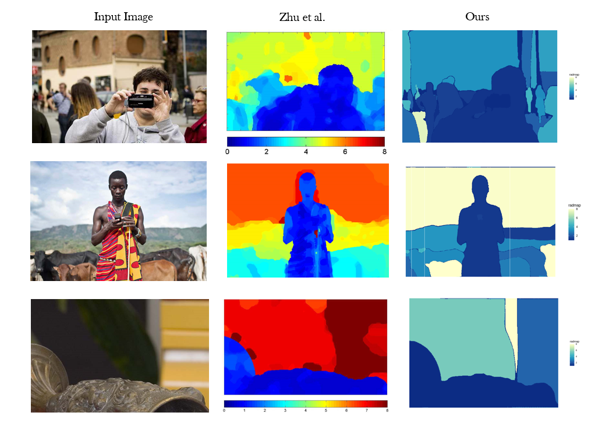

# DepthR

Collection of functions to estimate depth from Natural Images.

Install the package using the following R code.

```
   devtools::install_github("ShrayanRoy/DepthR")
```

## Some Examples of Estimated Blurred Maps


## Comparison with Zhu et al.


