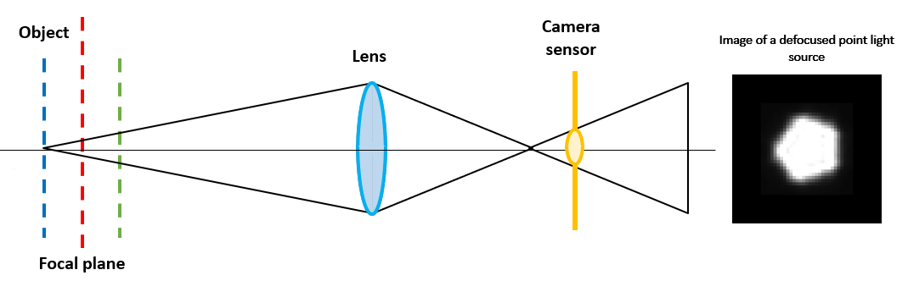

# Thin Lens Model for Camera

.panelset[
.panel[.panel-name[Thin Lens Model]

* From a single point source, light rays emit in different directions and fall on the lens of camera.

--

* The lens bends light to form a circle on the camera sensor. It's called the *Blur Circle* or *Circle of Confusion*.

--

* There is a relation between circle of confusion and depth of object in an image.

$$c_{diam} = a_{diam}f \left|\frac{d - d_{focus}}{d(d_{focus} - f)}\right| \approx a_{diam}f \left|\frac{1}{d_{focus}} - \frac{1}{d}\right|$$
--

* In a given camera settings, $c_{diam} \propto \left|\frac{1}{d_{focus}} - \frac{1}{d}\right|$ 

--

* For different values of $d$, we can have $\left|\frac{1}{d_{focus}} - \frac{1}{d}\right|$ same $\implies$ ill possed problem !

]

.panel[.panel-name[Objects Closer]

* For objects closer to the camera than the plane of focus

```{r ,warning=FALSE,echo=FALSE,out.width='100%',fig.align='center',echo=FALSE}


```

]

.panel[.panel-name[Objects Farther]

* For objects farther from the camera than the plane of focus

```{r ,warning=FALSE,echo=FALSE,out.width='100%',fig.align='center',echo=FALSE}


```

]
]

---
