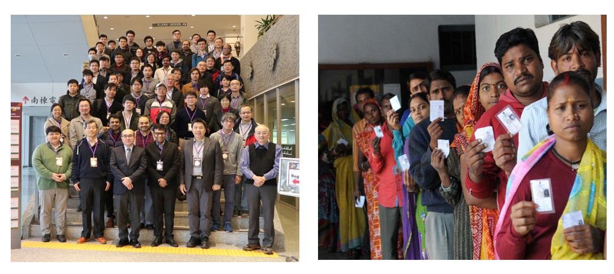
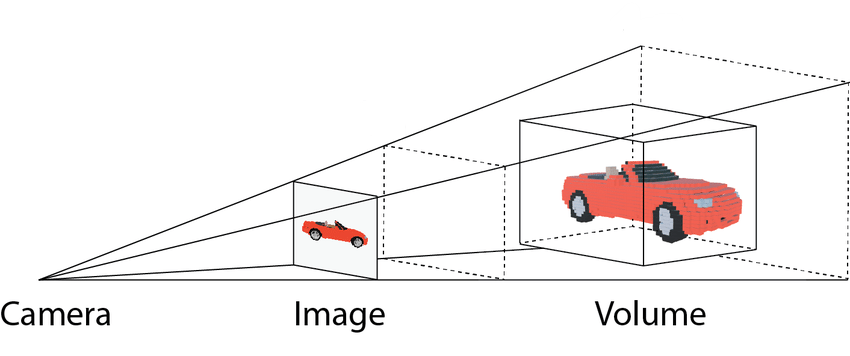
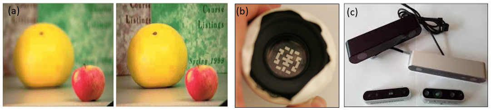
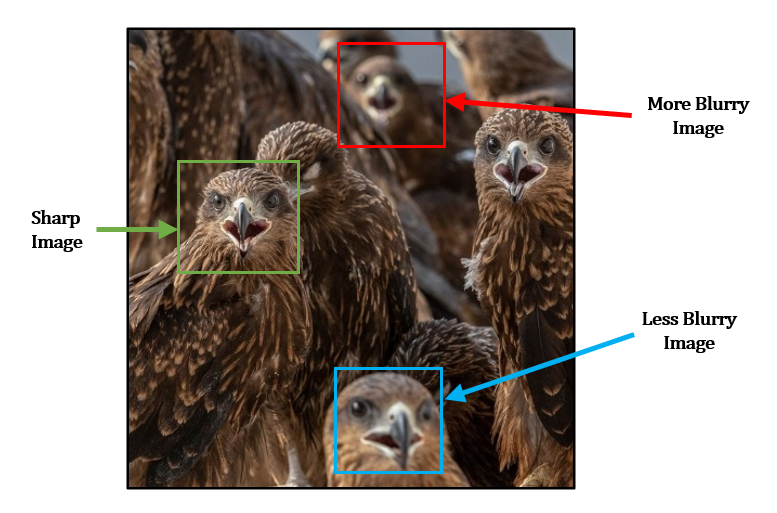
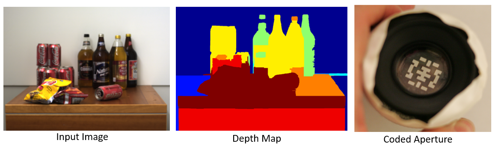
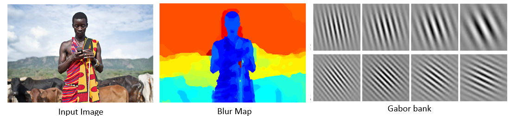
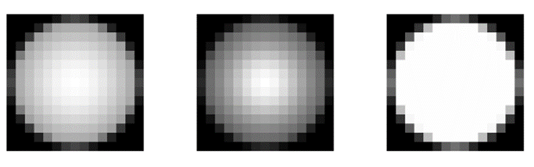

```{r setup, include=FALSE}
options(htmltools.dir.version = FALSE)
```


# Introduction

* Humans possess a natural ability to perceive 3D structure from 2D images, primarily relying on *visual cues* such as perspective, relative object sizes.

--

```{r ,warning=FALSE,echo=FALSE,out.width='65%',fig.align='center',echo=FALSE,fig.cap= "Figure: 3D perspective from 2D image."}


```

---

# Depth: the third dimension

* Traditional photographs are two dimensional projections of a three dimensional scene.

--

* The third dimension is *depth*, which represents the distance between camera and objects in the image.

--

* It provides **spatial information** about the scene, which can be used for applications such as post-capture image refocusing, automatic scene segmentation and object detection.

--

```{r,warning=FALSE,echo=FALSE,out.width='65%',fig.align='center',echo=FALSE,fig.cap = "Figure: 2D Projection of 3D scene in standard cameras"}


```

---

# Existing Methods to Estimate Depth

* Most modifications to estimate depth involves **multiple images** of the same scene or some **hardware based solution** such as light emitters, coded aperture.

--

* These methods are **not** applicable in practice, as it requires modifying the camera system before capturing the image, which may not always be feasible.

--

* Ideally, we aim to estimate the depth map given a single image of the scene.

--

* Depth estimation from a single image is a more challenging problem because we have only a **single observation** for each pixel of the scene.


```{r ,warning=FALSE,echo=FALSE,out.width='90%',fig.align='center',echo=FALSE,fig.cap = "Figure: Methods to estimate depth"}


```

---

# Depth from Defocus

* Depth estimation from defocus blur exploits the phenomenon where objects appear more blurred depending on their distance from the camera lens.

--

* Therefore, measuring the amount of blur at a point of an image can provide a way to recover the depth to the respective point in the 3D world.

--


```{r ,warning=FALSE,echo=FALSE,out.width='45%',fig.align='center',echo=FALSE,fig.cap= "Figure: Bluriness depends on distance of objects from camera"}


```

---

# Levin et al. (2007)

* Levin et al. utilized this concept to estimate the level of blur per pixel in a given input image.

* They used *sparse gradient prior* on natural images.

* However, this method requires a modified camera with a special coded aperture, rendering it impractical for use with a given input image.


```{r ,warning=FALSE,echo=FALSE,out.width='75%',fig.align='center',echo=FALSE,fig.cap= "Figure: Levin et al. 2007 - Image and Depth from a Conventional Camera with a Coded Aperture"}


```

---

# Zhu et al. (2013)

* Zhu et al. employed the concept of depth from defocus blur to estimate the level of blur per pixel in a given input image.

* They utilized Gabor filters for local frequency component analysis and used *simple gradient prior* on natural images.

* However, this method does not require a special coded aperture.

```{r ,warning=FALSE,echo=FALSE,out.width='85%',fig.align='center',echo=FALSE,fig.cap= "Figure: Zhu et al. 2013 - Estimating Spatially Varying Defocus Blur from A Single Image"}


```

---

# Point Spread Function

* When light rays spread from a single point source and hit the camera lens, they should ideally get refracted and converge on the pixel corresponding to the original scene.

--

* However, if the source is out of focus, the refracted rays spread out over neighboring pixels as well.

--

* This spreading pattern, determined by the object’s distance from the lens or camera movement, is called the Point Spread Function (PSF) or Blur Kernel.

--

```{r ,warning=FALSE,echo=FALSE,out.width='85%',fig.align='center',echo=FALSE,fig.cap= "Figure: Point Spread Function"}


```

---

# Model for Blurred Image

* The blurred image can be viewed as the result of convolving the original sharp image using the Point Spread Function. An observed blurred image $\boldsymbol{b}$ of dimension $M \times N$ can be modeled as - 

  $$\boldsymbol{b} = \boldsymbol{k} \ \otimes \ \boldsymbol{l} \ + \ \boldsymbol{\epsilon}$$
Where,

  * $\boldsymbol{k}$ is an $m \times n$ PSF / blur kernel.
  
  * $\boldsymbol{l}$ is the $(M + m) \times (N + n)$ *true latent image* which we want to estimate.
  
  * $\boldsymbol{\epsilon}$ is an $M \times N$ matrix of noise.
  
  * $\otimes$ denotes the *valid convolution* operator.
  
* Estimating $\boldsymbol{l}$ and $\boldsymbol{k}$ from the above model is ill possed problem.

--

* Can use some prior on $\boldsymbol{l}$ to deal with this ? 

---

# Model for Blurred Image (Contd.)


* The model defined in last slide assumes that PSF is *shift invariant* i.e. same PSF applies to all pixels. 

--

* In the context of defocus blur, PSF is *spatially varying*.

--

* We redefine the uniform blur model as - 

  $$\boldsymbol{b[t]} = (\boldsymbol{k_t} \ \otimes \ \boldsymbol{l})\boldsymbol{[t]} \ + \ \boldsymbol{\epsilon[t]}$$
--
  
Where $[t]$ indicates the corresponding elements at pixel location $\boldsymbol{t}$ and $\boldsymbol{k_t}$ is the spatially varying blur kernel at pixel location $\boldsymbol{t}$.

---

# Parametric Model for Blur Kernel


---

# Prior on Natural Images


---

# Maximum Likelihood Estimation


---

# Challenges


