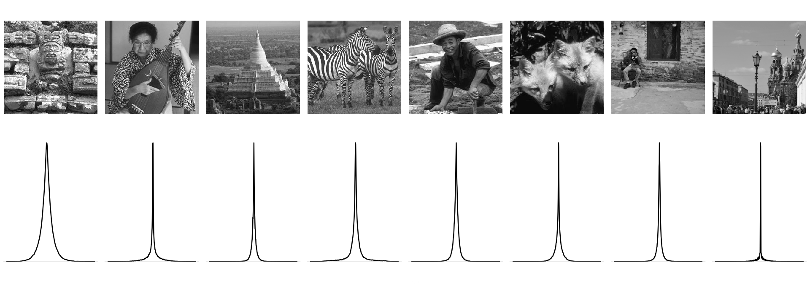
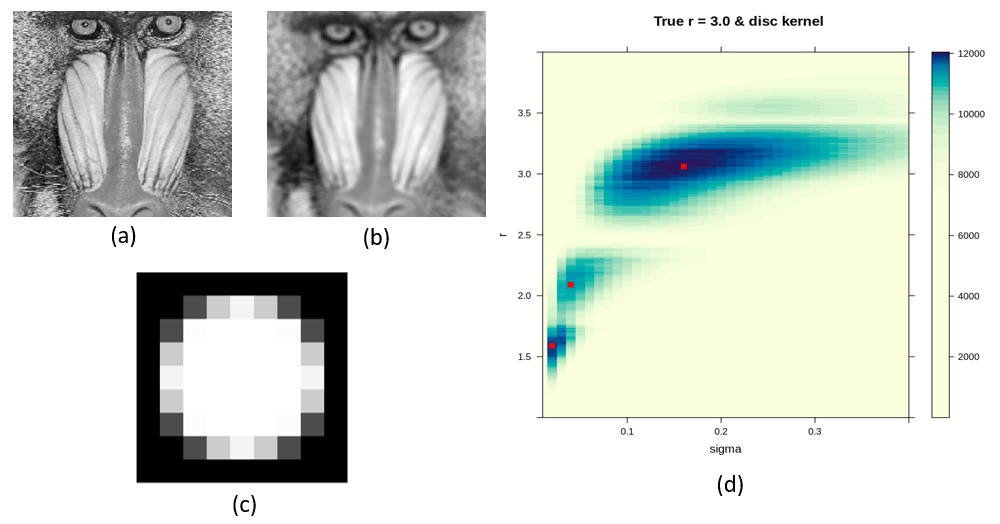
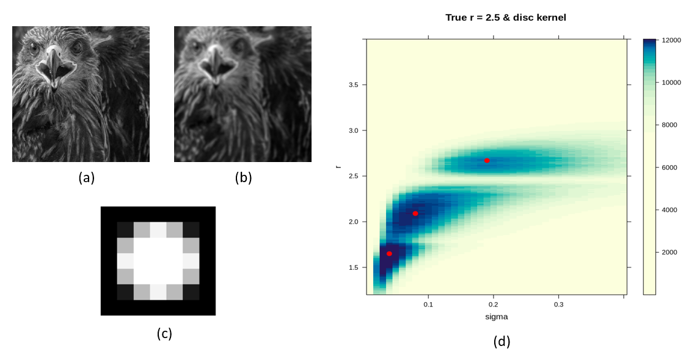
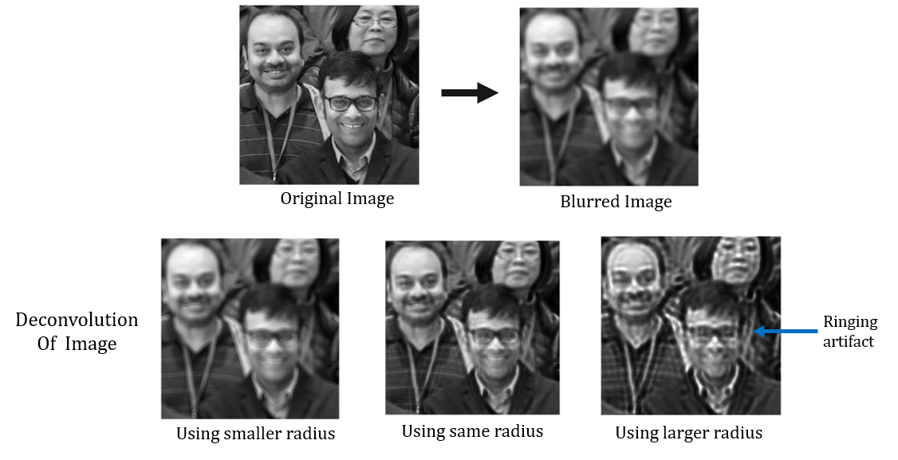
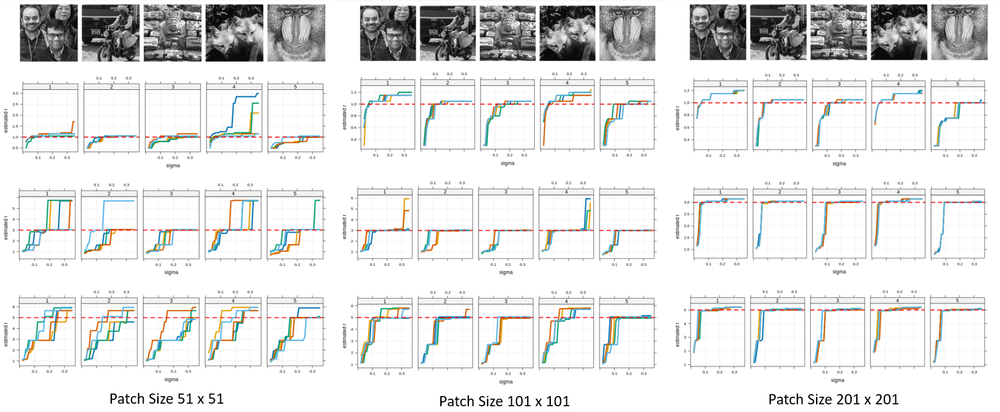
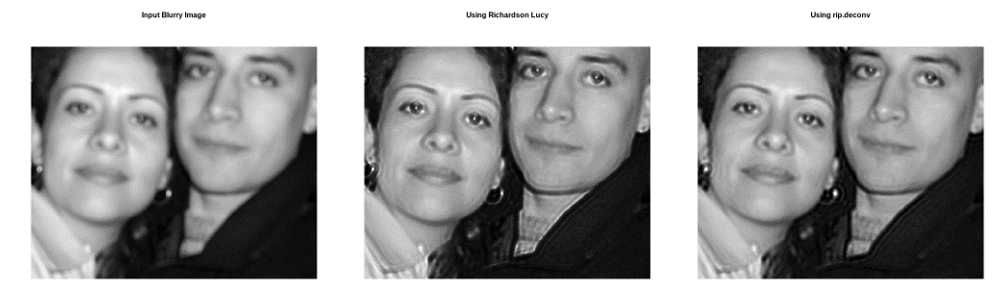
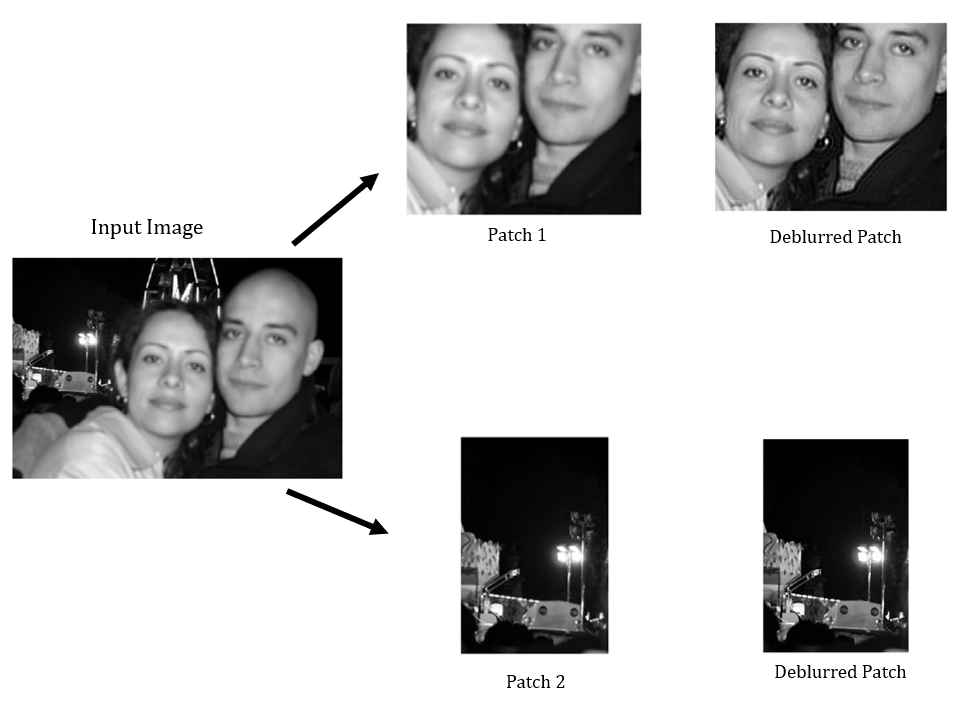

```{r setup, include=FALSE}
options(htmltools.dir.version = FALSE)
```

```{r xaringan-panelset, echo=FALSE}
xaringanExtra::use_panelset()
```

```{css,echo = FALSE}
.remark-slide-number {
  display: none;
}
```

# Introduction

* Humans possess a natural ability to perceive *3D structure* from 2D images.

--

* Primarily relying on *visual cues* such as perspective, relative object sizes.

--

```{r ,warning=FALSE,echo=FALSE,out.width='70%',fig.align='center',echo=FALSE,fig.cap= "Figure: 3D perspective from 2D image"}

knitr::include_graphics("pimg/dof.jpg")
```

---

# Depth: the third dimension

* Traditional photographs are two dimensional projections of a three dimensional scene.

--

* The third dimension is *depth*, which represents the distance between camera and objects in the image.

--

* It has applications such as post-capture *image refocusing*, automatic *scene segmentation*, and *object detection*.

--

* Most depth estimation methods use **multiple images** or **hardware solutions** like light emitters and coded apertures.

--

```{r ,warning=FALSE,echo=FALSE,out.width='80%',fig.align='center',echo=FALSE,fig.cap = "Figure: Methods to estimate depth"}

knitr::include_graphics("pimg/dest.png")
```

---

# Depth: the third dimension

* Traditional photographs are two dimensional projections of a three dimensional scene.

* The third dimension is *depth*, which represents the distance between camera and objects in the image.

* It has applications such as post-capture *image refocusing*, automatic *scene segmentation*, and *object detection*.

* Most depth estimation methods use **multiple images** or **hardware solutions** like light emitters and coded apertures.

* These methods are **not** applicable in practice as they require pre-modifying the camera system, which may not always be feasible.

--

* Ideally, we aim to estimate the depth map given a single image of the scene.

--

* Depth estimation from a single image is more **challenging** because we have only one observation per pixel.


---

# Depth from Defocus

* Depth estimation from defocus blur exploits the phenomenon where objects appear more blurred depending on their distance from the camera lens.

--

* Measuring blur for each image point can help recover its corresponding depth in the 3D world.

--

```{r ,warning=FALSE,echo=FALSE,out.width='45%',fig.align='center',echo=FALSE,fig.cap= "Figure: Bluriness depends on distance of objects from camera"}

knitr::include_graphics("pimg/depfoc.png")
```

---

# Levin et al. (2007)

* Levin et al. utilized this concept to estimate level of blur for each pixel.

* They used *sparse gradient prior* on natural images.

* But requires a modified camera with a special coded aperture.


```{r ,warning=FALSE,echo=FALSE,out.width='75%',fig.align='center',echo=FALSE,fig.cap= "Figure: Levin et al. 2007 - Image and Depth from a Conventional Camera with a Coded Aperture"}


```

---

# Zhu et al. (2013)

* Zhu et al. employed same idea with modification.

* They utilized Gabor filters for local frequency component analysis with *simple gradient prior*.

* This method does not require a special coded aperture.

```{r ,warning=FALSE,echo=FALSE,out.width='85%',fig.align='center',echo=FALSE,fig.cap= "Figure: Zhu et al. 2013 - Estimating Spatially Varying Defocus Blur from A Single Image"}


```

---

# Point Spread Function

* When light rays spread from a point source and hit the camera lens, they should ideally refract and converge on the corresponding pixel of the original scene.

--

* However, if the source is out of focus, the refracted rays spread out over neighboring pixels as well.

--

* This spreading pattern is called the Point Spread Function (PSF) or Blur Kernel.

--

```{r ,warning=FALSE,echo=FALSE,out.width='85%',fig.align='center',echo=FALSE,fig.cap= "Figure: Point Spread Function"}

knitr::include_graphics("pimg/psf.jpg")
```

---

# Model for Blurred Image

* The blurred image can be viewed as **convolution** of original sharp image and Point Spread Function. 

* The observed blurred image $\boldsymbol{b}$ of dimension $M \times N$ can be modeled as - 

  $$\boldsymbol{b} = \boldsymbol{k} \ \otimes \ \boldsymbol{l} \ + \ \boldsymbol{\epsilon}$$
Where,

  * $\boldsymbol{k}$ is an $m \times n$ PSF / blur kernel.
  
  * $\boldsymbol{l}$ is the $(M + m) \times (N + n)$ *true latent image* which we want to estimate.
  
  * $\boldsymbol{\epsilon}$ is an $M \times N$ matrix of noise.
  
  * $\otimes$ denotes the *valid convolution* operator.

--

* Estimating both $\boldsymbol{l}$ and $\boldsymbol{k}$ using above model is called *blind deconvolution problem*.

--

* Number of observations $MN$ is very large compared number of parameters $\implies$ ill-possed problem 

--

* Can use some prior on $\boldsymbol{l}$ to deal with this ? 

---

# Model for Blurred Image (Contd.)


* The model defined in last slide assumes that PSF is *shift invariant* i.e. same PSF applies to all pixels.

--

* In the context of defocus blur, PSF/ Blur Kernel is *spatially varying*.

--

```{r ,warning=FALSE,echo=FALSE,out.width='50%',fig.align='center',echo=FALSE,fig.cap= "Figure: Spatially Varying Blur Kernel"}

knitr::include_graphics("pimg/svarying.png")
```


---

# Model for Blurred Image (Contd.)


* The model defined in last slide assumes that PSF is *shift invariant* i.e. same PSF applies to all pixels. 

* In the context of defocus blur, PSF/ Blur Kernel is *spatially varying*.

* We will assume that $\boldsymbol{k_t}$ is shift invariant in a neighborhood ${\boldsymbol{\eta_t}}$ of size $p_1(\boldsymbol{t}) \times p_2(\boldsymbol{t})$ containing $\boldsymbol{t}$.

--

* Based on this, we redefine the *uniform blur model* as - 

  $$\boldsymbol{y[t']} = (\boldsymbol{k_t} \ \otimes \ \boldsymbol{x})\boldsymbol{[t']} \ + \ \boldsymbol{n[t']} \ \ \ \forall \boldsymbol{t'} \in \boldsymbol{\eta_t}$$
Where, 

  * $[t']$ indicates the elements at pixel location $\boldsymbol{t'}$.
  
  * $\boldsymbol{k_t}$ is the spatially varying PSF at pixel location $\boldsymbol{t}$.

--
  
* We need to estimate $\boldsymbol{k_t}$ for each pixel location $\boldsymbol{t}$ $\implies$ more ill possed !

--

* What if assume some form of blur kernel ? For example- *Bivariate Normal distribution*.

---

# Proposed Parametric Models for Blur Kernel

.panelset[
.panel[.panel-name[Thin Lens Model]

* From a single point source, light rays emit in different directions and fall on the lens of camera.

* The lens bends light to form a circle on the camera sensor. It's called the *Blur Circle* or *Circle of Confusion*.

* There is a relation between circle of confusion and depth of object in an image.

$$c_{diam} = a_{diam}f \left|\frac{d - d_{focus}}{d(d_{focus} - f)}\right| \approx a_{diam}f \left|\frac{1}{d_{focus}} - \frac{1}{d}\right|$$

* In a given camera settings, $c_{diam} \propto \left|\frac{1}{d_{focus}} - \frac{1}{d}\right|$ 

* For different values of $d$, we can have $\left|\frac{1}{d_{focus}} - \frac{1}{d}\right|$ same $\implies$ ill possed problem !

]

.panel[.panel-name[Objects Closer]

* For objects closer to the camera than the plane of focus

```{r ,warning=FALSE,echo=FALSE,out.width='80%',fig.align='center',echo=FALSE}

knitr::include_graphics("pimg/d1.png")
```

]

.panel[.panel-name[Objects Farther]

* For objects farther from the camera than the plane of focus

```{r ,warning=FALSE,echo=FALSE,out.width='80%',fig.align='center',echo=FALSE}

knitr::include_graphics("pimg/d2.png")
```

]

.panel[.panel-name[Choice of Kernels]

* **Uniform distribution** across a circular are defined by the radius of the circle, denoted by $r$.

$$k(x,y) = \frac{1}{\pi r^2} \times \text{I}_{\{x^2 + y^2 \ \leq \ r^2\}}$$

* **Gaussian distribution** across a circular area defined by the radius of the circle, denoted as $r$, and the scale parameter, represented as $h$.

$$k(x,y) = \frac{C_{h,r}}{2\pi h^2} e^{-\frac{x^2 + y^2}{2h^2}} \times \text{I}_{\{x^2 + y^2 \ \leq \ r^2\}}$$

* **Cauchy distribution** across a circular area defined by the radius of the circle, denoted as $r$, and the scale parameter $h$.

  $$k(x,y) = \frac{C_{h,r}}{2\pi}\frac{h}{(x^2 + y^2 + h^2)^{3/2}}\times \text{I}_{\{x^2 + y^2 \ \leq \ r^2\}}$$

]
]

---

# Prior on Natural Images

* By *natural*, we refer to typical scenes captured in amateur digital photography, excluding specialized contexts like astronomy or satellite imaging. 

* The prior family used is motivated from the observation that the distribution of image gradients have a **sharp peak near zero** and and relatively **heavier tails** than the Gaussian distribution and Laplace distribution.

```{r ,warning=FALSE,echo=FALSE,out.width='75%',out.height='30%',fig.align='center',echo=FALSE,fig.cap="Figure: Eight sharp images and their density plot of horizontal gradients"}


```

---

# Prior on Natural Images(Contd.)

* A useful parametric family to model this is the so called **Hyper-Laplacian Distribution** given by 

$$f_{\alpha}(z) = \frac{\alpha}{2\Gamma(\frac{1}{\alpha})}\text{exp}{(-|z|^{\alpha})}, z \in \mathbb{R} \ \ \text{and} \ \ \alpha > 0$$

* Levin et al. used $\alpha = 0.8$ and Zhu et al. used $\alpha = 2$  with IID assumption of image gradients.

--

* Nandy (2021) showed that assumption of independent gradients is incorrect and suggested *simple AR process* to model it.

--

* To use these priors we express the blur model in-terms of image gradients in frequency domain.

$$\boldsymbol{\delta_h}\otimes\boldsymbol{b} = \boldsymbol{\delta_h} \otimes(\boldsymbol{k} \ \otimes \ \boldsymbol{l}) \ + \ (\boldsymbol{\delta_h}\otimes \boldsymbol{\epsilon}) =  k \otimes(\boldsymbol{\delta_h} \ \otimes \ \boldsymbol{l}) \ + \ (\boldsymbol{\delta_h}\otimes \boldsymbol{\epsilon})$$
$$\boldsymbol{\delta_v}\otimes\boldsymbol{b} = \boldsymbol{\delta_v} \otimes(\boldsymbol{k} \ \otimes \ \boldsymbol{l}) \ + \ (\boldsymbol{\delta_v}\otimes \boldsymbol{\epsilon}) =  k \otimes(\boldsymbol{\delta_v} \ \otimes \ \boldsymbol{l}) \ + \ (\boldsymbol{\delta_v}\otimes \boldsymbol{\epsilon})$$
--

* Combining the last two equations we have

$$\boldsymbol{y} = \boldsymbol{k} \ \otimes \ \boldsymbol{x} \ + \ \boldsymbol{n}$$

---

# Prior on Natural Images(Contd.)

* Using Convolution Theorem for *Discrete Fourier Transform* we have

$$\boldsymbol{Y} = \boldsymbol{K} \odot \boldsymbol{X} + \boldsymbol{N}$$
$\ \ \  \ \ \ \ \ \text{}$ Where, $\boldsymbol{Y,K,X}$ and $\boldsymbol{N}$ are the *Discrete Fourier Transform*'s of $\boldsymbol{y,k,x}$ and $\boldsymbol{n}$ respectively.

--

* Then, $\forall \ \boldsymbol{\omega} = (\omega_1,\omega_2)$ we have $\boldsymbol{Y_{\omega} = K_{\omega}X_{\omega} + N_{\omega}}$

--

* Nandy (2021) defined the prior on DFT coefficients as -

  * $X_{\omega}$'s are independently distributed and follow the complex normal distribution $\mathcal{CN}(0,\sigma^2 g_{\omega})$ exactly or asymptotically, depending on whether $\alpha = 2$ or not.
  
  * Simple AR process is used to model the dependence structure of latent image gradients, i.e. $\rho(\boldsymbol{x_{ij},x_{kl}}) = {\rho_1}^{|i-k|}{\rho_2}^{|j-l|}$. 
  
  * Under these assumptions $g_{\omega}$ can be calculated explicitly.

--

* For spatially varying case, we simply apply these priors to the local patches of the image.

---

# Maximum Likelihood Estimation

* To estimate blur kernel parameters $\theta = (r,\sigma)$ or $r$, we will use maximum likelihood procedure.

--

* If we assume that $N_{\omega} \sim \mathcal{CN}(0,\eta^2 h_{\omega})$ for all $\omega$. Then $|\boldsymbol{Y_{\omega}}|^2 \sim \text{Exp}(\lambda_\omega = \frac{1}{\sigma^2|K_\omega|^2 g_{\omega} + \eta^2 h_{\omega}}) \ \ \ \forall \omega$

--

* The joint pdf of $|\boldsymbol{Y_{\omega}}|^2$'s is given by

$$f_{\theta}(|Y_{\omega}|^2,\forall \omega) = \prod_{\omega} f_{\theta,\omega}(|Y_{\omega}|^2)$$
$\ \ \  \ \ \ \ \ \text{}$  Where, $f_{\theta,\omega}(.)$ denotes the pdf of $\text{Exp}(\lambda_\omega = \frac{1}{\sigma^2|K_\omega|^2 g_{\omega} + \eta^2 h_{\omega}})$.

--

* By assuming independence of vertical and horizontal gradients of latent image, the joint likelihood is given by -

$$L(\boldsymbol{\theta}) = L_h(\boldsymbol{\theta})\times L_v(\boldsymbol{\theta}) = f_{\theta}(|Y_{h,\omega}|^2,\forall \omega) \times f_{\theta}(|Y_{v,\omega'}|^2,\forall \omega')$$

--

* Our objective is to find, $\hat{\theta} = \underset{\boldsymbol{\theta}}{\text{argmax}} \ \ logL(\boldsymbol{\boldsymbol{\theta}}) = \underset{\theta}{\text{argmax}} \ \ \{logL_h(\boldsymbol{\theta}) + logL_v(\boldsymbol{\theta})\}$

---

# Challenges in ML Estimation

* The first task is to find maximizer of $L(\boldsymbol{\theta})$. 

--

* Parameter $\boldsymbol{\theta}$ is involved in the expression $\lambda_{\omega}$ through $|K_{\omega}|^2$, which itself is a complicated function of parameter.

--

* Before we start using any optimization technique, we should empirically investigate the behavior of $L(\boldsymbol{\theta})$ as a function of $\boldsymbol{\theta}$.

* Simulated experiments using disc kernel is conducted for this purpose.

--

* Sequence of values for $r \in [1,4]$ with $\Delta{r} = 0.05$, and for $\sigma \in [0.01,0.4]$ with $\Delta{\sigma} = 0.01$ are considered, with $\eta = 0.001$ constant.

---

## Experiment - 1

```{r ,warning=FALSE,echo=FALSE,out.width='70%',fig.align='center',echo=FALSE,fig.cap="Figure: (a) 101 x 101 Sharp Image, (b) Blurred Image Using disc kernel with r = 3, (c) Disc Kernel with r = 3, (d) Levelplot of log likelihood as a function of sigma and r"}


```


---

## Experiment - 2

```{r ,warning=FALSE,echo=FALSE,out.width='72%',fig.align='center',echo=FALSE,fig.cap="Figure: (a) 101 x 101 Sharp Image, (b) Blurred Image Using disc kernel with r = 2.5, (c) Disc Kernel with r = 2.5, (d) Levelplot of log likelihood as a function of sigma and r"}


```

---

# Challenges in ML Estimation

* The first task is to find maximizer of $L(\boldsymbol{\theta})$. 

* The parameter $\boldsymbol{\theta}$ is involved in the expression $\lambda_{\omega}$ through $|K_{\omega}|^2$, which itself is a complicated function of parameter.

* Before we start using any optimization technique, we should empirically investigate the behavior of $L(\boldsymbol{\theta})$ as a function of $\boldsymbol{\theta}$.

* Simulated experiments using disc kernel is conducted for this purpose.

* Sequence of values for $r \in [1,4]$ with $\Delta{r} = 0.05$, and for $\sigma \in [0.01,0.4]$ with $\Delta{\sigma} = 0.01$ are considered, with $\eta = 0.001$ constant.

* Global maxima don't always correspond to the actual parameters of the blur kernel.

--

* We aim for nearly accurate estimation of blur kernel parameters.


---

## Effect of Poor Parameter Estimation

```{r ,warning=FALSE,echo=FALSE,out.width='72%',fig.align='center',echo=FALSE,fig.cap="Figure: Effect of poor estimation of radius r in disc kernel (Using Richardson Lucy Algorithm)"}


```

---

# Challenges in ML Estimation

* The first task is to find maximizer of $L(\boldsymbol{\theta})$. 

* The parameter $\boldsymbol{\theta}$ is involved in the expression $\lambda_{\omega}$ through $|K_{\omega}|^2$, which itself is a complicated function of parameter.

* Before we start using any optimization technique, we should empirically investigate the behavior of $L(\boldsymbol{\theta})$ as a function of $\boldsymbol{\theta}$.

* Simulated experiments using disc kernel is conducted for this purpose.

* Sequence of values for $r \in [1,4]$ with $\Delta{r} = 0.05$, and for $\sigma \in [0.01,0.4]$ with $\Delta{\sigma} = 0.01$ are considered, with $\eta = 0.001$ constant.

* Global maxima don't always correspond to the actual parameters of the blur kernel.

* We aim for nearly accurate estimation of blur kernel parameters.

* Proper choice of $\sigma$ is required (A common situation is *Bayesian paradigm* !).

--

* Simulations can be used to find a reasonable value of $\sigma$.


---

## Experiment: Choice of $\sigma$

* $\sigma = 0.2$ seems to be a reasonable choice.

```{r ,warning=FALSE,echo=FALSE,out.width='100%',fig.align='center',echo=FALSE,fig.cap="Figure: Empirical study to find sigma"}


```

---

# Challenges in ML Estimation(Contd.)

* $\sigma = 0.2$ doesn't solve all problems.

--

* We may still encounter issues with multiple local maxima, which can affect the quality of estimation.

--

```{r ,warning=FALSE,echo=FALSE,out.width='90%',fig.align='center',echo=FALSE,fig.cap="Figure: Problem with multiple local maximas"}

knitr::include_graphics("pimg/rest.png")
```

---

# Challenges in Deblurring

* An important application of depth estimation is post-capture refocusing of blurred areas.

--

* To address this, we require efficient deblurring algorithms. Classical methods such as the *Richardson-Lucy algorithm* may not suffice in some cases.

--

```{r ,warning=FALSE,echo=FALSE,out.width='80%',fig.align='center',echo=FALSE,fig.cap="Figure: Comparison of Different Deblurring Algorithms"}


```

---

# An Application of Our Approach

```{r ,warning=FALSE,echo=FALSE,out.width='60%',fig.align='center',echo=FALSE,fig.cap="Figure: Application on real life image"}


```

---

# References

* Brian A. Barsky, Daniel R. Horn, and Klein. “Camera Models and Optical Systems Used in Computer Graphics: Part I, Object-Based Techniques”. In: Lecture Notes in Computer Science. Springer Berlin Heidelberg, 2003. url: http://dx.doi.org/10.1007/3-540-44842X_26.

* P. Grossmann. “Depth from focus”. In: Pattern Recognition Letters (1987). issn: 0167-8655.url: http://dx.doi.org/10.1016/0167-8655(87)90026-2.

* Alexander Kirillov et al. Segment Anything. 2023. url: https://arxiv.org/abs/2304.02643.

* Anat Levin et al. “Image and depth from a conventional camera with a coded aperture”. In: ACM transactions on graphics (TOG) 26.3 (2007), 70–es. url: http://dx.doi.org/10.1145/1276377.1276464

*  Kaustav Nandy. “Locally Dependent Natural Image Priors for Non-blind and Blind Image Deconvolution”. PhD thesis. Indian Statistical Institute, 2021. url: 
https://digitalcommons.isical.ac.in/doctoral-theses/7/

* Deepayan Sarkar and Kaustav Nandy. rip: Image Processing in R. New Delhi, India, 2021. url: https://github.com/deepayan/rip.

* Xiang Zhu et al. “Estimating Spatially Varying Defocus Blur From A Single Image”. In: (2013). issn: 1941-0042. url: http://dx.doi.org/10.1109/TIP.2013.2279316.


---

class: center, middle
background-size: cover

# Thank You

All codes, diagrams are available at [ShrayanRoy/DepthR](https://github.com/ShrayanRoy/DepthR)
