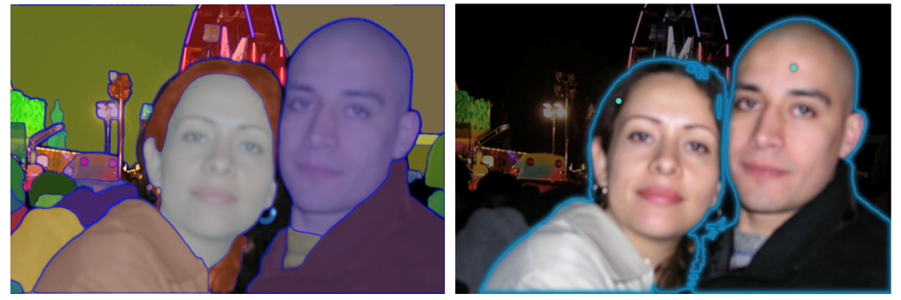
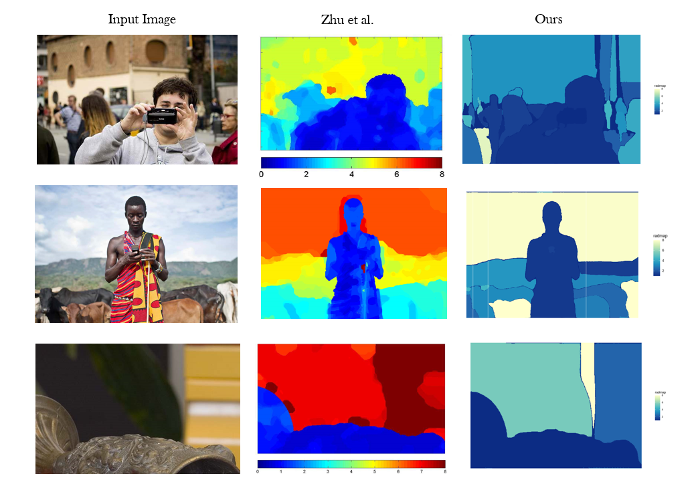
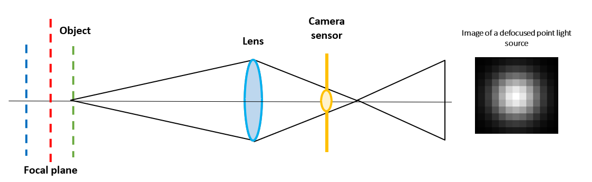
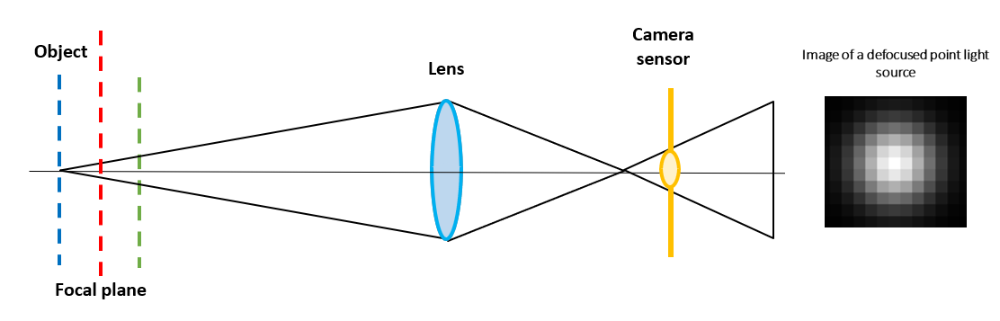

```{r setup, include=FALSE}
options(htmltools.dir.version = FALSE)
```

```{r xaringan-panelset, echo=FALSE}
xaringanExtra::use_panelset()
```

```{css,echo = FALSE}
.remark-slide-number {
  display: none;
}
```


# Depth Estimation

* Traditional photographs are two dimensional projections of a three dimensional scene.

* The third dimension is **depth**, which represents the distance between camera and objects in the image.

```{r ,warning=FALSE,echo=FALSE,out.width='70%',fig.align='center',echo=FALSE,fig.cap= "Figure: 3D perspective from 2D image"}

knitr::include_graphics("pimg/dof.jpg")
```

---

# Depth from Defocus Blur

* Depth estimation from defocus blur exploits the phenomenon where objects appear more blurred depending on their distance from the camera lens.

* Measuring level of blur for each pixel can be used as a *surrogate* for depth.

```{r ,warning=FALSE,echo=FALSE,out.width='44%',fig.align='center',echo=FALSE,fig.cap= "Figure: Bluriness depending on distance from camera"}

knitr::include_graphics("pimg/depfoc.png")
```

---

# Our Approach: Main Idea

* Use of more **general prior** for image proposed by Nandy (2021).

* Parametric models to estimate level of blur as surrogate for depth.

* Instead of doing post estimation segmentation, start with pre-segmented image.

* Estimate blur (depth) for each segment separately.

* Use of Modern segmentation algorithms such as **Segment-Anything**.

```{r ,warning=FALSE,echo=FALSE,out.width='87%',fig.align='center',echo=FALSE}


```

---

# Proposed Parametric Models for Blur Kernel

* In the case of blurring due to defocus, shape of the blur kernel is **circular** and controls the level of blur.

* **Uniform distribution** across a circular are defined by the radius of the circle, denoted by $r$.

$$k(x,y) = \frac{1}{\pi r^2} \times \text{I}_{\{x^2 + y^2 \ \leq \ r^2\}}$$
* **Gaussian distribution** across a circular area defined by the radius of the circle, denoted as $r$, and the scale parameter, represented as $h$.

$$k(x,y) = \frac{C_{h,r}}{2\pi h^2} e^{-\frac{x^2 + y^2}{2h^2}} \times \text{I}_{\{x^2 + y^2 \ \leq \ r^2\}}$$

* **Cauchy distribution** across a circular area defined by the radius of the circle, denoted as $r$, and the scale parameter $h$.

  $$k(x,y) = \frac{C_{h,r}}{2\pi}\frac{h}{(x^2 + y^2 + h^2)^{3/2}}\times \text{I}_{\{x^2 + y^2 \ \leq \ r^2\}}$$

---

# Image Blurring Model

* The blurred image can be viewed as **convolution** of original sharp image and blur kernel. 

* The observed blurred image $\boldsymbol{b}$ of can be modeled in terms of its gradients as - 

  $$\boldsymbol{y} = \boldsymbol{k} \ \otimes \ \boldsymbol{x} \ + \ \boldsymbol{n}$$
Where,

  * $\boldsymbol{k}$ is blur kernel and $\boldsymbol{x}$ is gradient of *true latent image*.
  
  * $\boldsymbol{n}$ is gradient of noise and $\otimes$ denotes the *valid convolution* operator.
  
* Expressing the model in frequency domain as - 

$$\boldsymbol{Y_{\omega} = K_{\omega}X_{\omega} + N_{\omega}}  \  \ \  \forall \ \boldsymbol{\omega} = (\omega_1,\omega_2)$$  
* We assume Nandy's Auto regressive prior on DFT coefficients $\boldsymbol{X_{\omega}}$.


---

# Maximum Likelihood Estimation of Blur Kernel Parameters

* To estimate blur kernel parameters $\theta = (r,h)$ or $r$, we will use maximum likelihood procedure.

* If we assume that $N_{\omega} \sim \mathcal{CN}(0,\eta^2 h_{\omega})$ for all $\omega$. Then $|\boldsymbol{Y_{\omega}}|^2 \sim \text{Exp}(\lambda_\omega = \frac{1}{\sigma^2|K_\omega|^2 g_{\omega} + \eta^2 h_{\omega}}) \ \ \ \forall \omega$

* The joint pdf of $|\boldsymbol{Y_{\omega}}|^2$'s is given by

$$f_{\theta}(|Y_{\omega}|^2,\forall \omega) = \prod_{\omega} f_{\theta,\omega}(|Y_{\omega}|^2)$$
$\ \ \  \ \ \ \ \ \text{}$  Where, $f_{\theta,\omega}(.)$ denotes the pdf of $\text{Exp}(\lambda_\omega = \frac{1}{\sigma^2|K_\omega|^2 g_{\omega} + \eta^2 h_{\omega}})$.

* Assuming independence of vertical and horizontal gradients, the joint likelihood is given by

$$L(\boldsymbol{\theta}) = L_h(\boldsymbol{\theta})\times L_v(\boldsymbol{\theta}) = f_{\theta}(|Y_{h,\omega}|^2,\forall \omega) \times f_{\theta}(|Y_{v,\omega'}|^2,\forall \omega')$$

* Our objective is to find

$$\hat{\theta} = \underset{\boldsymbol{\theta}}{\text{argmax}} \ \log L(\boldsymbol{\boldsymbol{\theta}}) = \underset{\theta}{\text{argmax}} \ \ \{\log L_h(\boldsymbol{\theta}) + \log L_v(\boldsymbol{\theta})\}$$
---

## Choice of $\sigma$

```{r ,warning=FALSE,echo=FALSE,out.width='100%',fig.align='center',echo=FALSE}


```

---

# How to estimate Spatially Varying blur ?

--

```{r ,warning=FALSE,echo=FALSE,out.width='44%',fig.align='center',echo=FALSE}

knitr::include_graphics("pimg/moon.png")
```

---

# How to estimate Spatially Varying blur ?

```{r ,warning=FALSE,echo=FALSE,out.width='44%',fig.align='center',echo=FALSE}

knitr::include_graphics("pimg/moon_kern.png")
```

---

# Spatially Varying Blur Estimation

* Real world images often exhibit spatially varying blur implying pixel to pixel varying blur level.

* Assume locally constant blur within a small patch around each pixel.

--

* Estimating blur level for each pixel we can obtain a reasonable blur map.

--

* We have conducted a simple spatially varying blur experiment on $255\times 255$ image using disc kernel.

* Estimated blur map under locally constant blur assumption with patch size $51\times 51$.

---

## Experiment

```{r ,warning=FALSE,echo=FALSE,out.width='90%',out.height="90%",fig.align='center',echo=FALSE,fig.cap= "Figure: (a) Spatially Varying Blurred Image, (b) Latent Blurmap, (c) Estimated Blurmap"}


```

---

# Spatially Varying Blur Estimation

* The generated blur map is non-smooth and requires *MRF Smoothing* to obtain a smooth map.

--

* The entire procedure is time-consuming, even the initial blur map estimation also.

* Boundary between different objects in image is not clear.

--

* Instead of estimating blur for all pixels separately, consider the individual objects.

* It is the objects themselves that vary in distance from camera, not individual pixels.

--

* Segment image into meaningful objects and estimate blur for each segment.

---

# Segment Anything

* Segment Anything (SAM) is developed by Meta AI (2023) for image segmentation.

* It has both manual and automatic method to perform segmentation.

* We used automatic version of SAM to obtain the masks and corresponding bounding boxes.

* We filtered out small segments based on size of bounding boxes and confidence scores.

```{r ,warning=FALSE,echo=FALSE,out.width='70%',fig.align='center',echo=FALSE,fig.cap="Figure: Automatic and Manual Segmentation by SAM"}


```

---

# Challenges in Post-Segmentation ML Estimation

* Our ML estimation procedure requires images of rectangular shapes.

* But image segments obtained by SAM are of irregular shape.

--

* Obvious solution is to pad or fill with zeros to make rectangular array.

* This approach leads to bias towards selecting small values of radius $r$.

```{r ,warning=FALSE,echo=FALSE,out.width='60%',out.height="40%",fig.align='center',echo=FALSE,fig.cap= "Figure: Zero padding to make rectangular array"}


```

---

## Experiment

* Simulated defocus blur using disc kernel with $r_{true} = 3$.

```{r ,warning=FALSE,echo=FALSE,out.width='90%',out.height="80%",fig.align='center',echo=FALSE,fig.cap= "Figure: (a) Fourier Spectrum of Kernel, (b) Blurred Image, (c)  Fourier Spectrum of blurred image gradient"}


```

---

## Experiment

* After zero padding of segmented image portion, the fourier spectrum of blur kernel is destroyed.

```{r ,warning=FALSE,echo=FALSE,out.width='60%',out.height="40%",fig.align='center',echo=FALSE,fig.cap= "Figure: (a) Segmented Blurred Image, (b)  Fourier Spectrum of segmented blurred image gradient"}

knitr::include_graphics("pimg/zero_pad_prob2.png")
```

---

# Challenges in Post-Segmentation ML Estimation

* DFT combines frequency content across all spatial locations.

--

* It implicitly assumes stationarity of the gradients, which doesn't hold here.

--

* To address this issue we have tried some approaches.

---

# Approach - 1

* Instead of irregular segments, consider corresponding bounding boxes.

* Bounding boxes may contain objects with vastly different depths $\implies$ different blur levels.

* Sub-area of the box with least level of blur tends to dominate the Fourier spectrum.

```{r ,warning=FALSE,echo=FALSE,out.width='47%',out.height="30%",fig.align='center',echo=FALSE,fig.cap= "Figure: Local Patch Containing pixels of different depth"}


```


---

# Approach - 2

* Decompose irregularly shaped segments into smaller, rectangular regions.

* Apply estimation procedure to these sub regions.

--

* Discards a large proportion of available data depending on how irregular segment it is.

```{r ,warning=FALSE,echo=FALSE,out.width='70%',out.height="30%",fig.align='center',echo=FALSE,fig.cap= "Figure: Irregular segments identified by SAM"}


```


---

# Approach - 3

* Instead of Frequency domain work in spatial domain. 

* As convolution is linear operator, we can express $\boldsymbol{y} = \boldsymbol{k}\otimes \boldsymbol{x} + \boldsymbol{n}$ as 

$$\text{vec}(\boldsymbol{y}) = \boldsymbol{A_k} \text{vec}(\boldsymbol{x}) + \text{vec}(\boldsymbol{n})$$

--

* Assuming simple IID normal prior on image gradients $\boldsymbol{x}$ and independence of elements of $\boldsymbol{n}$,

$$\text{Vec}(\boldsymbol{y}) \sim \text{MVN}(\boldsymbol{0}, \sigma^2 \boldsymbol{A_k} \boldsymbol{A_k}^{T} + \eta^2 \boldsymbol{I})$$
--

* To calculate maximum likelihood estimator, we need to calculate likelihood as a function of $\boldsymbol{\theta}$, i.e.

$$L(\boldsymbol{\theta}) \propto \frac{1}{\sqrt{\text{det}(\sigma^2 \boldsymbol{A_k} \boldsymbol{A_k}^{T} + \eta^2 \boldsymbol{I})}}\exp\left( -\frac{1}{2}\text{Vec}(y)^T (\sigma^2 \boldsymbol{A_k} \boldsymbol{A_k}^{T} + \eta^2 \boldsymbol{I} )^{-1} \text{Vec}(y)\right)$$
* Where, $\boldsymbol{A_k}$ is determined by $\boldsymbol{\theta}$ and choice of blur kernel model.

---

# Approach - 3

* Requires calculation of inverse and determinant of the matrix $\sigma^2 \boldsymbol{A_k} \boldsymbol{A_k}^{T} + \eta^2 \boldsymbol{I}$ multiple times.

--

* Although the matrix is sparse, it is still potentially large. 

* Evaluating inverse and determinant for multiple values of $\boldsymbol{\theta}$ for each segment is impractical.

--

* Instead we propose an ad-hoc alternative loss function that is simpler to evaluate.

---

# Decorrelation Loss

* For an observed blurred image $\boldsymbol{y}$, suppose the true blur kernel is $\boldsymbol{k_{\theta_0}}$.

--

* Deconvolving $\boldsymbol{y}$ using $\boldsymbol{k_{\theta_0}}$ should yield a quantity $\boldsymbol{x_{\theta_0}}$ close to latent sharp image gradient $\boldsymbol{x}$.

* Along and across direction ACF of $\boldsymbol{x_{\theta_0}}$ will take smaller values compared to the blurred image gradient $\boldsymbol{y}$.

--

* Because, convolution using $\boldsymbol{k}$ increases the correlation among image gradients.

--

* We simulated defocus blur on a $255\times 255$ image using disc kernel with $r_{true} = 3$.

* Plotted ACF of both horizontal and vertical gradients after deconvoluting using $r = 2,3,4$. 

---

## Experiment

```{r ,warning=FALSE,echo=FALSE,out.width='75%',out.height="30%",fig.align='center',echo=FALSE,fig.cap= "Figure: ACF of sharp and blurred image gradients"}


```

---

## Experiment

```{r ,warning=FALSE,echo=FALSE,out.height="63%",out.width='63%',fig.align='center',echo=FALSE}


```

---

# Decorrelation Loss

* For deconvolution step we used conditional mean of $\boldsymbol{X_{\omega}}$ given $\boldsymbol{Y_{\omega}}$ and $\boldsymbol{K_{\omega}}$ i.e.

$$\mathbb{E}[\boldsymbol{X_{\omega}}|\boldsymbol{Y_{\omega}},\boldsymbol{K_{\omega}}] = \frac{\sigma^2g_{\omega}\boldsymbol{K_{\omega}Y_{\omega}}}{\eta^2h_{\omega} + \sigma^2g_{\omega}|\boldsymbol{K_{\omega}}|^2}$$

* Take Inverse DFT to obtain deconvoluted horizontal and vertical gradients denoted by $\boldsymbol{x_{h,\theta}}$ and $\boldsymbol{x_{v,\theta}}$.

--

* Consider sum of squared ACF in both along and across direction of gradients as loss function denoted by 

$$\text{Decorr}(\boldsymbol{\theta}) = \text{Decorr}(\boldsymbol{x_{h,\theta}},\boldsymbol{x_{v,\theta}})$$

* It captures the amount of correlation present in image gradients after deblurring using $\boldsymbol{k_\theta}$.

--

* $\text{Decorr}(\boldsymbol{\theta})$ should be minimum for true value of $\boldsymbol{\theta}$.

$$\hat{\boldsymbol{\theta}} = \underset{\boldsymbol{\theta}}{\text{argmin}} \ \text{Decorr}(\boldsymbol{x_{h,\theta}},\boldsymbol{x_{v,\theta}})$$

---

# Decorrelation Loss for Image Segments

* We perform deconvolution of bounding boxes corresponding to the image segments.

--

* Consider only the pixels belonging to image segment corresponding to that bounding box.

* Calculate ACF in both along and across direction only for those pixels.

* Use decorrelation loss to find optimal value of $\boldsymbol{\theta}$.

--

* We simulated spatially varying blur on a $550 \times 450$ image using disc kernel of varying radius.

* Used decorrelation loss to estimate blur radius map.

* Deblurred the image based on estimated blur radius map using Richardson-Lucy Algorithm.

---

## Experiment

```{r ,warning=FALSE,echo=FALSE,out.width='50%',out.height="50%",fig.align='center',echo=FALSE,fig.cap = "Figure: (a) Simulated spatially varying blurred image, (b) Deblurred image based on estimated blur map, (c) Latent blur map, (d) Estimated blur map"}

knitr::include_graphics("pimg/11.1.png")
```

---

# Application on Real Image

* We applied the procedure based on decorrelation loss to real world blurred images.

* As images are sourced externally, calibrated blur kernels are unavailable.

--

* Blur from lens with circular aperture can be modeled by disc kernel in the absence of diffraction effects.

--

* But real world scenarios involve diffraction, so we required alternative choice of blur kernel.

* Disc kernel can produce good enough blur map but loss curves may not be stable. 

--

* We have used circular cauchy kernel with $\kappa = 0.5$ to estimate blur radius map.

* $\sigma = 0.10$, $\eta = 0.010$, and $\rho = (0.5, 0.5)$ used in all cases.

---

# Results

```{r ,warning=FALSE,echo=FALSE,out.width='90%',out.height="100%",fig.align='center',echo=FALSE}


```

---

# Results

```{r ,warning=FALSE,echo=FALSE,out.width='90%',out.height="100%",fig.align='center',echo=FALSE}


```

---

# Comparison With Zhu et al.

```{r ,warning=FALSE,echo=FALSE,out.width='70%',out.height="100%",fig.align='center',echo=FALSE}


```

---

# Deblurred Images

```{r ,warning=FALSE,echo=FALSE,out.width='90%',out.height="100%",fig.align='center',echo=FALSE}


```

---

# Post Capture Refocusing

```{r ,warning=FALSE,echo=FALSE,out.width='100%',out.height="100%",fig.align='center',echo=FALSE}


```


---

# Discussion

* We proposed a new method to estimate spatially varying blur based on single image of the scene.

--

* Due to issue of zero padding with ML estimation, we developed an ad hoc procedure based on Decorrelation Loss.

--

* Estimated blur maps clearly depict differences in blur levels & boundaries between objects in image.

--

* Ranking in blur maps are not entirely correct.

   * Problem in identifying the blur level of background objects.

   * Segments with little texture often result in underestimation of the blur radius.

--
   
* Choice of $\kappa$ can be incorporated in estimation procedure.

--
 
* Hard to isolate effects of tuning parameter because of their confounding effect.

---

# Discussion

* A significant reduction in computing time.

* Because instead of estimating for all pixel separately we are estimating only for segments.

--

* Our R implementation takes around 7 minutes time for estimation step for $1000\times1000$ image.

* SAM takes around 3 minutes for segmentation on GPU run time.

--

* Pixel by pixel blur estimation takes around 1 hr 30 minutes only for initial step.

---

# References

* Brian A. Barsky, Daniel R. Horn, and Klein. “Camera Models and Optical Systems Used in Computer Graphics: Part I, Object-Based Techniques”. In: Lecture Notes in Computer Science. Springer Berlin Heidelberg, 2003. url: http://dx.doi.org/10.1007/3-540-44842X_26.

* P. Grossmann. “Depth from focus”. In: Pattern Recognition Letters (1987). issn: 0167-8655.url: http://dx.doi.org/10.1016/0167-8655(87)90026-2.

* Alexander Kirillov et al. Segment Anything. 2023. url: https://arxiv.org/abs/2304.02643.

* Anat Levin et al. “Image and depth from a conventional camera with a coded aperture”. In: ACM transactions on graphics (TOG) 26.3 (2007), 70–es. url: http://dx.doi.org/10.1145/1276377.1276464

*  Kaustav Nandy. “Locally Dependent Natural Image Priors for Non-blind and Blind Image Deconvolution”. PhD thesis. Indian Statistical Institute, 2021. url: 
https://digitalcommons.isical.ac.in/doctoral-theses/7/

* Deepayan Sarkar and Kaustav Nandy. rip: Image Processing in R. New Delhi, India, 2021. url: https://github.com/deepayan/rip.

* Xiang Zhu et al. “Estimating Spatially Varying Defocus Blur From A Single Image”. In: (2013). issn: 1941-0042. url: http://dx.doi.org/10.1109/TIP.2013.2279316.

---

class: center, middle
background-size: cover

# Thank You

All codes and diagrams are available at [ShrayanRoy/DepthR](https://github.com/ShrayanRoy/DepthR)

---

# Appendix

.panelset[
.panel[.panel-name[Thin Lens Model]

* From a single point source, light rays emit in different directions and fall on the lens of camera.

* The lens bends light to form a circle on the camera sensor. It's called the *Blur Circle* or *Circle of Confusion*.

* There is a relation between circle of confusion and depth of object in an image.

$$c_{diam} = a_{diam}f \left|\frac{d - d_{focus}}{d(d_{focus} - f)}\right| \approx a_{diam}f \left|\frac{1}{d_{focus}} - \frac{1}{d}\right|$$

* In a given camera settings, $c_{diam} \propto \left|\frac{1}{d_{focus}} - \frac{1}{d}\right|$ 

* For different values of $d$, we can have $\left|\frac{1}{d_{focus}} - \frac{1}{d}\right|$ same $\implies$ ill possed problem !

]

.panel[.panel-name[Objects Closer]

* For objects closer to the camera than the plane of focus

```{r ,warning=FALSE,echo=FALSE,out.width='80%',fig.align='center',echo=FALSE}


```

]

.panel[.panel-name[Objects Farther]

* For objects farther from the camera than the plane of focus

```{r ,warning=FALSE,echo=FALSE,out.width='75%',fig.align='center',echo=FALSE}


```

]
]
