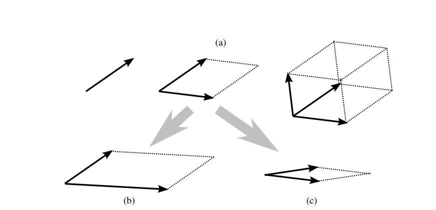
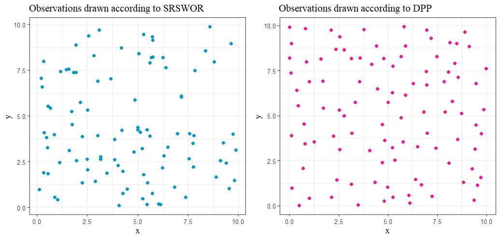

class: center, middle
background-image: url("BACK.JPEG")
background-size: cover

```{css,echo = F}
.reduced_opacity {
  opacity: 0.4;
}
.red { color: rgb(200,0,0); }
.green { color: green; }
.blue { color: blue; }
.scroll-1000 {
  max-height: 400px;
  max-width: 1000px;
  overflow-y: auto;
  background-color: inherit;
}
```

```{r xaringan-panelset, echo=FALSE}
xaringanExtra::use_panelset()
```

```{css,echo = FALSE}
.remark-slide-number {
  display: none;
}
```

```{css,echo = FALSE}
.small-text {
  font-size: 0.8em;
}
```

# Last time...

---
# Introduction

- We were interested in **Classification** problems.

- A popular choice is to consider **K-Nearest Neighbor Classifier** based on the Euclidean distance.

- But in High Dimensional problems, KNN based on the Euclidean distance performs poorly.

--

- If location difference is dominated by scale difference, .red[NN classifier assigns all observations to the population with smaller dispersion!]

---

# Mean Absolute Difference of Distances

* MADD (Sarkar and Ghosh 2019) is a semi-metric based on available data cloud, defined as: 

$$\rho(\mathbf{x},\mathbf{y})= \frac{1}{n - 2} \sum_{\mathbf{z} \in \mathcal{X} \setminus \{\mathbf{x},\mathbf{y}\}} \big|\|\mathbf{x}- \mathbf{z}\| - \|\mathbf{y}-\mathbf{z}\|\big|$$
* Roy et. al. 2022 used MADD for high dimension, low sample size classification problems.


* Computation of MADD between two points requires $\mathcal{O}(nd)$ operations.


* Complexity becomes $\mathcal{O}(n^2d)$ for classifying a single observation $\implies$ Quadratic in $n$.

---

# High Dimensional Behavior of MADD

* If $\mathbf{X} \sim F_1, \mathbf{Y} \sim F_2$ are two independent observations, then under certain conditions

$$d^{-1/2}||\mathbf{X}-\mathbf{Y}|| \xrightarrow{P} \sqrt{\nu_{12}^2+\sigma_1^2+\sigma_2^2} \ \ \text{as} \ \ d \rightarrow \infty$$

* Let us look at the expression,

$$\rho_0(\mathbf{X},\mathbf{Y}) = d^{-1/2}\left[\frac{1}{n - 2} \sum_{\mathbf{Z} \in \mathcal{X} \setminus \{\mathbf{X},\mathbf{Y}\}} \big| \|\mathbf{X}- \mathbf{Z}\| - \|\mathbf{Y}- \mathbf{Z}\|\big|\right]$$

$$= \frac{1}{n - 2} \left\{\sum_{\mathbf{Z} \in \mathcal{X}_1 \setminus \{\mathbf{X}\}} \underbrace{d^{-1/2}\big| \|\mathbf{X}- \mathbf{Z}\| - \|\mathbf{Y}- \mathbf{Z}\|\big|}+
\sum_{\mathbf{Z} \in \mathcal{X}_2 \setminus \{\mathbf{Y}\}} d^{-1/2}\big| \|\mathbf{X}- \mathbf{Z}\| - \|\mathbf{Y}- \mathbf{Z}\|\big|\right\}$$

---

# High Dimensional Behavior of MADD

* If $\mathbf{X} \sim F_1, \mathbf{Y} \sim F_2$ are two independent observations, then under certain conditions

$$d^{-1/2}||\mathbf{X}-\mathbf{Y}|| \xrightarrow{P} \sqrt{\nu_{12}^2+\sigma_1^2+\sigma_2^2} \ \ \text{as} \ \ d \rightarrow \infty$$
* Let us look at the expression,

$$\rho_0(\mathbf{X},\mathbf{Y}) = d^{-1/2}\left[\frac{1}{n - 2} \sum_{\mathbf{Z} \in \mathcal{X} \setminus \{\mathbf{X},\mathbf{Y}\}} \big| \|\mathbf{X}- \mathbf{Z}\| - \|\mathbf{Y}- \mathbf{Z}\|\big|\right]$$

$$= \frac{1}{n - 2} \left\{\sum_{\mathbf{Z} \in \mathcal{X}_1 \setminus \{\mathbf{X}\}} d^{-1/2}\big| \|\mathbf{X}- \mathbf{Z}\| - \|\mathbf{Y}- \mathbf{Z}\|\big|+
\sum_{\mathbf{Z} \in \mathcal{X}_2 \setminus \{\mathbf{Y}\}} \underbrace{d^{-1/2}\big| \|\mathbf{X}- \mathbf{Z}\| - \|\mathbf{Y}- \mathbf{Z}\|\big|}\right\}$$


---

# Modified Version of MADD

The modified version of MADD, will be of the form:

$$\rho_{Mod}(\mathbf{x},\mathbf{y}) = \frac{1}{|\mathcal{X}^{\ast}\setminus \{\mathbf{x},\mathbf{y}\}|} \sum_{\mathbf{z} \in \mathcal{X}^{\ast}\setminus \{\mathbf{x},\mathbf{y}\}} \big| \|\mathbf{x}- \mathbf{z}\| - \|\mathbf{y}- \mathbf{z}\|\big|$$
Where,

   * $|\mathcal{X}^{\ast}\setminus \{\mathbf{x},\mathbf{y}\}|$ denotes the cardinality of $\mathcal{X}^{\ast}\setminus \{\mathbf{x},\mathbf{y}\}$.
  
   * $\mathcal{X}^{\ast} \subset \mathcal{X}$.
  
   * $\mathcal{X}^{\ast} \cap \mathcal{X}_j \neq \phi, \quad \text{for } j= 1,2.$

---

# Strategy 01: SRSWOR

```{r, echo = F,out.width='100%', fig.align='center'}

knitr::include_graphics('SRSWOR.JPEG')

```

* .green[Straightforward choice]


* .red[Does not consider diversity in the data structure] $\implies$ .red[May lack in representing the whole sample.]

---

# Strategy 02: Determinantal Point Process

.panelset[
.panel[.panel-name[DPP]
* DPP creates a repulsion between points leading to the selection of a diverse set.

* A point process $\mathcal{P}$ on a discrete set $\mathcal{Y}$ $= \{1, . . . , N\}$ is a probability measure on $2^{\mathcal{Y}}$, the set of all subsets of $\mathcal{Y}$. 

* It is said to be a DPP, if for a random set **Y** drawn as per $\mathcal{P}$, $\mathcal{P}(A \subseteq \boldsymbol{Y}) = det(K_A)$ for every subset $A \subseteq \mathcal{Y}$.

$$\mathcal{P}(i \in \boldsymbol{Y}) = K_{ii}, \quad \mathcal{P}(i \in \boldsymbol{Y}, j \in \boldsymbol{Y}) = K_{ii}K_{jj}-K_{ij}^2, \quad \text{for all }i,j \in \mathcal{Y}$$
* The general definition of DPP gives the probability of **inclusion** of a subset.
]
.panel[.panel-name[L-Ensemble]

* Defines a DPP through a positive semi-definite matrix $L$ indexed by elements of $\mathcal{Y}$.
$$\mathcal{P}_L(\boldsymbol{Y}= A) = \text{det}(L_A)/{\text{det}(L + I)}$$

* Directly represent the probabilities of observing each subset of $\mathcal{Y}$.

]
.panel[.panel-name[k-DPP]

* A k-DPP selects exactly k points according to a DPP.

* DPP conditioned on the cardinality of the selected subset.
]
]

---
# Strategy 02: Determinantal Point Process

* .green[Considers the diversity in the data points.] 

* .red[Depends on the choice of Kernel Matrix.]

---

# DPP-1 

* Let us take $L= XX'$, where $X_{n \times p}$ is the data matrix.

* Denote the rows of $X$ by $\{\mathbf{X_i}\}_{i=1}^n$, $\mathcal{P}_L(\mathbf{Y}) \propto det(L_\mathbf{Y}) = Vol^2(\{\mathbf{X_i}\}_{i \in \mathbf{Y}})$.

```{r, echo = F,out.width='50%',fig.cap= 'Figure: Geometrical View of DPPs (Source: Kulesza and Taskar 2012)', fig.align='center'}



```

---

# DPP-2

* In a $2$-DPP problem, where $L=((L_{i,j}))$, with $L_{i,j}= e^{-\frac{||\mathbf{x_i}-\mathbf{x_j}||^2}{d}}$. 

* For the set $A=\{\mathbf{x_i},\mathbf{x_j}\}$, $$\mathcal{P}_L(A) \propto det(L_A) = 1 - e^{-\frac{2||\mathbf{x_i}-\mathbf{x_j}||^2}{d}}$$

* As the distance between $\mathbf{x_i}$ and $\mathbf{x_j}$ increases, the probability of their selection also increases.


* Thus we consider *Radial-Basis Function Kernel* between the data points present in each population.


* For two data points $\mathbf{x_i}$ and $\mathbf{x_j}$, it is defined as $$L(\mathbf{x_i},\mathbf{x_j})=e^{-\frac{||\mathbf{x_i}-\mathbf{x_j}||^2}{d}}$$

* Being a kernel it will result in a positive semi-definite symmetric matrix (Lanckriet et al. 2002).

---

# Simulation Studies 

.green[Experiment Specifications:]

>- $5$-nearest neighbor classifier

>- Test set size: $500$ ( $250$ observations from each class)

>- Sample sizes: $n_1 = n_2 = n = 50, 100$

>- Dimensionality: $d = 20, 50, 100$

>- No. of points Selected from each population: $k = 2, 4, 8, 16$

>- $100$ replications considered

---

### Simulation 01: A Pure Location Problem

* Population 1 $\equiv N_d(\mathbf{0},I_{d})$ & Population 2 $\equiv N_d(0.5\mathbf{1_{d}},I_{d})$

```{r, echo = F,out.width='50%', fig.align='center',message=FALSE,warning=FALSE}
# MVN location problem
# For n=50-50,d=20
# M.P.

suppressPackageStartupMessages(library(ggplot2)) 


defined_theme <- theme(plot.subtitle = element_text(family = "mono",size = 11,
                                                    face = "bold",hjust = 0.01),axis.title = element_text(family = "serif"),
                       axis.text = element_text(size = 10),plot.title = element_text(family = "serif",
                                                                                     colour = "red", hjust = -0.01),legend.text = element_text(size = 10,family = "serif"), 
                       legend.title = element_text(family = "serif"),legend.background = element_blank(),
                       legend.box.background = element_rect(colour = "black"))


# Sample data for three sets of means and standard errors
means_1 <- c(0.3351,0.2815,0.2471,0.2190)*100
standard_errors_1 <- c(0.0631,0.0532,0.0363,0.0291)*10
means_2 <- c(0.3338,0.2858,0.2464,0.2191)*100
standard_errors_2 <- c(0.0682,0.0452,0.03435,0.0267)*10
means_3 <- c(0.3333,0.2823,0.2439,0.2139)*100
standard_errors_3 <- c(0.0582,0.0434,0.0412,0.0281)*10
k <- c(1,2,3,4)

# Create data frames
data_1 <- data.frame(k=k-0.1,means= means_1, se = standard_errors_1)
data_1$Method <- "1. DPP 1"
data_2 <- data.frame(k=k, means= means_2, se= standard_errors_2)
data_2$Method <- "2. DPP 2"
data_3 <- data.frame(k=k+0.1, means = means_3,se= standard_errors_3)
data_3$Method <- "3. SRSWOR"

# Combine data frames
combined_data <- rbind(data_1, data_2, data_3)
colnames(combined_data) <- c('k','MP','Standard Error','Method')
combined_data$k=jitter(combined_data$k)
# Calculate upper and lower bounds for all groups
combined_data$upper <- combined_data$MP+ 1*combined_data$`Standard Error`
combined_data$lower <- combined_data$MP - 1*combined_data$`Standard Error`

cutpt <- data.frame(cuts =  c(0.1927*100,0.2234*100),Distance = c("4. MADD","5. Euclidean"))

# Create the plot
# Create the plot
p1 <- ggplot(combined_data, aes(x = k, y = MP, color = Method)) +
  geom_point() +
  geom_line(aes(group = Method))+#interaction(k, group))) + # Connect points within the same group
  geom_errorbar(aes(ymin = lower, ymax = upper), width = 0.2) +
  labs(x = "k(log2 scale)", y = "Misclassification Rate (in %)") +ylim(c(0,41))+
  #geom_ribbon(aes(ymin = lower, ymax = upper, fill = group), alpha = 0.3) +
  ggtitle("(a) n=50, d=20") +
  #scale_x_discrete(breaks = as.factor(c(2, 4, 8, 16)), labels = c("2", "4", "8", "16"))+
  defined_theme+theme_bw(13)
p1<- p1 + geom_hline(linetype = 6,size = 1,aes(yintercept = cuts,color = Distance),
                data = cutpt,show.legend = T)
p1<- p1 + labs(caption = "MADD Misclassification SE: 0.26\n Euclidean Misclassification SE: 0.27")+theme(plot.caption = element_text(hjust=0,size = 15))

# Display the plot
#p1

```


```{r, echo = F,out.width='50%', fig.align='center',message=FALSE,warning=FALSE}

# Sample data for three sets of means and standard errors
means_1 <- c(0.2451,0.1756,0.1355,0.0992)*100
standard_errors_1 <- c(0.0641,0.0532,0.0374,0.0291)*10
means_2 <- c(0.2565,0.1807,0.1353,0.0941)*100
standard_errors_2 <- c(0.0566,0.0472,0.0294,0.0197)*10
means_3 <- c(0.2479,0.1839,0.1358,0.0996)*100
standard_errors_3 <- c(0.0601,0.0492,0.0335,0.0211)*10
k <- c(1,2,3,4)

# Create data frames
data_1 <- data.frame(k=k-0.1,means= means_1, se = standard_errors_1)
data_1$Method <- "1. DPP 1"
data_2 <- data.frame(k=k, means= means_2, se= standard_errors_2)
data_2$Method <- "2. DPP 2"
data_3 <- data.frame(k=k+0.1, means = means_3,se= standard_errors_3)
data_3$Method <- "3. SRSWOR"

# Combine data frames
combined_data <- rbind(data_1, data_2, data_3)
colnames(combined_data) <- c('k','MP','Standard Error','Method')
combined_data$k=jitter(combined_data$k)
# Calculate upper and lower bounds for all groups
combined_data$upper <- combined_data$MP+ 1*combined_data$`Standard Error`
combined_data$lower <- combined_data$MP - 1*combined_data$`Standard Error`
cutpt <- data.frame(cuts =  c(0.072*100,0.109*100),Distance = c("4. MADD","5. Euclidean"))

# Create the plot
# Create the plot
p2 <- ggplot(combined_data, aes(x = k, y = MP, color = Method)) +
  geom_point() +
  geom_line(aes(group = Method))+#interaction(k, group))) + # Connect points within the same group
  geom_errorbar(aes(ymin = lower, ymax = upper), width = 0.2) +
  #geom_ribbon(aes(ymin = lower, ymax = upper, fill = group), alpha = 0.3) +
  labs(x = "k(log2 scale)", y = "Misclassification Rate (in %)") +ylim(c(0,41))+
  ggtitle("(c) n=50, d=50") +
  #scale_x_discrete(breaks = as.factor(c(2, 4, 8, 16)), labels = c("2", "4", "8", "16"))+
  defined_theme+theme_bw(13)

p2<- p2 + geom_hline(linetype = 6,size = 1,aes(yintercept = cuts,color = Distance),
                data = cutpt,show.legend = T)+ labs(caption = "MADD Misclassification SE: 0.19 \nEuclidean Misclassification SE: 0.21")+theme(plot.caption = element_text(hjust=0,size = 15))

```


```{r, echo = F,out.width='50%', fig.align='center',message=FALSE,warning=FALSE}

# Sample data for three sets of means and standard errors
means_1 <- c(0.1543,0.0971,0.0527,0.0301)*100
standard_errors_1 <- c(0.0531,0.0332,0.0145,0.010)*10
means_2 <- c(0.1661,0.0917,0.0558,0.0302)*100
standard_errors_2 <- c(0.0525,0.0284,0.0182,0.016)*10
means_3 <- c(0.1618,0.0938,0.0529,0.0298)*100
standard_errors_3 <- c(0.0502,0.0324,0.0153,0.009)*10
k <- c(1,2,3,4)

# Create data frames
data_1 <- data.frame(k=k-0.1,means= means_1, se = standard_errors_1)
data_1$group <- "1. DPP 1"
data_2 <- data.frame(k=k, means= means_2, se= standard_errors_2)
data_2$group <- "2. DPP 2"
data_3 <- data.frame(k=k+0.1, means = means_3,se= standard_errors_3)
data_3$group <- "3. SRSWOR"

# Combine data frames
combined_data <- rbind(data_1, data_2, data_3)
colnames(combined_data) <- c('k','MP','Standard Error','Method')
combined_data$k=jitter(combined_data$k)
# Calculate upper and lower bounds for all groups
combined_data$upper <- combined_data$MP+ 1*combined_data$`Standard Error`
combined_data$lower <- combined_data$MP - 1*combined_data$`Standard Error`
cutpt <- data.frame(cuts =  c(0.016*100,0.043*100),Distance = c("4. MADD","5. Euclidean"))

# Create the plot
# Create the plot
p3 <- ggplot(combined_data, aes(x = k, y = MP, color = Method)) +
  geom_point() +
  geom_line(aes(group = Method))+#interaction(k, group))) + # Connect points within the same group
  geom_errorbar(aes(ymin = lower, ymax = upper), width = 0.2) +
  #geom_ribbon(aes(ymin = lower, ymax = upper, fill = group), alpha = 0.3) +
  labs(x = "k(log2 scale)", y = "Misclassification Rate (in %)") +ylim(c(0,41))+
  ggtitle("(e) n=50, d=100") +
  #scale_x_discrete(breaks = as.factor(c(2, 4, 8, 16)), labels = c("2", "4", "8", "16"))+
  defined_theme+theme_bw(13)

p3<- p3 + geom_hline(linetype = 6,size = 1,aes(yintercept = cuts,color = Distance),
                data = cutpt,show.legend = T)+ labs(caption = "MADD Misclassification SE: 0.10 \nEuclidean Misclassification SE: 0.13")+theme(plot.caption = element_text(hjust=0,size = 15))

# Display the plot
suppressPackageStartupMessages(library(ggpubr))


```


```{r, echo = F,out.width='50%', fig.align='center',message=FALSE,warning=FALSE}
# Sample data for three sets of means and standard errors
means_1 <- c(0.3281,0.2772,0.2278,0.2005)*100
standard_errors_1 <- c(0.0744,0.0553,0.0341,0.0236)*10
means_2 <- c(0.3238,0.2836,0.2301,0.1995)*100
standard_errors_2 <- c(0.0600,0.0521,0.0335,0.0214)*10
means_3 <- c(0.3179,0.2708,0.2346,0.2041)*100
standard_errors_3 <- c(0.0641,0.0473,0.0517,0.0245)*10
k <- c(1,2,3,4)

# Create data frames
data_1 <- data.frame(k=k-0.1,means= means_1, se = standard_errors_1)
data_1$group <- "1. DPP 1"
data_2 <- data.frame(k=k, means= means_2, se= standard_errors_2)
data_2$group <- "2. DPP 2"
data_3 <- data.frame(k=k+0.1, means = means_3,se= standard_errors_3)
data_3$group <- "3. SRSWOR"

# Combine data frames
combined_data <- rbind(data_1, data_2, data_3)
colnames(combined_data) <- c('k','MP','Standard Error','Method')
combined_data$k=jitter(combined_data$k)
# Calculate upper and lower bounds for all groups
combined_data$upper <- combined_data$MP+ 1*combined_data$`Standard Error`
combined_data$lower <- combined_data$MP - 1*combined_data$`Standard Error`
cutpt <- data.frame(cuts =  c(0.179*100,0.211*100),Distance = c("4. MADD","5. Euclidean"))

# Create the plot
# Create the plot
p4 <- ggplot(combined_data, aes(x = k, y = MP, color = Method)) +
  geom_point() +
  geom_line(aes(group = Method))+#interaction(k, group))) + # Connect points within the same group
  geom_errorbar(aes(ymin = lower, ymax = upper), width = 0.2) +
  #geom_ribbon(aes(ymin = lower, ymax = upper, fill = group), alpha = 0.3) +
  labs(x = "k(log2 scale)", y = "Misclassification Rate (in %)") +ylim(c(0,41))+
  ggtitle("(b) n=100, d=20") +
  #scale_x_discrete(breaks = as.factor(c(2, 4, 8, 16)), labels = c("2", "4", "8", "16"))+
  defined_theme+theme_bw(13)


# Display the plot
p4<- p4 + geom_hline(linetype = 6,size = 1,aes(yintercept = cuts,color = Distance),
                data = cutpt,show.legend = T)+ labs(caption = "MADD Misclassification SE: 0.19\n Euclidean Misclassification SE: 0.21")+theme(plot.caption = element_text(hjust=0,size = 15))


```


```{r, echo = F,out.width='50%', fig.align='center',message=FALSE,warning=FALSE}

# Sample data for three sets of means and standard errors
means_1 <- c(0.2501,0.1685,0.1185,0.0903)*100
standard_errors_1 <- c(0.0642,0.04543,0.0261,0.0157)*10
means_2 <- c(0.2387,0.1769,0.1191,0.0884)*100
standard_errors_2 <- c(0.0591,0.0404,0.0249,0.0174)*10
means_3 <- c(0.2389,0.1708,0.1217,0.0887)*100
standard_errors_3 <- c(0.0683,0.0462,0.0245,0.0169)*10
k <- c(1,2,3,4)
cutpt <- data.frame(cuts =  c(0.0598*100,0.097*100),Distance = c("4. MADD","5. Euclidean"))

# Create data frames
data_1 <- data.frame(k=k-0.1,means= means_1, se = standard_errors_1)
data_1$group <- "1. DPP 1"
data_2 <- data.frame(k=k, means= means_2, se= standard_errors_2)
data_2$group <- "2. DPP 2"
data_3 <- data.frame(k=k+0.1, means = means_3,se= standard_errors_3)
data_3$group <- "3. SRSWOR"

# Combine data frames
combined_data <- rbind(data_1, data_2, data_3)
colnames(combined_data) <- c('k','MP','Standard Error','Method')
combined_data$k=jitter(combined_data$k)
# Calculate upper and lower bounds for all groups
combined_data$upper <- combined_data$MP+ 1*combined_data$`Standard Error`
combined_data$lower <- combined_data$MP - 1*combined_data$`Standard Error`

# Create the plot
# Create the plot
p5 <- ggplot(combined_data, aes(x = k, y = MP, color = Method)) +
  geom_point() +
  geom_line(aes(group = Method))+#interaction(k, group))) + # Connect points within the same group
  geom_errorbar(aes(ymin = lower, ymax = upper), width = 0.2) +
  #geom_ribbon(aes(ymin = lower, ymax = upper, fill = group), alpha = 0.3) +
  labs(x = "k(log2 scale)", y = "Misclassification Rate (in %)") +ylim(c(0,41))+
  ggtitle("(d) n=100, d=50") +
  #scale_x_discrete(breaks = as.factor(c(2, 4, 8, 16)), labels = c("2", "4", "8", "16"))+
  defined_theme+theme_bw(13)

p5<- p5 + geom_hline(linetype = 6,size = 1,aes(yintercept = cuts,color = Distance),
                data = cutpt,show.legend = T)+ labs(caption = "MADD Misclassification SE: 0.15\n Euclidean Misclassification SE: 0.16")+theme(plot.caption = element_text(hjust=0,size = 15))

# Display the plot


```


```{r,echo = F,fig.align='center',fig.width=12,fig.height=5,message=FALSE,warning=FALSE}

# Sample data for three sets of means and standard errors
means_1 <- c(0.145,0.084,0.049,0.025)*100
standard_errors_1 <- c(0.045,0.029,0.016,0.007)*10
means_2 <- c(0.1551,0.0919,0.0478,0.0262)*100
standard_errors_2 <- c(0.0467,0.0277,0.0141,0.0077)*10
means_3 <- c(0.154,0.0884,0.047,0.026)*100
standard_errors_3 <- c(0.044,0.028,0.015,0.009)*10
k <- c(1,2,3,4)

# Create data frames
data_1 <- data.frame(k=k-0.1,means= means_1, se = standard_errors_1)
data_1$group <- "1. DPP 1"
data_2 <- data.frame(k=k, means= means_2, se= standard_errors_2)
data_2$group <- "2. DPP 2"
data_3 <- data.frame(k=k+0.1, means = means_3,se= standard_errors_3)
data_3$group <- "3. SRSWOR"

# Combine data frames
combined_data <- rbind(data_1, data_2, data_3)
colnames(combined_data) <- c('k','MP','Standard Error','Method')
combined_data$k=jitter(combined_data$k)
# Calculate upper and lower bounds for all groups
combined_data$upper <- combined_data$MP+ 1*combined_data$`Standard Error`
combined_data$lower <- combined_data$MP - 1*combined_data$`Standard Error`
cutpt <- data.frame(cuts =  c(0.011*100,0.033*100),Distance = c("4. MADD","5. Euclidean"))

# Create the plot
# Create the plot
p6 <- ggplot(combined_data, aes(x = k, y = MP, color = Method)) +
  geom_point() +
  geom_line(aes(group = Method))+#interaction(k, group))) + # Connect points within the same group
  geom_errorbar(aes(ymin = lower, ymax = upper), width = 0.2) +
  #geom_ribbon(aes(ymin = lower, ymax = upper, fill = group), alpha = 0.3) +
  labs(x = "k(log2 scale)", y = "Misclassification Rate (in %)") +ylim(c(0,41))+
  ggtitle("(f) n=100, d=100") +
  #scale_x_discrete(breaks = as.factor(c(2, 4, 8, 16)), labels = c("2", "4", "8", "16"))+
  defined_theme+theme_bw(13)

p6<- p6 + geom_hline(linetype = 6,size = 1,aes(yintercept = cuts,color = Distance),
                data = cutpt,show.legend = T)+ labs(caption = "MADD Misclassification SE: 0.65 \nEuclidean Misclassification SE: 0.86")+theme(plot.caption = element_text(hjust=0,size = 15))

# Display the plot
#plot1 <-ggarrange(p1,p4,p2,p5,p3,p6,ncol=2)
#plot1$'1'
#plot1$'2'
#plot1$'3'

#ggarrange(p1,p4,p2,p5,p3,p6,ncol=2,nrow=3)
```

.panelset[
.panel[.panel-name[.green[d= 20]]
```{r , echo = F,fig.width = 11.5,fig.height= 4.8, fig.align='center',message=FALSE,warning=FALSE,fig.cap = "Figure: Misclassification rates (in %) in a Pure Location Problem. The reported numbers are averages $\\pm$ SE based on 100 replications."}

ggarrange(p1,p4,ncol=2,nrow=1)
```
]
.panel[.panel-name[.green[d= 50]]

```{r , echo = F,fig.width = 11.5,fig.height= 4.8, fig.align='center',message=FALSE,warning=FALSE,fig.cap=  "Figure: Misclassification rates (in %) in a Pure Location Problem. The reported numbers are averages $\\pm$ SE based on 100 replications."}

ggarrange(p2,p5,ncol=2,nrow=1)
```
]
.panel[.panel-name[.green[d= 100]]
```{r , echo = F,fig.width = 11.5,fig.height= 4.8, fig.align='center',message=FALSE,warning=FALSE,fig.cap= "Figure: Misclassification rates (in %) in a Pure Location Problem. The reported numbers are averages $\\pm$ SE based on 100 replications."}

ggarrange(p3,p6,ncol=2,nrow=1)
```
]
]

---

### Simulation 02: A Pure Scale Problem 

* Population 1 $\equiv N_d(\mathbf{0},I_{d})$ & Population 2 $\equiv N_d(\mathbf{0},2I_{d})$

```{r, echo = F,out.width='50%', fig.align='center',message=FALSE,warning=FALSE}

# Sample data for three sets of means and standard errors
means_1 <- c(0.2186,0.2000,0.1825,0.1668)*100
standard_errors_1 <- c(0.0428,0.0433,0.0381,0.0403)*10
means_2 <- c(0.2084,0.1913,0.1757,0.1758)*100
standard_errors_2 <- c(0.0472,0.0365,0.0433,0.0356)*10
means_3 <- c(0.2167,0.1991,0.1797,0.1744)*100
standard_errors_3 <- c(0.0451,0.0378,0.0390,0.0417)*10
k <- c(1,2,3,4)
cutpt <- data.frame(cuts =  0.1684*100,Distance = "4. MADD")

# Create data frames
data_1 <- data.frame(k=k-0.1,means= means_1, se = standard_errors_1)
data_1$group <- "1. DPP 1"
data_2 <- data.frame(k=k, means= means_2, se= standard_errors_2)
data_2$group <- "2. DPP 2"
data_3 <- data.frame(k=k+0.1, means = means_3,se= standard_errors_3)
data_3$group <- "3. SRSWOR"

# Combine data frames
combined_data <- rbind(data_1, data_2, data_3)
colnames(combined_data) <- c('k','MP','Standard Error','Method')
combined_data$k=jitter(combined_data$k)
# Calculate upper and lower bounds for all groups
combined_data$upper <- combined_data$MP+ 1*combined_data$`Standard Error`
combined_data$lower <- combined_data$MP - 1*combined_data$`Standard Error`

# Create the plot
p1 <- ggplot(combined_data, aes(x = k, y = MP, color = Method)) +
  geom_point() +
  geom_line(aes(group = Method))+#interaction(k, group))) + # Connect points within the same group
  geom_errorbar(aes(ymin = lower, ymax = upper), width = 0.2) +
  #geom_ribbon(aes(ymin = lower, ymax = upper, fill = group), alpha = 0.3) +
  labs(x = "k(log2 scale)", y = "Misclassification Rate (in %)") +ylim(c(0,29))+
  ggtitle("(a) n=50, d=20") +
  #scale_x_discrete(breaks = as.factor(c(2, 4, 8, 16)), labels = c("2", "4", "8", "16"))+
  defined_theme+theme_bw(13)
p1<-p1+  labs(caption = "Euclidean: Misclassification:47.29% , S.E.: 0.17\n MADD: Misclassification SE: 0.31") +
  theme(plot.caption = element_text(hjust=0,size = 15))

# Display the plot

p1<- p1 + geom_hline(linetype = 6,size = 1,aes(yintercept = cuts,color = Distance),
                data = cutpt,show.legend = T)


```

```{r, echo = F,out.width='50%', fig.align='center',message=FALSE,warning=FALSE}
# Sample data for three sets of means and standard errors
means_1 <- c(0.0941,0.0740,0.0642,0.0562)*100
standard_errors_1 <- c(0.0307,0.0261,0.0231,0.0218)*10
means_2 <- c(0.0889,0.0734,0.0632,0.0550)*100
standard_errors_2 <- c(0.0296,0.0266,0.0216,0.0225)*10
means_3 <- c(0.0911,0.0790,0.0616,0.0546)*100
standard_errors_3 <- c(0.0282,0.0292,0.0220,0.0232)*10
k <- c(1,2,3,4)
cutpt <- data.frame(cuts =  0.0510*100,Distance = "4. MADD")

# Create data frames
data_1 <- data.frame(k=k-0.1,means= means_1, se = standard_errors_1)
data_1$group <- "1. DPP 1"
data_2 <- data.frame(k=k, means= means_2, se= standard_errors_2)
data_2$group <- "2. DPP 2"
data_3 <- data.frame(k=k+0.1, means = means_3,se= standard_errors_3)
data_3$group <- "3. SRSWOR"

# Combine data frames
combined_data <- rbind(data_1, data_2, data_3)
colnames(combined_data) <- c('k','MP','Standard Error','Method')
combined_data$k=jitter(combined_data$k)
# Calculate upper and lower bounds for all groups
combined_data$upper <- combined_data$MP+ 1*combined_data$`Standard Error`
combined_data$lower <- combined_data$MP - 1*combined_data$`Standard Error`

# Create the plot
p2 <- ggplot(combined_data, aes(x = k, y = MP, color = Method)) +
  geom_point() +
  geom_line(aes(group = Method))+#interaction(k, group))) + # Connect points within the same group
  geom_errorbar(aes(ymin = lower, ymax = upper), width = 0.2) +
  #geom_ribbon(aes(ymin = lower, ymax = upper, fill = group), alpha = 0.3) +
  labs(x = "k(log2 scale)", y = "Misclassification Rate (in %)") +ylim(c(0,29))+
  ggtitle("(c) n=50, d=50") +
  #scale_x_discrete(breaks = as.factor(c(2, 4, 8, 16)), labels = c("2", "4", "8", "16"))+
  defined_theme+theme_bw(13)
p2<-p2+  labs(caption = "Euclidean: Misclassification: 49.92%, S.E.:0.31\n MADD: Misclassification SE: 0.21") +
  theme(plot.caption = element_text(hjust=0,size = 15))

# Display the plot
p2<- p2 + geom_hline(linetype = 6,size = 1,aes(yintercept = cuts,color = Distance),
                data = cutpt,show.legend = T)


```


```{r, echo = F,out.width='50%', fig.align='center',message=FALSE,warning=FALSE}

# Sample data for three sets of means and standard errors
means_1 <- c(0.0257,0.0171,0.0151,0.0127)*100
standard_errors_1 <- c(0.0159,0.0131,0.0118,0.0109)*10
means_2 <- c(0.0241,0.0162,0.0127,0.0113)*100
standard_errors_2 <- c(0.0167,0.0125,0.0117,0.0099)*10
means_3 <- c(0.0271,0.0171,0.0134,0.0126)*100
standard_errors_3 <- c(0.0169,0.0138,0.0119,0.0097)*10
k <- c(1,2,3,4)

# Create data frames
data_1 <- data.frame(k=k-0.1,means= means_1, se = standard_errors_1)
data_1$group <- "1. DPP 1"
data_2 <- data.frame(k=k, means= means_2, se= standard_errors_2)
data_2$group <- "2. DPP 2"
data_3 <- data.frame(k=k+0.1, means = means_3,se= standard_errors_3)
data_3$group <- "3. SRSWOR"

# Combine data frames
combined_data <- rbind(data_1, data_2, data_3)
colnames(combined_data) <- c('k','MP','Standard Error','Method')
combined_data$k=jitter(combined_data$k)
# Calculate upper and lower bounds for all groups
combined_data$upper <- combined_data$MP+ 1*combined_data$`Standard Error`
combined_data$lower <- combined_data$MP - 1*combined_data$`Standard Error`
cutpt <- data.frame(cuts =  0.0097*100,Distance = "4. MADD")

# Create the plot
p3 <- ggplot(combined_data, aes(x = k, y = MP, color = Method)) +
  geom_point() +
  geom_line(aes(group = Method))+#interaction(k, group))) + # Connect points within the same group
  geom_errorbar(aes(ymin = lower, ymax = upper), width = 0.2) +
  #geom_ribbon(aes(ymin = lower, ymax = upper, fill = group), alpha = 0.3) +
  labs(x = "k(log2 scale)", y = "Misclassification Rate (in %)") +ylim(c(0,29))+
  ggtitle("(e) n=50, d=100") +
  #scale_x_discrete(breaks = as.factor(c(2, 4, 8, 16)), labels = c("2", "4", "8", "16"))+
  defined_theme+theme_bw(13)
p3<-p3+  labs(caption = "Euclidean: Misclassification: 50% , S.E.:0.0\n MADD: Misclassification SE: 0.10") +
  theme(plot.caption = element_text(hjust=0,size = 15))

# Display the plot
p3<- p3 + geom_hline(linetype = 6,size = 1,aes(yintercept = cuts,color = Distance),
                data = cutpt,show.legend = T)

```


```{r, echo = F,out.width='50%', fig.align='center',message=FALSE,warning=FALSE}
# Sample data for three sets of means and standard errors
means_1 <- c(0.2110,0.1886,0.1797,0.1706)*100
standard_errors_1 <- c(0.0311,0.0278,0.0282,0.0253)*10
means_2 <- c(0.2067,0.1830,0.1749,0.1700)*100
standard_errors_2 <- c(0.0331,0.0287,0.0285,0.0243)*10
means_3 <- c(0.2075,0.1898,0.1765,0.17)*100
standard_errors_3 <- c(0.0337,0.0303,0.0266,0.0262)*10
k <- c(1,2,3,4)

# Create data frames
data_1 <- data.frame(k=k-0.1,means= means_1, se = standard_errors_1)
data_1$group <- "1. DPP 1"
data_2 <- data.frame(k=k, means= means_2, se= standard_errors_2)
data_2$group <- "2. DPP 2"
data_3 <- data.frame(k=k+0.1, means = means_3,se= standard_errors_3)
data_3$group <- "3. SRSWOR"

# Combine data frames
combined_data <- rbind(data_1, data_2, data_3)
colnames(combined_data) <- c('k','MP','Standard Error','Method')
combined_data$k=jitter(combined_data$k)
# Calculate upper and lower bounds for all groups
combined_data$upper <- combined_data$MP+ 1*combined_data$`Standard Error`
combined_data$lower <- combined_data$MP - 1*combined_data$`Standard Error`
cutpt <- data.frame(cuts =  0.1629*100,Distance = "4. MADD")

# Create the plot
p4 <- ggplot(combined_data, aes(x = k, y = MP, color = Method)) +
  geom_point() +
  geom_line(aes(group = Method))+#interaction(k, group))) + # Connect points within the same group
  geom_errorbar(aes(ymin = lower, ymax = upper), width = 0.2) +
  #geom_ribbon(aes(ymin = lower, ymax = upper, fill = group), alpha = 0.3) +
  labs(x = "k(log2 scale)", y = "Misclassification Rate (in %)") + ylim(c(0,29))+
  ggtitle("(b) n=100, d=20") +
  #scale_x_discrete(breaks = as.factor(c(2, 4, 8, 16)), labels = c("2", "4", "8", "16"))+
  defined_theme+theme_bw(13)
p4<-p4+  labs(caption = "Euclidean: Misclassification: 47.13% , S.E.:0.14\n MADD: Misclassification SE: 0.21") +
  theme(plot.caption = element_text(hjust=0,size = 15))

# Display the plot

p4<- p4 + geom_hline(linetype = 6,size = 1,aes(yintercept = cuts,color = Distance),
                data = cutpt,show.legend = T)


```


```{r, echo = F,out.width='50%', fig.align='center',message=FALSE,warning=FALSE}
# Sample data for three sets of means and standard errors
means_1 <- c(0.0890,0.0703,0.0617,0.0553)*100
standard_errors_1 <- c(0.0226,0.0184,0.0157,0.0165)*10
means_2 <- c(0.0871,0.0712,0.0596,0.0554)*100
standard_errors_2 <- c(0.0194,0.0186,0.0151,0.0176)*10
means_3 <- c(0.0881,0.0711,0.0598,0.0560)*100
standard_errors_3 <- c(0.0199,0.0158,0.0164,0.0173)*10
k <- c(1,2,3,4)

# Create data frames
data_1 <- data.frame(k=k-0.1,means= means_1, se = standard_errors_1)
data_1$group <- "1. DPP 1"
data_2 <- data.frame(k=k, means= means_2, se= standard_errors_2)
data_2$group <- "2. DPP 2"
data_3 <- data.frame(k=k+0.1, means = means_3,se= standard_errors_3)
data_3$group <- "3. SRSWOR"

# Combine data frames
combined_data <- rbind(data_1, data_2, data_3)
colnames(combined_data) <- c('k','MP','Standard Error','Method')
combined_data$k=jitter(combined_data$k)
# Calculate upper and lower bounds for all groups
combined_data$upper <- combined_data$MP+ 1*combined_data$`Standard Error`
combined_data$lower <- combined_data$MP - 1*combined_data$`Standard Error`
cutpt <- data.frame(cuts =  0.0504*100,Distance = "4. MADD")

# Create the plot
p5 <- ggplot(combined_data, aes(x = k, y = MP, color = Method)) +
  geom_point() +
  geom_line(aes(group = Method))+#interaction(k, group))) + # Connect points within the same group
  geom_errorbar(aes(ymin = lower, ymax = upper), width = 0.2) +
  #geom_ribbon(aes(ymin = lower, ymax = upper, fill = group), alpha = 0.3) +
  labs(x = "k(log2 scale)", y = "Misclassification Rate (in %)") + ylim(c(0,29))+
  ggtitle("(d) n=100, d=50") +
  #scale_x_discrete(breaks = as.factor(c(2, 4, 8, 16)), labels = c("2", "4", "8", "16"))+
  defined_theme+theme_bw(13)
p5<-p5+  labs(caption = "Euclidean: Misclassification: 49.91% , S.E.: 0.02\n MADD: Misclassification SE: 0.15") +
  theme(plot.caption = element_text(hjust=0,size = 15))

# Display the plot

p5<- p5 + geom_hline(linetype = 6,size = 1,aes(yintercept = cuts,color = Distance),
                data = cutpt,show.legend = T)


```


```{r Figure-4, echo = F,fig.width = 12,fig.height= 15, fig.align='center',message=FALSE,warning=FALSE,fig.cap= "Misclassification rates (in %) in a Pure Scale Problem. The reported numbers are averages $\\pm$ SE based on 100 replications."}

# Sample data for three sets of means and standard errors
means_1 <- c(0.0269,0.0165,0.0131,0.0114)*100
standard_errors_1 <- c(0.0126,0.0096,0.0078,0.0075)*10
means_2 <- c(0.0252,0.0162,0.0117,0.0107)*100
standard_errors_2 <- c(0.0120,0.0094,0.0078,0.0072)*10
means_3 <- c(0.0258,0.0170,0.0131,0.0126)*100
standard_errors_3 <- c(0.0113,0.0086,0.0080,0.0086)*10
k <- c(1,2,3,4)

# Create data frames
data_1 <- data.frame(k=k-0.1,means= means_1, se = standard_errors_1)
data_1$group <- "1. DPP 1"
data_2 <- data.frame(k=k, means= means_2, se= standard_errors_2)
data_2$group <- "2. DPP 2"
data_3 <- data.frame(k=k+0.1, means = means_3,se= standard_errors_3)
data_3$group <- "3. SRSWOR"

# Combine data frames
combined_data <- rbind(data_1, data_2, data_3)
colnames(combined_data) <- c('k','MP','Standard Error','Method')
combined_data$k=jitter(combined_data$k)
# Calculate upper and lower bounds for all groups
combined_data$upper <- combined_data$MP+ 1*combined_data$`Standard Error`
combined_data$lower <- combined_data$MP - 1*combined_data$`Standard Error`
cutpt <- data.frame(cuts =  0.0077*100,Distance = "4. MADD")

# Create the plot
p6 <- ggplot(combined_data, aes(x = k, y = MP, color = Method)) +
  geom_point() +
  geom_line(aes(group = Method))+#interaction(k, group))) + # Connect points within the same group
  geom_errorbar(aes(ymin = lower, ymax = upper), width = 0.2) +
  #geom_ribbon(aes(ymin = lower, ymax = upper, fill = group), alpha = 0.3) +
  labs(x = "k(log2 scale)", y = "Misclassification Rate (in %)") + ylim(c(0,29))+
  ggtitle("(f) n=100, d=50") +
  #scale_x_discrete(breaks = as.factor(c(2, 4, 8, 16)), labels = c("2", "4", "8", "16"))+
  defined_theme+theme_bw(13)
p6<-p6+  labs(caption = "Euclidean: Misclassification: 50% , S.E.: 0.0\n MADD: Misclassification SE: 0.07") +
  theme(plot.caption = element_text(hjust=0,size = 15))

# Display the plot
p6<- p6 + geom_hline(linetype = 6,size = 1,aes(yintercept = cuts,color = Distance),
                data = cutpt,show.legend = T)

```
.panelset[
.panel[.panel-name[.green[d= 20]]
```{r , echo = F,fig.width = 11.5,fig.height= 4.8, fig.align='center',message=FALSE,warning=FALSE,fig.cap= "Figure: Misclassification rates (in %) in a Pure Scale Problem. The reported numbers are averages $\\pm$ SE based on 100 replications."}

ggarrange(p1,p4,ncol=2,nrow=1)
```
]
.panel[.panel-name[.green[d= 50]]
```{r , echo = F,fig.width = 11.5,fig.height= 4.8, fig.align='center',message=FALSE,warning=FALSE,fig.cap= "Figure: Misclassification rates (in %) in a Pure Scale Problem. The reported numbers are averages $\\pm$ SE based on 100 replications."}

ggarrange(p2,p5,ncol=2,nrow=1)
```
]
.panel[.panel-name[.green[d= 100]]
```{r , echo = F,fig.width = 11.5,fig.height= 4.8, fig.align='center',message=FALSE,warning=FALSE,fig.cap= "Figure: Misclassification rates (in %) in a Pure Scale Problem. The reported numbers are averages $\\pm$ SE based on 100 replications."}

ggarrange(p3,p6,ncol=2,nrow=1)
```
]
]

---
###  Simulation 03: Location Problem with Autocorrelated Features

* .small-text[Population 1] $\small{\equiv Y_j= Y_{j-1}+\epsilon_j, \epsilon_j \sim^{ind} N(0,1)}$ .small-text[& Population 2] $\small{\equiv Y_j-0.5 = 0.5(Y_{j-1}-0.5)+\epsilon^*_j, \epsilon^*_j \sim^{ind} N(0,1)}$

```{r Figure-5, echo = F,fig.width = 12,fig.height= 15, fig.align='center',message=FALSE,warning=FALSE,fig.cap= "Figure: Misclassification rates (in %) in a location Problem with autocorrelated features. The reported numbers are averages $\\pm$ SE based on 100 replications."}

library(ggplot2) 
library(ggpubr)
# Test Sample :250-250, R: 100, DPP2, d: 100
defined_theme <- theme(plot.subtitle = element_text(family = "mono",size = 11,
                                                    face = "bold",hjust = 0.01),axis.title = element_text(family = "serif"),
                       axis.text = element_text(size = 10),plot.title = element_text(family = "serif",
                                                                                     colour = "red", hjust = -0.01),legend.text = element_text(size = 10,family = "serif"), 
                       legend.title = element_text(family = "serif"),legend.background = element_blank(),
                       legend.box.background = element_rect(colour = "black"))

# n =50, d= 20
# EUclidean: M.P.: 0.3497,SE: 0.0320,
#MADD: M.P.:0.3362,SE: 0.0304,
means_1 <- c(0.3896,0.3674,0.3490,0.3415)*100
standard_errors_1 <- c(0.0394,0.0355,0.0333,0.0294)*10
means_2 <- c(0.3950,0.3705,0.3465,0.3405)*100
standard_errors_2 <- c(0.0506,0.0418,0.0301,0.0274)*10
means_3 <- c(0.3828,0.3685,0.3502,0.3422)*100
standard_errors_3 <- c(0.0392,0.0328,0.0337,0.0296)*10
k <- 1:4
cutpt <- data.frame(cuts =  c(0.3362*100,0.3497*100),Distance = c("4. MADD","5. Euclidean"))

# Create data frames
data_1 <- data.frame(k,means= means_1, se = standard_errors_1)
data_1$group <- "1. DPP 1"
data_2 <- data.frame(k, means= means_2, se= standard_errors_2)
data_2$group <- "2. DPP 2"
data_3 <- data.frame(k, means = means_3,se= standard_errors_3)
data_3$group <- "3. SRSWOR"

# Combine data frames
combined_data <- rbind(data_1, data_2, data_3)
colnames(combined_data) <- c('k','MP','Standard Error','Method')
combined_data$k=jitter(combined_data$k)
# Calculate upper and lower bounds for all groups
combined_data$upper <- combined_data$MP+ 1*combined_data$`Standard Error`
combined_data$lower <- combined_data$MP - 1*combined_data$`Standard Error`

# Create the plot
p1 <- ggplot(combined_data, aes(x = k, y = MP, color = Method)) +
  geom_point() +
  geom_line(aes(group = Method))+#interaction(k, group))) + # Connect points within the same group
  geom_errorbar(aes(ymin = lower, ymax = upper), width = 0.2) +
  #geom_ribbon(aes(ymin = lower, ymax = upper, fill = group), alpha = 0.3) +
  #geom_hline(yintercept = 0.3362*100, 
  #           linetype = "dashed", color = "black") +
  #geom_hline(yintercept = 0.3497*100, 
  #           linetype = "dashed", color = "black") +
  labs(x = "k(log2 scale)", y = "Misclassification Rate (in %)") + ylim(c(10,45))+
  #geom_text(data = combined_data, aes(x = max(k) + 0.5, 
  #                                   y = 0.3362*100, 
  #                                  label= paste("MADD")), 
  #          color = "black", vjust = -0.5, hjust = 0.8)+
  #geom_text(data = combined_data, aes(x = max(k) + 0.5, 
  #                                    y = 0.3497*100, 
  #                                    label= paste("Euclidean")), 
  #          color = "black", vjust = -0.5, hjust = 0.8)+
  ggtitle("(a) n=50, d=20") +
  #scale_x_discrete(breaks = as.factor(c(2, 4, 8, 16)), labels = c("2", "4", "8", "16"))+
  defined_theme+theme_bw(13)
p1<-p1+ geom_hline(linetype = 6,size = 1,aes(yintercept = cuts,color = Distance),
                     data = cutpt,show.legend = T)+ labs(caption = "Euclidean S.E.: 0.3202, MADD SE: 0.3041") +
  theme(plot.caption = element_text(hjust=0,size = 15))

# n =50, d= 50
# EUclidean: M.P.: 0.2679,SE: 0.0241,
#MADD: M.P.:0.2393,SE: 0.0233,
means_1 <- c(0.3354,0.3078,0.2666,0.2538)*100
standard_errors_1 <-c(0.0518,0.0483,0.0345,0.0258)*10
means_2 <-c(0.3487,0.3023,0.2702,0.2503)*100
standard_errors_2 <-c(0.0576,0.0437,0.0338,0.0278)*10
means_3 <-c(0.3460,0.2970,0.2715,0.2587)*100
standard_errors_3 <-c(0.0613,0.0397,0.0357,0.0295)*10

k <- 1:4
cutpt <- data.frame(cuts =  c(0.2393*100,0.2679*100),Distance = c("4. MADD","5. Euclidean"))

# Create data frames
data_1 <- data.frame(k,means= means_1, se = standard_errors_1)
data_1$group <- "1. DPP 1"
data_2 <- data.frame(k, means= means_2, se= standard_errors_2)
data_2$group <- "2. DPP 2"
data_3 <- data.frame(k, means = means_3,se= standard_errors_3)
data_3$group <- "3. SRSWOR"

# Combine data frames
combined_data <- rbind(data_1, data_2, data_3)
colnames(combined_data) <- c('k','MP','Standard Error','Method')
combined_data$k=jitter(combined_data$k)
# Calculate upper and lower bounds for all groups
combined_data$upper <- combined_data$MP+ 1*combined_data$`Standard Error`
combined_data$lower <- combined_data$MP - 1*combined_data$`Standard Error`

# Create the plot
p2 <- ggplot(combined_data, aes(x = k, y = MP, color = Method)) +
  geom_point() +
  geom_line(aes(group = Method))+
  geom_errorbar(aes(ymin = lower, ymax = upper), width = 0.2) +
  #geom_ribbon(aes(ymin = lower, ymax = upper, fill = group), alpha = 0.3) +
  #geom_hline(yintercept = 0.2393*100, 
  #           linetype = "dashed", color = "black") +
  #geom_hline(yintercept = 0.2679*100, 
  #           linetype = "dashed", color = "black") +
  labs(x = "k(log2 scale)", y = "Misclassification Rate (in %)") + ylim(c(10,45))+
  #geom_text(data = combined_data, aes(x = max(k) + 0.5, 
  #                                    y = 0.2393*100, 
  #                                    label= paste("MADD")), 
  #          color = "black", vjust = -0.5, hjust = 0.8)+
  #geom_text(data = combined_data, aes(x = max(k) + 0.5, 
  #                                    y = 0.2679*100, 
  #                                    label= paste("Euclidean")), 
  #          color = "black", vjust = -0.5, hjust = 0.8)+
  ggtitle("(c) n=50, d=50") +
  #scale_x_discrete(breaks = as.factor(c(2, 4, 8, 16)), labels = c("2", "4", "8", "16"))+
  defined_theme+theme_bw(13)
p2<-p2+ geom_hline(linetype = 6,size = 1,aes(yintercept = cuts,color = Distance),
                     data = cutpt,show.legend = T)+ labs(caption = "Euclidean S.E.: 0.2410, MADD SE: 0.2333") +
  theme(plot.caption = element_text(hjust=0,size = 15))


# n =50, d= 100
# EUclidean: M.P.: 0.1878,SE: 0.0239,
#MADD: M.P.: 0.1468,SE: 0.0187,
means_1 <- c(0.2919,0.2425,0.1958,0.1690)*100
standard_errors_1 <-c(0.0721,0.0529,0.0299,0.0239)*10
means_2 <-c(0.2860,0.2409,0.2012,0.1682)*100
standard_errors_2 <-c(0.0601,0.0481,0.0306,0.0227)*10
means_3 <-c(0.2903,0.2429,0.1987,0.1701)*100
standard_errors_3 <-c(0.0704,0.0491,0.0320,0.0265)*10

k <- 1:4
cutpt <- data.frame(cuts =  c(0.1468*100,0.1878*100),Distance = c("4. MADD","5. Euclidean"))

# Create data frames
data_1 <- data.frame(k,means= means_1, se = standard_errors_1)
data_1$group <- "1. DPP 1"
data_2 <- data.frame(k, means= means_2, se= standard_errors_2)
data_2$group <- "2. DPP 2"
data_3 <- data.frame(k, means = means_3,se= standard_errors_3)
data_3$group <- "3. SRSWOR"

# Combine data frames
combined_data <- rbind(data_1, data_2, data_3)
colnames(combined_data) <- c('k','MP','Standard Error','Method')
combined_data$k=jitter(combined_data$k)
# Calculate upper and lower bounds for all groups
combined_data$upper <- combined_data$MP+ 1*combined_data$`Standard Error`
combined_data$lower <- combined_data$MP - 1*combined_data$`Standard Error`

# Create the plot
p3 <- ggplot(combined_data, aes(x = k, y = MP, color = Method)) +
  geom_point() +
  geom_line(aes(group = Method))+#interaction(k, group))) + # Connect points within the same group
  geom_errorbar(aes(ymin = lower, ymax = upper), width = 0.2) +
  #geom_ribbon(aes(ymin = lower, ymax = upper, fill = group), alpha = 0.3) +
  #geom_hline(yintercept = 0.1468*100, 
  #           linetype = "dashed", color = "black") +
  #geom_hline(yintercept = 0.1878*100, 
  #           linetype = "dashed", color = "black") +
  labs(x = "k(log2 scale)", y = "Misclassification Rate (in %)") + ylim(c(10,45))+
  #geom_text(data = combined_data, aes(x = max(k) + 0.5, 
  #                                    y = 0.1468*100, 
  #                                    label= paste("MADD")), 
  #          color = "black", vjust = -0.5, hjust = 0.8)+
  #geom_text(data = combined_data, aes(x = max(k) + 0.5, 
  #                                    y = 0.1878*100, 
  #                                    label= paste("Euclidean")), 
  #          color = "black", vjust = -0.5, hjust = 0.8)+
  ggtitle("(e) n=50, d=100") +
  #scale_x_discrete(breaks = as.factor(c(2, 4, 8, 16)), labels = c("2", "4", "8", "16"))+
  defined_theme+theme_bw(13)
p3<-p3+ geom_hline(linetype = 6,size = 1,aes(yintercept = cuts,color = Distance),
                     data = cutpt,show.legend = T)+ labs(caption = "Euclidean S.E.: 0.2390, MADD SE: 0.1876") +
  theme(plot.caption = element_text(hjust=0,size = 15))


# n =100, d= 20
# EUclidean: M.P.: 0.3467,SE: 0.0284,
#MADD: M.P.: 0.3315,SE: 0.0241,
means_1 <- c(0.3798,0.3555,0.3428,0.3359)*100
standard_errors_1 <-c(0.0432,0.0322,0.0271,0.0271)*10
means_2 <-c(0.3839,0.3587,0.3463,0.3344)*100
standard_errors_2 <-c(0.0398,0.0301,0.0217,0.0274)*10
means_3 <-c(0.3828,0.3545,0.3415,0.3342)*100
standard_errors_3 <-c(0.0412,0.0341,0.0242,0.0241)*10

k <- 1:4
cutpt <- data.frame(cuts =  c(0.3315*100,0.3467*100),Distance = c("4. MADD","5. Euclidean"))

# Create data frames
data_1 <- data.frame(k,means= means_1, se = standard_errors_1)
data_1$group <- "1. DPP 1"
data_2 <- data.frame(k, means= means_2, se= standard_errors_2)
data_2$group <- "2. DPP 2"
data_3 <- data.frame(k, means = means_3,se= standard_errors_3)
data_3$group <- "3. SRSWOR"

# Combine data frames
combined_data <- rbind(data_1, data_2, data_3)
colnames(combined_data) <- c('k','MP','Standard Error','Method')
combined_data$k=jitter(combined_data$k)
# Calculate upper and lower bounds for all groups
combined_data$upper <- combined_data$MP+ 1*combined_data$`Standard Error`
combined_data$lower <- combined_data$MP - 1*combined_data$`Standard Error`

# Create the plot
p4 <- ggplot(combined_data, aes(x = k, y = MP, color = Method)) +
  geom_point() +
  geom_line(aes(group = Method))+#interaction(k, group))) + # Connect points within the same group
  geom_errorbar(aes(ymin = lower, ymax = upper), width = 0.2) +
  #geom_ribbon(aes(ymin = lower, ymax = upper, fill = group), alpha = 0.3) +
  #geom_hline(yintercept = 0.3315*100, 
  #           linetype = "dashed", color = "black") +
  #geom_hline(yintercept = 0.3467*100, 
  #           linetype = "dashed", color = "black") +
  labs(x = "k(log2 scale)", y = "Misclassification Rate (in %)") + ylim(c(10,45))+
  #geom_text(data = combined_data, aes(x = max(k) + 0.5, 
  #                                    y = 0.3315*100, 
  #                                    label= paste("MADD")), 
  #          color = "black", vjust = -0.5, hjust = 0.8)+
  #geom_text(data = combined_data, aes(x = max(k) + 0.5, 
  #                                    y = 0.3467*100, 
  #                                    label= paste("Euclidean")), 
  #          color = "black", vjust = -0.5, hjust = 0.8)+
  ggtitle("(b) n=100, d=20") +
  #scale_x_discrete(breaks = as.factor(c(2, 4, 8, 16)), labels = c("2", "4", "8", "16"))+
  defined_theme+theme_bw(13)
p4<-p4+ geom_hline(linetype = 6,size = 1,aes(yintercept = cuts,color = Distance),
                     data = cutpt,show.legend = T)+ labs(caption = "Euclidean S.E.: 0.2843, MADD SE: 0.2452") +
  theme(plot.caption = element_text(hjust=0,size = 15))


# n =100, d= 50
# EUclidean: M.P.: 0.2612,SE: 0.0233,
#MADD: M.P.: 0.2305,SE: 0.0197,
means_1 <- c(0.3446,0.2889,0.2637,0.2403)*100
standard_errors_1 <-c(0.0558,0.0387,0.0313,0.0254)*10
means_2 <-c(0.3511,0.2920,0.2654,0.2444)*100
standard_errors_2 <-c(0.0648,0.0396,0.0296,0.0241)*10
means_3 <-c(0.3446,0.2824,0.2599,0.2397)*100
standard_errors_3 <-c(0.0639,0.0337,0.0275,0.0229)*10

k <- 1:4
cutpt <- data.frame(cuts =  c(0.2305*100,0.2612*100),Distance = c("4. MADD","5. Euclidean"))

# Create data frames
data_1 <- data.frame(k,means= means_1, se = standard_errors_1)
data_1$group <- "1. DPP 1"
data_2 <- data.frame(k, means= means_2, se= standard_errors_2)
data_2$group <- "2. DPP 2"
data_3 <- data.frame(k, means = means_3,se= standard_errors_3)
data_3$group <- "3. SRSWOR"

# Combine data frames
combined_data <- rbind(data_1, data_2, data_3)
colnames(combined_data) <- c('k','MP','Standard Error','Method')
combined_data$k=jitter(combined_data$k)
# Calculate upper and lower bounds for all groups
combined_data$upper <- combined_data$MP+ 1*combined_data$`Standard Error`
combined_data$lower <- combined_data$MP - 1*combined_data$`Standard Error`

# Create the plot
p5 <- ggplot(combined_data, aes(x = k, y = MP, color = Method)) +
  geom_point() +
  geom_line(aes(group = Method))+#interaction(k, group))) + # Connect points within the same group
  geom_errorbar(aes(ymin = lower, ymax = upper), width = 0.2) +
  #geom_ribbon(aes(ymin = lower, ymax = upper, fill = group), alpha = 0.3) +
  #geom_hline(yintercept = 0.2612*100, 
  #           linetype = "dashed", color = "black") +
  #geom_hline(yintercept = 0.2305*100, 
  #           linetype = "dashed", color = "black") +
  labs(x = "k(log2 scale)", y = "Misclassification Rate (in %)") + ylim(c(10,45))+
  #geom_text(data = combined_data, aes(x = max(k) + 0.5, 
  #                                    y = 0.2612*100, 
  #                                    label= paste("MADD")), 
  #          color = "black", vjust = -0.5, hjust = 0.8)+
  #geom_text(data = combined_data, aes(x = max(k) + 0.5, 
  #                                    y = 0.2305*100, 
  #                                    label= paste("Euclidean")), 
  #          color = "black", vjust = -0.5, hjust = 0.8)+
  ggtitle("(d) n=100, d=50") +
  #scale_x_discrete(breaks = as.factor(c(2, 4, 8, 16)), labels = c("2", "4", "8", "16"))+
  defined_theme+theme_bw(13)
p5<-p5+ geom_hline(linetype = 6,size = 1,aes(yintercept = cuts,color = Distance),
                     data = cutpt,show.legend = T)+ labs(caption = "Euclidean S.E.: 0.2332, MADD SE: 0.1951") +
  theme(plot.caption = element_text(hjust=0,size = 15))

# n =100, d= 100
# EUclidean: M.P.: 0.1755,SE: 0.0221,
#MADD: M.P.: 0.1340,SE: 0.0184,
means_1 <- c(0.2908,0.2223,0.1882,0.1589)*100
standard_errors_1 <-c(0.0594,0.0424,0.0248,0.0238)*10
means_2 <-c(0.2866,0.2344,0.1855,0.1599)*100
standard_errors_2 <-c(0.0585,0.0457,0.0283,0.0194)*10
means_3 <-c(0.2829,0.2365,0.1849,0.1646)*100
standard_errors_3 <-c(0.0655,0.0464,0.0260,0.0198)*10

k <- 1:4
cutpt <- data.frame(cuts =  c(0.1340*100,0.1755*100),Distance = c("4. MADD","5. Euclidean"))

# Create data frames
data_1 <- data.frame(k,means= means_1, se = standard_errors_1)
data_1$group <- "1. DPP 1"
data_2 <- data.frame(k, means= means_2, se= standard_errors_2)
data_2$group <- "2. DPP 2"
data_3 <- data.frame(k, means = means_3,se= standard_errors_3)
data_3$group <- "3. SRSWOR"

# Combine data frames
combined_data <- rbind(data_1, data_2, data_3)
colnames(combined_data) <- c('k','MP','Standard Error','Method')
combined_data$k=jitter(combined_data$k)
# Calculate upper and lower bounds for all groups
combined_data$upper <- combined_data$MP+ 1*combined_data$`Standard Error`
combined_data$lower <- combined_data$MP - 1*combined_data$`Standard Error`

# Create the plot
p6 <- ggplot(combined_data, aes(x = k, y = MP, color = Method)) +
  geom_point() +
  geom_line(aes(group = Method))+#interaction(k, group))) + # Connect points within the same group
  geom_errorbar(aes(ymin = lower, ymax = upper), width = 0.2) +
  #geom_ribbon(aes(ymin = lower, ymax = upper, fill = group), alpha = 0.3) +
  #geom_hline(yintercept = 0.1340*100, 
  #           linetype = "dashed", color = "black") +
  #geom_hline(yintercept = 0.1755*100, 
  #           linetype = "dashed", color = "black") +
  labs(x = "k(log2 scale)", y = "Misclassification Rate (in %)") + ylim(c(10,45))+
  #geom_text(data = combined_data, aes(x = max(k) + 0.5, 
  #                                    y = 0.1340*100, 
  #                                    label= paste("MADD")), 
  #          color = "black", vjust = -0.5, hjust = 0.8)+
  #geom_text(data = combined_data, aes(x = max(k) + 0.5, 
  #                                    y = 0.1755*100, 
  #                                    label= paste("Euclidean")), 
  #          color = "black", vjust = -0.5, hjust = 0.8)+
  ggtitle("(a) n=100, d=100") +
  #scale_x_discrete(breaks = as.factor(c(2, 4, 8, 16)), labels = c("2", "4", "8", "16"))+
  defined_theme+theme_bw(13)
p6<-p6+ geom_hline(linetype = 6,size = 1,aes(yintercept = cuts,color = Distance),
                     data = cutpt,show.legend = T)+ labs(caption = "Euclidean S.E.: 0.2210, MADD SE: 0.1874") +
  theme(plot.caption = element_text(hjust=0,size = 15))

```
.panelset[
.panel[.panel-name[.green[d= 20]]
```{r , echo = F,fig.width = 12,fig.height= 5, fig.align='center',message=FALSE,warning=FALSE,fig.cap="Figure: Misclassification rates (in %) in a location Problem with autocorrelated features. The reported numbers are averages $\\pm$ SE based on 100 replications."}

ggarrange(p1,p4,ncol=2,nrow=1)
```
]
.panel[.panel-name[.green[d= 50]]
```{r , echo = F,fig.width = 12,fig.height= 5, fig.align='center',message=FALSE,warning=FALSE,fig.cap="Figure: Misclassification rates (in %) in a location Problem with autocorrelated features. The reported numbers are averages $\\pm$ SE based on 100 replications."}

ggarrange(p2,p5,ncol=2,nrow=1)
```
]
.panel[.panel-name[.green[d= 100]]
```{r , echo = F,fig.width = 12,fig.height= 5, fig.align='center',message=FALSE,warning=FALSE,fig.cap="Figure: Misclassification rates (in %) in a location Problem with autocorrelated features. The reported numbers are averages $\\pm$ SE based on 100 replications."}

ggarrange(p3,p6,ncol=2,nrow=1)
```
]]

---

## Comparison of Computing times

```{r, echo = F,out.width='50%', fig.align='center',message=FALSE,warning=FALSE}

# Sample data for three sets of means and standard errors
means_1 <- c(0.8035,  0.9675,  1.2997,  1.9492)
standard_errors_1 <- c(0.1020,0.1151,0.1519,0.2230)/10
means_2 <- c(0.7843,0.9356,1.2706,1.9026)
standard_errors_2 <- c(0.1161,0.1013,0.1621,0.2044)/10
means_3 <- c(0.6714,  0.8163,  1.0938,  1.6266 )
standard_errors_3 <- c(0.0153, 0.0183, 0.0196, 0.0235)/10
k <- c(1,2,3,4)

# Create data frames
data_1 <- data.frame(k,means= means_1, se = standard_errors_1)
data_1$group <- "DPP 1"
data_2 <- data.frame(k, means= means_2, se= standard_errors_2)
data_2$group <- "DPP 2"
data_3 <- data.frame(k, means = means_3,se= standard_errors_3)
data_3$group <- "SRSWOR"

# Combine data frames
combined_data <- rbind(data_1, data_2, data_3)
colnames(combined_data) <- c('k','MP','Standard Error','Method')
combined_data$k=jitter(combined_data$k)
# Calculate upper and lower bounds for all groups
combined_data$upper <- combined_data$MP+ 1*combined_data$`Standard Error`
combined_data$lower <- combined_data$MP - 1*combined_data$`Standard Error`

# Create the plot
p1 <- ggplot(combined_data, aes(x = k, y = MP, color = Method)) +
  geom_point() +
  geom_line(aes(group = Method))+#interaction(k, group))) + # Connect points within the same group
  geom_errorbar(aes(ymin = lower, ymax = upper), width = 0.2) +
  #geom_ribbon(aes(ymin = lower, ymax = upper, fill = group), alpha = 0.3) +
  #geom_hline(yintercept = 0.0077*100, 
  #           linetype = "dashed", color = "black") +
  labs(x = "k(log2 scale)", y = "Time (in sec)") + ylim(c(0,8))+
  #geom_text(data = combined_data, aes(x = max(k) + 0.5, 
  #                                   y = 0.0077*100, 
  #                                  label= paste("MADD")), 
  #          color = "black", vjust = -0.5, hjust = 0.8)+
  ggtitle("(a) n=50, d=20") +
  #scale_x_discrete(breaks = as.factor(c(2, 4, 8, 16)), labels = c("2", "4", "8", "16"))+
  defined_theme+theme_bw(13)
p1<-p1+  labs(caption = "Euclidean: mean Time: 0.0009, S.E.: 0.0003 \n MADD: mean Time: 5.7190, S.E.: 0.2009") +
  theme(plot.caption = element_text(hjust=0,size = 15))

#p1<-p1+  labs(caption = "") +
#  theme(plot.caption = element_text(hjust=0,size = 15))


# Display the plot


```


```{r, echo = F,out.width='50%', fig.align='center',message=FALSE,warning=FALSE}

# Sample data for three sets of means and standard errors
means_1 <- c(1.0589,  1.3271,  1.8722,  2.9612)
standard_errors_1 <- c(0.0493, 0.0402, 0.0339,0.0706 )/10
means_2 <- c(1.2099,1.5040,  2.0600,  2.8289)
standard_errors_2 <- c(0.0155,0.2645,0.0613,0.1280)/10
means_3 <- c(1.0139,  1.3307,  1.7548,  2.7257 )
standard_errors_3 <- c(0.0746,0.0841,0.0846,0.1583)/10
k <- c(1,2,3,4)

# Create data frames
data_1 <- data.frame(k,means= means_1, se = standard_errors_1)
data_1$group <- "DPP 1"
data_2 <- data.frame(k, means= means_2, se= standard_errors_2)
data_2$group <- "DPP 2"
data_3 <- data.frame(k, means = means_3,se= standard_errors_3)
data_3$group <- "SRSWOR"

# Combine data frames
combined_data <- rbind(data_1, data_2, data_3)
colnames(combined_data) <- c('k','MP','Standard Error','Method')
combined_data$k=jitter(combined_data$k)
# Calculate upper and lower bounds for all groups
combined_data$upper <- combined_data$MP+ 1*combined_data$`Standard Error`
combined_data$lower <- combined_data$MP - 1*combined_data$`Standard Error`

# Create the plot
p2 <- ggplot(combined_data, aes(x = k, y = MP, color = Method)) +
  geom_point() +
  geom_line(aes(group = Method))+#interaction(k, group))) + # Connect points within the same group
  geom_errorbar(aes(ymin = lower, ymax = upper), width = 0.2) +
  #geom_ribbon(aes(ymin = lower, ymax = upper, fill = group), alpha = 0.3) +
  #geom_hline(yintercept = 0.0077*100, 
  #           linetype = "dashed", color = "black") +
  labs(x = "k(log2 scale)", y = "Time (in sec)") + ylim(c(0,8))+
  #geom_text(data = combined_data, aes(x = max(k) + 0.5, 
  #                                   y = 0.0077*100, 
  #                                  label= paste("MADD")), 
  #          color = "black", vjust = -0.5, hjust = 0.8)+
  ggtitle("(c) n=50, d=50") +
  #scale_x_discrete(breaks = as.factor(c(2, 4, 8, 16)), labels = c("2", "4", "8", "16"))+
  defined_theme+theme_bw(13)
p2<-p2+  labs(caption = "Euclidean: Mean Time: 0.0029, S.E.:0.0006 \n MADD: Mean Time: 5.9962 , S.E.:0.5996") +
  theme(plot.caption = element_text(hjust=0,size = 15))

#p1<-p1+  labs(caption = "  ") +
#  theme(plot.caption = element_text(hjust=0,size = 15))


# Display the plot


```


```{r, echo = F,out.width='50%', fig.align='center',message=FALSE,warning=FALSE}

# Sample data for three sets of means and standard errors
means_1 <- c(1.2143,  1.6019,  2.3682,  3.8876 )
standard_errors_1 <- c(0.0650, 0.0969, 0.1023, 0.1754)/10
means_2 <- c( 1.3159,  1.7264,  2.5583,  3.9527 )
standard_errors_2 <- c(0.0796,0.1583,0.1069,0.1713)/10
means_3 <- c(1.2368, 1.6901, 2.2054, 3.4550  )
standard_errors_3 <- c(0.1148, 0.1380, 0.2043, 0.3499)/10
k <- c(1,2,3,4)

# Create data frames
data_1 <- data.frame(k,means= means_1, se = standard_errors_1)
data_1$group <- "DPP 1"
data_2 <- data.frame(k, means= means_2, se= standard_errors_2)
data_2$group <- "DPP 2"
data_3 <- data.frame(k, means = means_3,se= standard_errors_3)
data_3$group <- "SRSWOR"

# Combine data frames
combined_data <- rbind(data_1, data_2, data_3)
colnames(combined_data) <- c('k','MP','Standard Error','Method')
combined_data$k=jitter(combined_data$k)
# Calculate upper and lower bounds for all groups
combined_data$upper <- combined_data$MP+ 1*combined_data$`Standard Error`
combined_data$lower <- combined_data$MP - 1*combined_data$`Standard Error`

# Create the plot
p3 <- ggplot(combined_data, aes(x = k, y = MP, color = Method)) +
  geom_point() +
  geom_line(aes(group = Method))+#interaction(k, group))) + # Connect points within the same group
  geom_errorbar(aes(ymin = lower, ymax = upper), width = 0.2) +
  #geom_ribbon(aes(ymin = lower, ymax = upper, fill = group), alpha = 0.3) +
  #geom_hline(yintercept = 0.0077*100, 
  #           linetype = "dashed", color = "black") +
  labs(x = "k(log2 scale)", y = "Time (in sec)") + ylim(c(0,8))+
  #geom_text(data = combined_data, aes(x = max(k) + 0.5, 
  #                                   y = 0.0077*100, 
  #                                  label= paste("MADD")), 
  #          color = "black", vjust = -0.5, hjust = 0.8)+
  ggtitle("(e) n=50, d=100") +
  #scale_x_discrete(breaks = as.factor(c(2, 4, 8, 16)), labels = c("2", "4", "8", "16"))+
  defined_theme+theme_bw(13)
p3<-p3+  labs(caption = "Euclidean: mean Time: 0.0054, S.E.: 0.0008 \n MADD: mean Time: 8.5426, S.E.: 0.0198") +
  theme(plot.caption = element_text(hjust=0,size = 15))

#p1<-p1+  labs(caption = "") +
#  theme(plot.caption = element_text(hjust=0,size = 15))


# Display the plot


```


```{r, echo = F,out.width='50%', fig.align='center',message=FALSE,warning=FALSE}

# Sample data for three sets of means and standard errors
means_1 <- c(1.4436,  1.7545,  2.3466,  3.5316 )
standard_errors_1 <- c(0.1001, 0.1218, 0.1462, 0.2028 )/10
means_2 <- c(1.5313,  1.8358,  2.4526,  3.7348 )
standard_errors_2 <- c(0.0771,0.0795, 0.1331, 0.1994 )/10
means_3 <- c(1.3462,  1.7400,  2.3111,  3.8298)
standard_errors_3 <- c(0.0348, 0.0376,0.0308, 0.0444  )/10
k <- c(1,2,3,4)

# Create data frames
data_1 <- data.frame(k,means= means_1, se = standard_errors_1)
data_1$group <- "DPP 1"
data_2 <- data.frame(k, means= means_2, se= standard_errors_2)
data_2$group <- "DPP 2"
data_3 <- data.frame(k, means = means_3,se= standard_errors_3)
data_3$group <- "SRSWOR"

# Combine data frames
combined_data <- rbind(data_1, data_2, data_3)
colnames(combined_data) <- c('k','MP','Standard Error','Method')
combined_data$k=jitter(combined_data$k)
# Calculate upper and lower bounds for all groups
combined_data$upper <- combined_data$MP+ 1*combined_data$`Standard Error`
combined_data$lower <- combined_data$MP - 1*combined_data$`Standard Error`

# Create the plot
p4 <- ggplot(combined_data, aes(x = k, y = MP, color = Method)) +
  geom_point() +
  geom_line(aes(group = Method))+#interaction(k, group))) + # Connect points within the same group
  geom_errorbar(aes(ymin = lower, ymax = upper), width = 0.2) +
  #geom_ribbon(aes(ymin = lower, ymax = upper, fill = group), alpha = 0.3) +
  #geom_hline(yintercept = 0.0077*100, 
  #           linetype = "dashed", color = "black") +
  labs(x = "k(log2 scale)", y = "Time (in sec)") + ylim(c(0,8))+
  #geom_text(data = combined_data, aes(x = max(k) + 0.5, 
  #                                   y = 0.0077*100, 
  #                                  label= paste("MADD")), 
  #          color = "black", vjust = -0.5, hjust = 0.8)+
  ggtitle("(b) n=100, d=20") +
  #scale_x_discrete(breaks = as.factor(c(2, 4, 8, 16)), labels = c("2", "4", "8", "16"))+
  defined_theme+theme_bw(13)
p4<-p4+  labs(caption = "Euclidean: mean Time: 0.0028, S.E.: 0.0006 \n MADD: mean Time: 17.2189, S.E.: 0.1336") +
  theme(plot.caption = element_text(hjust=0,size = 15))

#p1<-p1+  labs(caption = "") +
# theme(plot.caption = element_text(hjust=0,size = 15))


# Display the plot


```


```{r, echo = F,out.width='50%', fig.align='center',message=FALSE,warning=FALSE}

# Sample data for three sets of means and standard errors
means_1 <- c(1.6024,  2.0365,  2.8901,  4.6193)
standard_errors_1 <- c(0.1299, 0.1446, 0.1623, 0.2926)/10
means_2 <- c(1.6245,  2.0732,  2.9445,  4.6700)
standard_errors_2 <- c(0.2165, 0.0894, 0.1652, 0.2451)/10
means_3 <- c(1.6932,  2.0648,  2.8546,  4.6969 )
standard_errors_3 <- c(0.0813, 0.0552, 0.0859, 0.1244)/10
k <- c(1,2,3,4)

# Create data frames
data_1 <- data.frame(k,means= means_1, se = standard_errors_1)
data_1$group <- "DPP 1"
data_2 <- data.frame(k, means= means_2, se= standard_errors_2)
data_2$group <- "DPP 2"
data_3 <- data.frame(k, means = means_3,se= standard_errors_3)
data_3$group <- "SRSWOR"

# Combine data frames
combined_data <- rbind(data_1, data_2, data_3)
colnames(combined_data) <- c('k','MP','Standard Error','Method')
combined_data$k=jitter(combined_data$k)
# Calculate upper and lower bounds for all groups
combined_data$upper <- combined_data$MP+ 1*combined_data$`Standard Error`
combined_data$lower <- combined_data$MP - 1*combined_data$`Standard Error`

# Create the plot
p5 <- ggplot(combined_data, aes(x = k, y = MP, color = Method)) +
  geom_point() +
  geom_line(aes(group = Method))+#interaction(k, group))) + # Connect points within the same group
  geom_errorbar(aes(ymin = lower, ymax = upper), width = 0.2) +
  #geom_ribbon(aes(ymin = lower, ymax = upper, fill = group), alpha = 0.3) +
  #geom_hline(yintercept = 0.0077*100, 
  #           linetype = "dashed", color = "black") +
  labs(x = "k(log2 scale)", y = "Time (in sec)") + ylim(c(0,8))+
  #geom_text(data = combined_data, aes(x = max(k) + 0.5, 
  #                                   y = 0.0077*100, 
  #                                  label= paste("MADD")), 
  #          color = "black", vjust = -0.5, hjust = 0.8)+
  ggtitle("(d) n=100, d=20") +
  #scale_x_discrete(breaks = as.factor(c(2, 4, 8, 16)), labels = c("2", "4", "8", "16"))+
  defined_theme+theme_bw(13)
p5<-p5+  labs(caption = "Euclidean: mean Time:0.0050 , S.E.: 0.0007 \n MADD: mean Time: 26.0503, S.E.: 0.3054") +
  theme(plot.caption = element_text(hjust=0,size = 15))

#p1<-p1+  labs(caption = "") +
#  theme(plot.caption = element_text(hjust=0,size = 15))


# Display the plot


```

```{r Figure-6, echo = F,fig.width = 12,fig.height= 15, fig.align='center',message=FALSE,warning=FALSE,fig.cap="Figure: Computing Times taken by different Methods (in seconds). The reported numbers are averages $\\pm$ SE based on 100 replications."}

# Sample data for three sets of means and standard errors
means_1 <- c(1.9258,  2.5539,  3.8437,  6.3005)
standard_errors_1 <- c(0.1265, 0.1557, 0.2744, 0.4313 )/10
means_2 <- c(1.9376,  2.5944,  3.9036,  6.3806)
standard_errors_2 <- c(0.1458, 0.1853, 0.3723, 0.3393)/10
means_3 <- c(1.9560, 2.5630, 3.8365, 6.3641)
standard_errors_3 <- c(0.2166, 0.3270, 0.4559, 0.7078)/10
k <- c(1,2,3,4)
#k<-jitter(k)
# Create data frames
data_1 <- data.frame(k,means= means_1, se = standard_errors_1)
data_1$group <- "DPP 1"
data_2 <- data.frame(k, means= means_2, se= standard_errors_2)
data_2$group <- "DPP 2"
data_3 <- data.frame(k, means = means_3,se= standard_errors_3)
data_3$group <- "SRSWOR"

# Combine data frames
combined_data <- rbind(data_1, data_2, data_3)
colnames(combined_data) <- c('k','MP','Standard Error','Method')
combined_data$k=jitter(combined_data$k)
# Calculate upper and lower bounds for all groups
combined_data$upper <- combined_data$MP+ 1*combined_data$`Standard Error`
combined_data$lower <- combined_data$MP - 1*combined_data$`Standard Error`

# Create the plot
p6 <- ggplot(combined_data, aes(x = k, y = MP, color = Method)) +
  geom_point() +
  
  geom_line(aes(group = Method))+#interaction(k, group))) + # Connect points within the same group
  geom_errorbar(aes(ymin = lower, ymax = upper), width = 0.2) +
  #geom_jitter(width = 0.2) +
  #geom_ribbon(aes(ymin = lower, ymax = upper, fill = group), alpha = 0.3) +
  #geom_hline(yintercept = 0.0077*100, 
  #           linetype = "dashed", color = "black") +
  labs(x = "k(log2 scale)", y = "Time (in sec)") + ylim(c(0,8))+
  #geom_text(data = combined_data, aes(x = max(k) + 0.5, 
  #                                   y = 0.0077*100, 
  #                                  label= paste("MADD")), 
  #          color = "black", vjust = -0.5, hjust = 0.8)+
  ggtitle("(f) n=100, d=100") +
  #scale_x_discrete(breaks = as.factor(c(2, 4, 8, 16)), labels = c("2", "4", "8", "16"))+
  defined_theme+theme_bw(13)
p6<-p6+  labs(caption = "Euclidean: mean Time: 0.0095, S.E.: 0.0008 \n MADD: mean Time: 32.6874 , S.E.: 0.1550") +
  theme(plot.caption = element_text(hjust=0,size = 15))
```
.panelset[
.panel[.panel-name[.green[d= 20]]
```{r , echo = F,fig.width = 12,fig.height= 5, fig.align='center',message=FALSE,warning=FALSE,fig.cap="Figure: Computing Times taken by different Methods (in seconds). The reported numbers are averages $\\pm$ SE based on 100 replications."}

ggarrange(p1,p4,ncol=2,nrow=1)
```
]
.panel[.panel-name[.green[d= 50]]
```{r , echo = F,fig.width = 12,fig.height= 5, fig.align='center',message=FALSE,warning=FALSE,fig.cap="Figure: Computing Times taken by different Methods (in seconds). The reported numbers are averages $\\pm$ SE based on 100 replications."}

ggarrange(p2,p5,ncol=2,nrow=1)
```
]
.panel[.panel-name[.green[d= 100]]
```{r , echo = F,fig.width = 12,fig.height= 5, fig.align='center',message=FALSE,warning=FALSE,fig.cap="Figure: Computing Times taken by different Methods (in seconds). The reported numbers are averages $\\pm$ SE based on 100 replications."}

ggarrange(p3,p6,ncol=2,nrow=1)
```
]]

---

class: center, middle
background-image: url("BACK.JPEG")
background-size: cover

# Extension to Multi-Class Classification Problem

---

# Scalable Version of MADD

$$\rho_{Mod}(\mathbf{x},\mathbf{y}) = \frac{1}{|\mathcal{X}^{\ast}\setminus \{\mathbf{x},\mathbf{y}\}|} \sum_{\mathbf{z} \in \mathcal{X}^{\ast}\setminus \{\mathbf{x},\mathbf{y}\}} \big| \|\mathbf{x}- \mathbf{z}\| - \|\mathbf{y}- \mathbf{z}\|\big|$$
Where,

   * $|\mathcal{X}^{\ast}\setminus \{\mathbf{x},\mathbf{y}\}|$ denotes the cardinality of $\mathcal{X}^{\ast}\setminus \{\mathbf{x},\mathbf{y}\}$.
  
   * $\mathcal{X}^{\ast} \subset \mathcal{X}$.
  
   * $\mathcal{X}^{\ast} \cap \mathcal{X}_j \neq \phi, \quad \text{for } j= 1,2,...,J.$

---

### Misclassification Rate for a Three-Class Pure Location Problem

* Population 1 $\equiv N_d(-0.5\mathbf{1_{d}},I_{d})$ & Population 2 $\equiv N_d(\mathbf{0},I_{d})$ & Population 3 $\equiv N_d(0.5\mathbf{1_{d}},I_{d})$

```{r Figure-9, echo = F,fig.width = 12,fig.height= 10, fig.align='center',message=FALSE,warning=FALSE,fig.cap= "Figure: Misclassification rates (in %) in a Pure Location Problem for a 3-class classification problem. The reported numbers are averages $\\pm$ SE based on 100 replications."}
library(ggplot2) 
library(ggpubr)
# Test Sample :250-250, R: 100, DPP2, d: 100
defined_theme <- theme(plot.subtitle = element_text(family = "mono",size = 11,
                                                    face = "bold",hjust = 0.01),axis.title = element_text(family = "serif"),
                       axis.text = element_text(size = 10),plot.title = element_text(family = "serif",
                                                                                     colour = "red", hjust = -0.01),legend.text = element_text(size = 10,family = "serif"), 
                       legend.title = element_text(family = "serif"),legend.background = element_blank(),
                       legend.box.background = element_rect(colour = "black"))

### n = 20, class = 3, mean = (-0.5,0,0.5), d = 20
# MADD: MP: 0.2502, 0.02416, T: 1.8690, 0.1782
# Euclidean: MP: 0.3191, 0.0275, T: 0.0004, 0.0028
mean_1 <- c(0.3268,0.2899,0.2688,0.2549)*100
se_1 <-  c(0.0450,0.0377,0.0270,0.0245)*10
mean_2 <-  c(0.3405,0.3000,0.2681,0.2572)*100
se_2 <- c(0.0420,0.0315,0.0278,0.0276)*10
mean_3 <- c(0.3357,0.2914,0.2710,0.2560)*100
se_3 <-c(0.0454,0.0314,0.0297,0.0267)*10
k <- c(1,2,3,4)

# Create data frames
data_1 <- data.frame(k=k-0.1,means= mean_1, se = se_1)
data_1$Method <- "1. DPP 1"
data_2 <- data.frame(k=k, means= mean_2, se= se_2)
data_2$Method <- "2. DPP 2"
data_3 <- data.frame(k=k+0.1, means= mean_3, se= se_3)
data_3$Method <- "3. SRSWOR"


# Combine data frames
combined_data <- rbind(data_1, data_2, data_3)
colnames(combined_data) <- c('k','MP','Standard Error','Method')
combined_data$k=jitter(combined_data$k)
# Calculate upper and lower bounds for all Methods
combined_data$upper <- combined_data$MP+ 1*combined_data$`Standard Error`
combined_data$lower <- combined_data$MP - 1*combined_data$`Standard Error`
cutpt <- data.frame(cuts =  c(0.2502*100,0.3191*100),Distance = c("4. MADD","5. Euclidean"))

p1 <- ggplot(combined_data, aes(x = k, y = MP, color = Method)) +
  geom_point() +
  geom_line(aes(group = Method))+#interaction(k, group))) + # Connect points within the same group
  geom_errorbar(aes(ymin = lower, ymax = upper), width = 0.2) +
  #geom_ribbon(aes(ymin = lower, ymax = upper, fill = group), alpha = 0.3) +
  labs(x = "k(log2 scale)", y = "Misclassification Rate (in %)") +ylim(c(5,36))+
  ggtitle("(a) n=20, d=20") +
  #scale_x_discrete(breaks = as.factor(c(2, 4, 8, 16)), labels = c("2", "4", "8", "16"))+
  defined_theme+theme_bw(13)

p1<- p1 + geom_hline(linetype = 6,size = 1,aes(yintercept = cuts,color = Distance),
                     data = cutpt,show.legend = T)+ 
  labs(caption = "MADD Misclassification SE: 0.241 \nEuclidean Misclassification SE: 0.275")+theme(plot.caption = element_text(hjust=0,size = 15))


### n = 50, class = 3, mean = (-0.5,0,0.5), d = 20
# MADD: MP: 0.2304, 0.0226, T: 9.0943, 1.3187
# Euclidean: MP: 0.2952, 0.0285, T: 0.0018, 0.0051
mean_1 <- c(0.3110,0.2750,0.2503,0.2411)*100
se_1 <-  c(0.0388,0.0323,0.0237,0.0220)*10
mean_2 <-  c(0.3274,0.2759,0.2536,0.2432)*100
se_2 <- c(0.0484,0.0306,0.0240,0.0251)*10
mean_3 <- c(0.3251,0.2765,0.2503,0.2428)*100
se_3 <-c(0.0486,0.0298,0.0233,0.0226)*10
k <- c(1,2,3,4)

# Create data frames
data_1 <- data.frame(k=k-0.1,means= mean_1, se = se_1)
data_1$Method <- "1. DPP 1"
data_2 <- data.frame(k=k, means= mean_2, se= se_2)
data_2$Method <- "2. DPP 2"
data_3 <- data.frame(k=k+0.1, means= mean_3, se= se_3)
data_3$Method <- "3. SRSWOR"


# Combine data frames
combined_data <- rbind(data_1, data_2, data_3)
colnames(combined_data) <- c('k','MP','Standard Error','Method')
combined_data$k=jitter(combined_data$k)
# Calculate upper and lower bounds for all groups
combined_data$upper <- combined_data$MP+ 1*combined_data$`Standard Error`
combined_data$lower <- combined_data$MP - 1*combined_data$`Standard Error`
cutpt <- data.frame(cuts =  c(0.2304*100,0.2952*100),Distance = c("4. MADD","5. Euclidean"))

p2 <- ggplot(combined_data, aes(x = k, y = MP, color = Method)) +
  geom_point() +
  geom_line(aes(group = Method))+#interaction(k, group))) + # Connect points within the same group
  geom_errorbar(aes(ymin = lower, ymax = upper), width = 0.2) +
  #geom_ribbon(aes(ymin = lower, ymax = upper, fill = group), alpha = 0.3) +
  labs(x = "k(log2 scale)", y = "Misclassification Rate (in %)") +ylim(c(5,36))+
  ggtitle("(b) n=50, d=20") +
  #scale_x_discrete(breaks = as.factor(c(2, 4, 8, 16)), labels = c("2", "4", "8", "16"))+
  defined_theme+theme_bw(13)

p2<- p2 + geom_hline(linetype = 6,size = 1,aes(yintercept = cuts,color = Distance),
                     data = cutpt,show.legend = T)+ 
  labs(caption = "MADD Misclassification SE: 0.226 \nEuclidean Misclassification SE: 0.285")+theme(plot.caption = element_text(hjust=0,size = 15))


### n = 20, class = 3, mean = (-0.5,0,0.5), d = 50
# MADD: MP: 0.0883, 0.0180, T: 2.9600, 0.5831
# Euclidean: MP: 0.1849, 0.0288, T: 0.0028, 0.0062
mean_1 <- c(0.1702,0.1347,0.1084,0.0948)*100
se_1 <-  c(0.0330,0.0254,0.0220,0.0196)*10
mean_2 <-  c(0.1726,0.1349,0.1059,0.0946)*100
se_2 <- c(0.0313,0.0250,0.0194,0.0188)*10
mean_3 <- c(0.1766,0.1330,0.1096,0.0948)*100
se_3 <-c(0.0393,0.0237,0.0195,0.0186)*10

k <- c(1,2,3,4)

# Create data frames
data_1 <- data.frame(k=k-0.1,means= mean_1, se = se_1)
data_1$Method <- "1. DPP 1"
data_2 <- data.frame(k=k, means= mean_2, se= se_2)
data_2$Method <- "2. DPP 2"
data_3 <- data.frame(k=k+0.1, means= mean_3, se= se_3)
data_3$Method <- "3. SRSWOR"


# Combine data frames
combined_data <- rbind(data_1, data_2, data_3)
colnames(combined_data) <- c('k','MP','Standard Error','Method')
combined_data$k=jitter(combined_data$k)
# Calculate upper and lower bounds for all groups
combined_data$upper <- combined_data$MP+ 1*combined_data$`Standard Error`
combined_data$lower <- combined_data$MP - 1*combined_data$`Standard Error`
cutpt <- data.frame(cuts =  c(0.0883*100,0.1849*100),Distance = c("4. MADD","5. Euclidean"))

p3 <- ggplot(combined_data, aes(x = k, y = MP, color = Method)) +
  geom_point() +
  geom_line(aes(group = Method))+#interaction(k, group))) + # Connect points within the same group
  geom_errorbar(aes(ymin = lower, ymax = upper), width = 0.2) +
  #geom_ribbon(aes(ymin = lower, ymax = upper, fill = group), alpha = 0.3) +
  labs(x = "k(log2 scale)", y = "Misclassification Rate (in %)") +ylim(c(5,36))+
  ggtitle("(c) n=20, d=50") +
  #scale_x_discrete(breaks = as.factor(c(2, 4, 8, 16)), labels = c("2", "4", "8", "16"))+
  defined_theme+theme_bw(13)

p3<- p3 + geom_hline(linetype = 6,size = 1,aes(yintercept = cuts,color = Distance),
                     data = cutpt,show.legend = T)+ 
  labs(caption = "MADD Misclassification SE: 0.180 \nEuclidean Misclassification SE: 0.288")+theme(plot.caption = element_text(hjust=0,size = 15))

### n = 50, class = 3, mean = (-0.5,0,0.5), d = 50
# MADD: MP: 0.0778, 0.0142, T: 18.4763, 7.1536
# Euclidean: MP: 0.1547, 0.0202, T: 0.0046, 0.0078
mean_1 <- c(0.1629,0.1198,0.0972,0.0848)*100
se_1 <-  c(0.0303,0.0232,0.0166,0.0152)*10
mean_2 <-  c(0.1642,0.1191,0.0956,0.0850)*100
se_2 <- c(0.0321,0.0239,0.0164,0.0129)*10
mean_3 <- c(0.1620,0.1195,0.0970,0.0854)*100
se_3 <-c(0.0374,0.0216,0.0189,0.0143)*10
k <- c(1,2,3,4)

# Create data frames
data_1 <- data.frame(k=k-0.1,means= mean_1, se = se_1)
data_1$Method <- "1. DPP 1"
data_2 <- data.frame(k=k, means= mean_2, se= se_2)
data_2$Method <- "2. DPP 2"
data_3 <- data.frame(k=k+0.1, means= mean_3, se= se_3)
data_3$Method <- "3. SRSWOR"


# Combine data frames
combined_data <- rbind(data_1, data_2, data_3)
colnames(combined_data) <- c('k','MP','Standard Error','Method')
combined_data$k=jitter(combined_data$k)
# Calculate upper and lower bounds for all groups
combined_data$upper <- combined_data$MP+ 1*combined_data$`Standard Error`
combined_data$lower <- combined_data$MP - 1*combined_data$`Standard Error`
cutpt <- data.frame(cuts =  c(0.0778*100,0.1547*100),Distance = c("4. MADD","5. Euclidean"))

p4 <- ggplot(combined_data, aes(x = k, y = MP, color = Method)) +
  geom_point() +
  geom_line(aes(group = Method))+#interaction(k, group))) + # Connect points within the same group
  geom_errorbar(aes(ymin = lower, ymax = upper), width = 0.2) +
  #geom_ribbon(aes(ymin = lower, ymax = upper, fill = group), alpha = 0.3) +
  labs(x = "k(log2 scale)", y = "Misclassification Rate (in %)") +ylim(c(5,36))+
  ggtitle("(c) n=50, d=50") +
  #scale_x_discrete(breaks = as.factor(c(2, 4, 8, 16)), labels = c("2", "4", "8", "16"))+
  defined_theme+theme_bw(13)

p4<- p4 + geom_hline(linetype = 6,size = 1,aes(yintercept = cuts,color = Distance),
                     data = cutpt,show.legend = T)+ 
  labs(caption = "MADD Misclassification SE: 0.142 \nEuclidean Misclassification SE: 0.202")+theme(plot.caption = element_text(hjust=0,size = 15))
```
.panelset[
.panel[.panel-name[.green[d= 20]]
```{r , echo = F,fig.width = 12,fig.height= 5, fig.align='center',message=FALSE,warning=FALSE,fig.cap= "Figure: Misclassification rates (in %) in a Pure Location Problem for a 3-class classification problem. The reported numbers are averages $\\pm$ SE based on 100 replications."}

ggarrange(p1,p2,ncol=2,nrow=1)
```
]
.panel[.panel-name[.green[d= 50]]
```{r , echo = F,fig.width = 12,fig.height= 5, fig.align='center',message=FALSE,warning=FALSE,fig.cap= "Figure: Misclassification rates (in %) in a Pure Location Problem for a 3-class classification problem. The reported numbers are averages $\\pm$ SE based on 100 replications."}

ggarrange(p3,p4,ncol=2,nrow=1)
```
]]

---
# Comparison of Computing Times

```{r Figure-10, echo = F,fig.width = 12,fig.height= 10, fig.align='center',message=FALSE,warning=FALSE,fig.cap= "Figure: Computing times taken (in secs.) in a 3-class classification problem with only location difference. The reported numbers are averages $\\pm$ SE based on 100 replications."}
library(ggplot2) 
library(ggpubr)
# Test Sample :250-250, R: 100, DPP2, d: 100
defined_theme <- theme(plot.subtitle = element_text(family = "mono",size = 11,
                                                    face = "bold",hjust = 0.01),axis.title = element_text(family = "serif"),
                       axis.text = element_text(size = 10),plot.title = element_text(family = "serif",
                                                                                     colour = "red", hjust = -0.01),legend.text = element_text(size = 10,family = "serif"), 
                       legend.title = element_text(family = "serif"),legend.background = element_blank(),
                       legend.box.background = element_rect(colour = "black"))

### n = 20, class = 3, mean = (-0.5,0,0.5), d = 20
# MADD: MP: 0.2502, 0.02416, T: 1.8690, 0.1782
# Euclidean: MP: 0.3191, 0.0275, T: 0.0004, 0.0028
mean_1 <- c(0.6286,0.6509,0.9039,1.4567)
se_1 <- c(0.1443,0.1090,0.0678,0.0663)/10 
mean_2 <- c(0.6210,0.6321,0.8947,1.4541) 
se_2 <- c(0.1420,0.0913,0.0452,0.0696)/10
mean_3 <- c(0.6182,0.6248,0.8717,1.4193)
se_3 <-c(0.1371,0.0979,0.0229, 0.0611)/10
k <- c(1,2,3,4)

# Create data frames
data_1 <- data.frame(k=k-0.1,means= mean_1, se = se_1)
data_1$Method <- "1. DPP 1"
data_2 <- data.frame(k=k, means= mean_2, se= se_2)
data_2$Method <- "2. DPP 2"
data_3 <- data.frame(k=k+0.1, means= mean_3, se= se_3)
data_3$Method <- "3. SRSWOR"


# Combine data frames
combined_data <- rbind(data_1, data_2, data_3)
colnames(combined_data) <- c('k','MP','Standard Error','Method')
combined_data$k=jitter(combined_data$k)
# Calculate upper and lower bounds for all groups
combined_data$upper <- combined_data$MP+ 1*combined_data$`Standard Error`
combined_data$lower <- combined_data$MP - 1*combined_data$`Standard Error`

p1 <- ggplot(combined_data, aes(x = k, y = MP, color = Method)) +
  geom_point() +
  geom_line(aes(group = Method))+#interaction(k, group))) + # Connect points within the same group
  geom_errorbar(aes(ymin = lower, ymax = upper), width = 0.2) +
  #geom_ribbon(aes(ymin = lower, ymax = upper, fill = group), alpha = 0.3) +
  labs(x = "k(log2 scale)", y = "Computing time taken (in secs.)") +ylim(c(0,9))+
  ggtitle("(a) n=20, d=20") +
  #scale_x_discrete(breaks = as.factor(c(2, 4, 8, 16)), labels = c("2", "4", "8", "16"))+
  defined_theme+theme_bw(13)

p1<- p1 + 
  labs(caption = "MADD mean time: 1.8690, SE: 0.1782 \nEuclidean mean time: 0.0004, SE: 0.0028")+theme(plot.caption = element_text(hjust=0,size = 15))


### n = 50, class = 3, mean = (-0.5,0,0.5), d = 20
# MADD: MP: 0.2304, 0.0226, T: 9.0943, 1.3187
# Euclidean: MP: 0.2952, 0.0285, T: 0.0018, 0.0051
mean_1 <- c(1.1591,1.5798,2.0717,3.8943)
se_1 <- c(0.2075,0.3751,0.4914,0.6709)/10 
mean_2 <- c(1.1543,1.5833,2.0379,3.8619) 
se_2 <- c(0.1925,0.3649,0.2196,0.6029)/10
mean_3 <- c(1.1494,1.5635,2.0292,3.8350)
se_3 <-c(0.2051,0.3586,0.3615,0.6292)/10
k <- c(1,2,3,4)

# Create data frames
data_1 <- data.frame(k=k-0.1,means= mean_1, se = se_1)
data_1$Method <- "1. DPP 1"
data_2 <- data.frame(k=k, means= mean_2, se= se_2)
data_2$Method <- "2. DPP 2"
data_3 <- data.frame(k=k+0.1, means= mean_3, se= se_3)
data_3$Method <- "3. SRSWOR"


# Combine data frames
combined_data <- rbind(data_1, data_2, data_3)
colnames(combined_data) <- c('k','MP','Standard Error','Method')
combined_data$k=jitter(combined_data$k)
# Calculate upper and lower bounds for all groups
combined_data$upper <- combined_data$MP+ 1*combined_data$`Standard Error`
combined_data$lower <- combined_data$MP - 1*combined_data$`Standard Error`

p2 <- ggplot(combined_data, aes(x = k, y = MP, color = Method)) +
  geom_point() +
  geom_line(aes(group = Method))+#interaction(k, group))) + # Connect points within the same group
  geom_errorbar(aes(ymin = lower, ymax = upper), width = 0.2) +
  #geom_ribbon(aes(ymin = lower, ymax = upper, fill = group), alpha = 0.3) +
  labs(x = "k(log2 scale)", y = "Computing Time Taken (in secs.)") +ylim(c(0,9))+
  ggtitle("(b) n=50, d=20") +
  #scale_x_discrete(breaks = as.factor(c(2, 4, 8, 16)), labels = c("2", "4", "8", "16"))+
  defined_theme+theme_bw(13)

p2<- p2 + 
  labs(caption = "MADD mean time: 9.0943, SE: 1.3187 \nEuclidean mean time: 0.0018, SE: 0.0051")+theme(plot.caption = element_text(hjust=0,size = 15))


### n = 20, class = 3, mean = (-0.5,0,0.5), d = 50
# MADD: MP: 0.0883, 0.0180, T: 2.9600, 0.5831
# Euclidean: MP: 0.1849, 0.0288, T: 0.0028, 0.0062
mean_1 <- c(0.7225,1.1621,1.3130,2.2128)
se_1 <- c(0.1967,0.5320,0.3520,0.6206)/10 
mean_2 <- c(0.7226,1.1623,1.3138,2.2033)
se_2 <- c(0.1810,0.5512,0.3608,0.6240)/10
mean_3 <- c(0.7063,1.1430,1.2949,2.1408)
se_3 <- c(0.1575,0.5437,0.3432,0.5678)/10

k <- c(1,2,3,4)

# Create data frames
data_1 <- data.frame(k=k-0.1,means= mean_1, se = se_1)
data_1$Method <- "1. DPP 1"
data_2 <- data.frame(k=k, means= mean_2, se= se_2)
data_2$Method <- "2. DPP 2"
data_3 <- data.frame(k=k+0.1, means= mean_3, se= se_3)
data_3$Method <- "3. SRSWOR"


# Combine data frames
combined_data <- rbind(data_1, data_2, data_3)
colnames(combined_data) <- c('k','MP','Standard Error','Method')
combined_data$k=jitter(combined_data$k)
# Calculate upper and lower bounds for all Methods
combined_data$upper <- combined_data$MP+ 1*combined_data$`Standard Error`
combined_data$lower <- combined_data$MP - 1*combined_data$`Standard Error`

p3 <- ggplot(combined_data, aes(x = k, y = MP, color = Method)) +
  geom_point() +
  geom_line(aes(group = Method))+#interaction(k, group))) + # Connect points within the same group
  geom_errorbar(aes(ymin = lower, ymax = upper), width = 0.2) +
  #geom_ribbon(aes(ymin = lower, ymax = upper, fill = group), alpha = 0.3) +
  labs(x = "k(log2 scale)", y = "Computing Time Taken (in secs.)") +ylim(c(0,9))+
  ggtitle("(c) n=20, d=50") +
  #scale_x_discrete(breaks = as.factor(c(2, 4, 8, 16)), labels = c("2", "4", "8", "16"))+
  defined_theme+theme_bw(13)

p3<- p3 +
  labs(caption = "MADD mean time: 2.9600, SE: 0.5831 \n Euclidean mean time: 0.0028, SE: 0.0062")+theme(plot.caption = element_text(hjust=0,size = 15))

### n = 50, class = 3, mean = (-0.5,0,0.5), d = 50
# MADD: MP: 0.0778, 0.0142, T: 18.4763, 7.1536
# Euclidean: MP: 0.1547, 0.0202, T: 0.0046, 0.0078
mean_1 <- c(1.9929,2.4867,3.2965,6.5647) 
se_1 <- c(0.9121,0.4027,0.2858,0.6856)/10 
mean_2 <- c(1.9533,2.4790,3.2841,6.4769)  
se_2 <- c(0.8721,0.4125,0.2186,0.6699)/10
mean_3 <- c(1.9121,2.4678,3.2832,6.4321)
se_3 <- c(0.8448,0.3990,0.4898,0.6004)/10
k <- c(1,2,3,4)

# Create data frames
data_1 <- data.frame(k=k-0.1,means= mean_1, se = se_1)
data_1$Method <- "1. DPP 1"
data_2 <- data.frame(k=k, means= mean_2, se= se_2)
data_2$Method <- "2. DPP 2"
data_3 <- data.frame(k=k+0.1, means= mean_3, se= se_3)
data_3$Method <- "3. SRSWOR"


# Combine data frames
combined_data <- rbind(data_1, data_2, data_3)
colnames(combined_data) <- c('k','MP','Standard Error','Method')
combined_data$k=jitter(combined_data$k)
# Calculate upper and lower bounds for all groups
combined_data$upper <- combined_data$MP+ 1*combined_data$`Standard Error`
combined_data$lower <- combined_data$MP - 1*combined_data$`Standard Error`

p4 <- ggplot(combined_data, aes(x = k, y = MP, color = Method)) +
  geom_point() +
  geom_line(aes(group = Method))+#interaction(k, group))) + # Connect points within the same group
  geom_errorbar(aes(ymin = lower, ymax = upper), width = 0.2) +
  #geom_ribbon(aes(ymin = lower, ymax = upper, fill = group), alpha = 0.3) +
  labs(x = "k(log2 scale)", y = "Computing Time Taken (in secs.)") +ylim(c(0,9))+
  ggtitle("(c) n=50, d=50") +
  #scale_x_discrete(breaks = as.factor(c(2, 4, 8, 16)), labels = c("2", "4", "8", "16"))+
  defined_theme+theme_bw(13)

p4<- p4 + 
  labs(caption = "MADD Mean time: 18.4763, SE: 7.1536 \n Euclidean Mean time: 0.0046, SE: 0.0078")+theme(plot.caption = element_text(hjust=0,size = 15))
```
.panelset[
.panel[.panel-name[.green[d= 20]]
```{r , echo = F,fig.width = 12,fig.height= 5, fig.align='center',message=FALSE,warning=FALSE,fig.cap= "Figure: Computing times taken (in secs.) in a 3-class classification problem with only location difference. The reported numbers are averages $\\pm$ SE based on 100 replications."}

ggarrange(p1,p2,ncol=2,nrow=1)
```
]
.panel[.panel-name[.green[d= 50]]
```{r , echo = F,fig.width = 12,fig.height= 5, fig.align='center',message=FALSE,warning=FALSE,fig.cap= "Figure: Computing times taken (in secs.) in a 3-class classification problem with only location difference. The reported numbers are averages $\\pm$ SE based on 100 replications."}

ggarrange(p3,p4,ncol=2,nrow=1)
```
]]

---

class: center, middle
background-image: url("BACK.JPEG")
background-size: cover

# Scalable Version of g-MADD

---


# Generalized MADD: An Overview

- Usual MADD is only confined to the cases where populations either differ in their location or in their total variance.

- For two vectors $\mathbf{x}$ and $\mathbf{y}$, define,

\begin{equation}
\label{1.1.4}
\rho_{h,\psi}(\mathbf{x}, \mathbf{y}) = \frac{1}{n - 2} \sum_{\mathbf{z} \in \mathcal{X} \setminus \{\mathbf{x},\mathbf{y}\}} \big| \phi_{h,\psi}(\mathbf{x}, \mathbf{z}) - \phi_{h,\psi}(\mathbf{y}, \mathbf{z}) \big|
\end{equation}
Where,
  * $h : \mathbb{R}^+ \rightarrow \mathbb{R}^+$ and $\psi : \mathbb{R}^+ \rightarrow \mathbb{R}^+$ continuous, monotonically increasing, $h(0) = \psi(0) = 0$ such that $\phi_{h,\psi}(\mathbf{x}, \mathbf{y}) = h\left( \frac{1}{d} \sum_{q=1}^{d} \psi \left( |x^{(q)} - y^{(q)}| \right) \right).$ 

- Here, we will take $h(t)=t$, $\psi(t)=1-e^{-t}$.

---
# Computational Challenges with g-MADD
- Again, the computational complexity becomes $O(n^2d)$ for classifying single observation.

--

- We will propose a scalable version of g-MADD of the form: $$\rho^{Mod}_{h,\psi}(\mathbf{x},\mathbf{y}) = \frac{1}{|\mathcal{X}^{\ast}\setminus \{\mathbf{x},\mathbf{y}\}|} \sum_{\mathbf{z} \in \mathcal{X}^{\ast}\setminus \{\mathbf{x},\mathbf{y}\}} \big| \phi_{h,\psi}(\mathbf{x}, \mathbf{z}) - \phi_{h,\psi}(\mathbf{y}, \mathbf{z})\big|$$
  where $\mathcal{X}^{\ast} \text{ is a subset of } \mathcal{X}$ such that $\mathcal{X}^{\ast} \cap \mathcal{X}_j \neq \phi, \quad \text{for } j=1,2.$ 

---
# Choice of L-ensemble Matrix

### Generalization of DPP-1

- Euclidean distance is directly related to the volume of the parallelepiped.
- No such direct connection for a general distance.

--

### Generalization of DPP-2

- Recall DPP-2: Used $L(\mathbf{x_i}, \mathbf{x_j}) = e^{-\frac{||\mathbf{x_i} - \mathbf{x_j}||^2}{d}}$.

- For g-MADD, propose: $L(\mathbf{x_i}, \mathbf{x_j}) = e^{-\frac{1}{d} \sum_{q=1}^{d} \psi( |x_i^{(q)} - x_j^{(q)}|)}$.

- Replace Euclidean distance with a general distance function. 

---
### Simulation: Features are Independent Normal vs Features are Independent t

* .small-text[Both the population have mean] $\small{\mathbf{0}}$ .small-text[and dispersion] $\small{3I_d}$.
```{r Figure-7, echo = F,fig.width = 12, fig.height = 15, fig.cap= "Figure: Misclassification rates (in %). The reported numbers are averages $\\pm$ SE based on 100 replications.", fig.align='center',message=FALSE,warning=FALSE}
library(ggplot2) 
library(ggpubr)
library(proxy)
# Test Sample :250-250, R: 100, DPP2, d: 100
defined_theme <- theme(plot.subtitle = element_text(family = "mono",size = 11,
                                                    face = "bold",hjust = 0.01),axis.title = element_text(family = "serif"),
                       axis.text = element_text(size = 10),plot.title = element_text(family = "serif",
                                                                                     colour = "red", hjust = -0.01),legend.text = element_text(size = 10,family = "serif"), 
                       legend.title = element_text(family = "serif"),legend.background = element_blank(),
                       legend.box.background = element_rect(colour = "black"))

# n =50, d= 20
# EUclidean: M.P.:0.4825 ,SE: 0.0169,T: 0.0012,SE:0.0040
#MADD: M.P.:0.3577 ,SE:0.0312 ,T:4.4769 ,SE:0.5765
means_1 <- c(0.3820,0.3691,0.3561,0.3573)*100
standard_errors_1 <-c(0.0302,0.0278,0.0312,0.0336)*10
means_2 <-c(0.3865,0.3688,0.3620,0.3590)*100
standard_errors_2 <-c(0.0321,0.0290,0.0297,0.0331)*10
k <- 1:4

# Create data frames
data_1 <- data.frame(k=k-0.1,means= means_1, se = standard_errors_1)
data_1$group <- "1. DPP"
data_2 <- data.frame(k=k, means= means_2, se= standard_errors_2)
data_2$group <- "2. SRSWOR"

# Combine data frames
combined_data <- rbind(data_1, data_2)
colnames(combined_data) <- c('k','MP','Standard Error','Method')
combined_data$k=jitter(combined_data$k)
# Calculate upper and lower bounds for all groups
combined_data$upper <- combined_data$MP+ 1*combined_data$`Standard Error`
combined_data$lower <- combined_data$MP - 1*combined_data$`Standard Error`
cutpt <- data.frame(cuts =  c(0.3577*100,0.4124*100),Distance = c("3 g-MADD","4. g-dist"))

p1 <- ggplot(combined_data, aes(x = k, y = MP, color = Method)) +
  geom_point() +
  geom_line(aes(group = Method))+#interaction(k, group))) + # Connect points within the same group
  geom_errorbar(aes(ymin = lower, ymax = upper), width = 0.2) +
  #geom_ribbon(aes(ymin = lower, ymax = upper, fill = group), alpha = 0.3) +
  labs(x = "k(log2 scale)", y = "Misclassification Rate (in %)") +ylim(c(25,52))+
  ggtitle("(a) n=50, d=20") +
  #scale_x_discrete(breaks = as.factor(c(2, 4, 8, 16)), labels = c("2", "4", "8", "16"))+
  defined_theme+theme_bw(13)

p1<- p1 + geom_hline(linetype = 6,size = 1,aes(yintercept = cuts,color = Distance),
                     data = cutpt,show.legend = T)+ 
  labs(caption = "g-MADD Misclassification SE: 0.312 \ng-dist Misclassification SE: 0.1921")+theme(plot.caption = element_text(hjust=0,size = 15))

# n =50, d= 50
# EUclidean: M.P.:0.4996,SE:0.0089 ,T:0.0037,SE:0.0073
#MADD: M.P.:0.3235,SE:0.0339,T:6.8638,SE:0.5345
means_1 <- c(0.3567,0.3431,0.3386,0.3300)*100
standard_errors_1 <-c(0.0314,0.0315,0.0287,0.0367)*10
means_2 <-c(0.3597,0.3457,0.3387,0.3331)*100
standard_errors_2 <-c(0.0390,0.0292,0.0309,0.0365)*10
k <- 1:4

# Create data frames
data_1 <- data.frame(k=k-0.1,means= means_1, se = standard_errors_1)
data_1$group <- "1. DPP"
data_2 <- data.frame(k=k, means= means_2, se= standard_errors_2)
data_2$group <- "2. SRSWOR"

# Combine data frames
combined_data <- rbind(data_1, data_2)
colnames(combined_data) <- c('k','MP','Standard Error','Method')
combined_data$k=jitter(combined_data$k)
# Calculate upper and lower bounds for all groups
combined_data$upper <- combined_data$MP+ 1*combined_data$`Standard Error`
combined_data$lower <- combined_data$MP - 1*combined_data$`Standard Error`
cutpt <- data.frame(cuts =  c(0.3235*100,0.4516*100),Distance = c("3 g-MADD","4. g-dist"))

p2 <- ggplot(combined_data, aes(x = k, y = MP, color = Method)) +
  geom_point() +
  geom_line(aes(group = Method))+#interaction(k, group))) + # Connect points within the same group
  geom_errorbar(aes(ymin = lower, ymax = upper), width = 0.2) +
  #geom_ribbon(aes(ymin = lower, ymax = upper, fill = group), alpha = 0.3) +
  labs(x = "k(log2 scale)", y = "Misclassification Rate (in %)") +ylim(c(25,52))+
  ggtitle("(c) n=50, d=50") +
  #scale_x_discrete(breaks = as.factor(c(2, 4, 8, 16)), labels = c("2", "4", "8", "16"))+
  defined_theme+theme_bw(13)

p2<- p2 + geom_hline(linetype = 6,size = 1,aes(yintercept = cuts,color = Distance),
                     data = cutpt,show.legend = T)+ 
  labs(caption = "g-MADD Misclassification SE: 0.339 \ng-dist Misclassification SE: 0.125")+theme(plot.caption = element_text(hjust=0,size = 15))

# n =50, d= 100
# EUclidean: M.P.:0.5022,SE:0.0064,T:0.0056,SE:0.0084
#MADD: M.P.:0.2976,SE:0.0259,T:9.5737,SE:0.1583
means_1 <- c(0.3401,0.3203,0.3050,0.3098)*100
standard_errors_1 <-c(0.0289,0.0299,0.0280,0.0340)*10
means_2 <-c(0.3368,0.3198,0.3082,0.3060)*100
standard_errors_2 <-c(0.0289,0.0280,0.0323,0.0302)*10
k <- 1:4

# Create data frames
data_1 <- data.frame(k=k-0.1,means= means_1, se = standard_errors_1)
data_1$group <- "1. DPP"
data_2 <- data.frame(k=k, means= means_2, se= standard_errors_2)
data_2$group <- "2. SRSWOR"

# Combine data frames
combined_data <- rbind(data_1, data_2)
colnames(combined_data) <- c('k','MP','Standard Error','Method')
combined_data$k=jitter(combined_data$k)
# Calculate upper and lower bounds for all groups
combined_data$upper <- combined_data$MP+ 1*combined_data$`Standard Error`
combined_data$lower <- combined_data$MP - 1*combined_data$`Standard Error`
cutpt <- data.frame(cuts =  c(0.2976*100,0.4865*100),Distance = c("3 g-MADD","4. g-dist"))

p3 <- ggplot(combined_data, aes(x = k, y = MP, color = Method)) +
  geom_point() +
  geom_line(aes(group = Method))+#interaction(k, group))) + # Connect points within the same group
  geom_errorbar(aes(ymin = lower, ymax = upper), width = 0.2) +
  #geom_ribbon(aes(ymin = lower, ymax = upper, fill = group), alpha = 0.3) +
  labs(x = "k(log2 scale)", y = "Misclassification Rate (in %)") +ylim(c(25,52))+
  ggtitle("(e) n=50, d=100") +
  #scale_x_discrete(breaks = as.factor(c(2, 4, 8, 16)), labels = c("2", "4", "8", "16"))+
  defined_theme+theme_bw(13)

p3<- p3 + geom_hline(linetype = 6,size = 1,aes(yintercept = cuts,color = Distance),
                     data = cutpt,show.legend = T)+ 
  labs(caption = "g-MADD Misclassification SE: 0.259 \ng-dist Misclassification SE: 0.065")+theme(plot.caption = element_text(hjust=0,size = 15))

# n =100, d= 20
# EUclidean: M.P.:.4796,SE: 0.0152, T: 0.0030,SE:0.0062
#MADD: M.P.:0.3495,SE:0.0238,T:20.1986,SE:6.5838
means_1 <- c(0.3802,0.3656,0.3557,0.3525)*100
standard_errors_1 <-c(0.0320,0.0279,0.0264,0.0263)*10
means_2 <-c(0.3797,0.3652,0.3582,0.3540)*100
standard_errors_2 <-c(0.0272,0.0264,0.0268,0.0265)*10
k <- 1:4

# Create data frames
data_1 <- data.frame(k=k-0.1,means= means_1, se = standard_errors_1)
data_1$group <- "1. DPP"
data_2 <- data.frame(k=k, means= means_2, se= standard_errors_2)
data_2$group <- "2. SRSWOR"

# Combine data frames
combined_data <- rbind(data_1, data_2)
colnames(combined_data) <- c('k','MP','Standard Error','Method')
combined_data$k=jitter(combined_data$k)
# Calculate upper and lower bounds for all groups
combined_data$upper <- combined_data$MP+ 1*combined_data$`Standard Error`
combined_data$lower <- combined_data$MP - 1*combined_data$`Standard Error`
cutpt <- data.frame(cuts =  c(0.3495*100,0.4042*100),Distance = c("3. g-MADD","4. g-dist"))

p4 <- ggplot(combined_data, aes(x = k, y = MP, color = Method)) +
  geom_point() +
  geom_line(aes(group = Method))+#interaction(k, group))) + # Connect points within the same group
  geom_errorbar(aes(ymin = lower, ymax = upper), width = 0.2) +
  #geom_ribbon(aes(ymin = lower, ymax = upper, fill = group), alpha = 0.3) +
  labs(x = "k(log2 scale)", y = "Misclassification Rate (in %)") +ylim(c(30,50))+
  ggtitle("(b) n=100, d=20") +
  #scale_x_discrete(breaks = as.factor(c(2, 4, 8, 16)), labels = c("2", "4", "8", "16"))+
  defined_theme+theme_bw(13)

p4<- p4 + geom_hline(linetype = 6,size = 1,aes(yintercept = cuts,color = Distance),
                     data = cutpt,show.legend = T)+ 
  labs(caption = "g-MADD Misclassification SE: 0.238 \ng-dist Misclassification SE: 0.085")+theme(plot.caption = element_text(hjust=0,size = 15))

# n =100, d= 50
# EUclidean: M.P.:0.5010,SE: 0.0073,T: 0.0067,SE:0.0084
#MADD: M.P.:0.3159,SE:0.0214,T:35.4037,SE:15.9742
means_1 <- c(0.3525,0.3406,0.3271,0.3222)*100
standard_errors_1 <-c(0.0261,0.0255,0.0260,0.0270)*10
means_2 <-c(0.3479,0.3399,0.3259,0.3248)*100
standard_errors_2 <-c(0.0253,0.0259,0.0265,0.0271)*10
k <- 1:4

# Create data frames
data_1 <- data.frame(k=k-0.1,means= means_1, se = standard_errors_1)
data_1$group <- "1. DPP"
data_2 <- data.frame(k=k, means= means_2, se= standard_errors_2)
data_2$group <- "2. SRSWOR"

# Combine data frames
combined_data <- rbind(data_1, data_2)
colnames(combined_data) <- c('k','MP','Standard Error','Method')
combined_data$k=jitter(combined_data$k)
# Calculate upper and lower bounds for all groups
combined_data$upper <- combined_data$MP+ 1*combined_data$`Standard Error`
combined_data$lower <- combined_data$MP - 1*combined_data$`Standard Error`
cutpt <- data.frame(cuts =  c(0.3159*100,0.4548*100),Distance = c("3. g-MADD","4. g-dist"))

p5 <- ggplot(combined_data, aes(x = k, y = MP, color = Method)) +
  geom_point() +
  geom_line(aes(group = Method))+#interaction(k, group))) + # Connect points within the same group
  geom_errorbar(aes(ymin = lower, ymax = upper), width = 0.2) +
  #geom_ribbon(aes(ymin = lower, ymax = upper, fill = group), alpha = 0.3) +
  labs(x = "k(log2 scale)", y = "Misclassification Rate (in %)") +ylim(c(25,52))+
  ggtitle("(d) n=100, d=20") +
  #scale_x_discrete(breaks = as.factor(c(2, 4, 8, 16)), labels = c("2", "4", "8", "16"))+
  defined_theme+theme_bw(13)

p5<- p5 + geom_hline(linetype = 6,size = 1,aes(yintercept = cuts,color = Distance),
                     data = cutpt,show.legend = T)+ 
  labs(caption = "g-MADD Misclassification SE: 0.214 \ng-dist Misclassification SE: 0.102")+theme(plot.caption = element_text(hjust=0,size = 15))

# n =100, d= 100
# EUclidean: M.P.:0.5020,SE: 0.0031,T: 0.0150,SE:0.0107
#MADD: M.P.:0.2941,SE:0.0228,T:54.2087,SE:21.6443
means_1 <- c(0.3283,0.3190,0.3067,0.2998)*100
standard_errors_1 <-c(0.0277,0.0283,0.0243,0.0261)*10
means_2 <-c(0.3341,0.3139,0.3043,0.3010)*100
standard_errors_2 <-c(0.0247,0.0243,0.0257,0.0246)*10
k <- 1:4

# Create data frames
data_1 <- data.frame(k=k-0.1,means= means_1, se = standard_errors_1)
data_1$group <- "1. DPP"
data_2 <- data.frame(k=k, means= means_2, se= standard_errors_2)
data_2$group <- "2. SRSWOR"

# Combine data frames
combined_data <- rbind(data_1, data_2)
colnames(combined_data) <- c('k','MP','Standard Error','Method')
combined_data$k=jitter(combined_data$k)
# Calculate upper and lower bounds for all groups
combined_data$upper <- combined_data$MP+ 1*combined_data$`Standard Error`
combined_data$lower <- combined_data$MP - 1*combined_data$`Standard Error`
cutpt <- data.frame(cuts =  c(0.2941*100,0.4903*100),Distance = c("3. g-MADD","4. g-dist"))

p6 <- ggplot(combined_data, aes(x = k, y = MP, color = Method)) +
  geom_point() +
  geom_line(aes(group = Method))+#interaction(k, group))) + # Connect points within the same group
  geom_errorbar(aes(ymin = lower, ymax = upper), width = 0.2) +
  #geom_ribbon(aes(ymin = lower, ymax = upper, fill = group), alpha = 0.3) +
  labs(x = "k(log2 scale)", y = "Misclassification Rate (in %)") +ylim(c(25,52))+
  ggtitle("(f) n=100, d=100") +
  #scale_x_discrete(breaks = as.factor(c(2, 4, 8, 16)), labels = c("2", "4", "8", "16"))+
  defined_theme+theme_bw(13)

p6<- p6 + geom_hline(linetype = 6,size = 1,aes(yintercept = cuts,color = Distance),
                     data = cutpt,show.legend = T)+ 
  labs(caption = "g-MADD Misclassification SE: 0.228 \ng-dist Misclassification SE: 0.043")+theme(plot.caption = element_text(hjust=0,size = 15))

```
.panelset[
.panel[.panel-name[.green[d= 20]]
```{r , echo = F,fig.width = 12,fig.height= 5, fig.align='center',message=FALSE,warning=FALSE,fig.cap="Figure: Misclassification rates (in %) when the features are independent normal vs when the features are independent t. The reported numbers are averages $\\pm$ SE based on 100 replications."}

ggarrange(p1,p4,ncol=2,nrow=1)
```
]
.panel[.panel-name[.green[d= 50]]
```{r , echo = F,fig.width = 12,fig.height= 5, fig.align='center',message=FALSE,warning=FALSE,fig.cap="Figure: Misclassification rates (in %) when the features are independent normal vs when the features are independent t. The reported numbers are averages $\\pm$ SE based on 100 replications."}

ggarrange(p2,p5,ncol=2,nrow=1)
```
]
.panel[.panel-name[.green[d= 100]]
```{r , echo = F,fig.width = 12,fig.height= 5, fig.align='center',message=FALSE,warning=FALSE,fig.cap="Figure: Misclassification rates (in %) when the features are independent normal vs when the features are independent t. The reported numbers are averages $\\pm$ SE based on 100 replications."}

ggarrange(p3,p6,ncol=2,nrow=1)
```
]]

---

## Comparison of Computing Times
```{r Figure-8, echo = F,fig.width = 12, fig.height = 15,  fig.align='center',message=FALSE,warning=FALSE}
library(ggplot2) 
library(ggpubr)
library(proxy)
# Test Sample :250-250, R: 100, DPP2, d: 100
defined_theme <- theme(plot.subtitle = element_text(family = "mono",size = 11,
                                                    face = "bold",hjust = 0.01),axis.title = element_text(family = "serif"),
                       axis.text = element_text(size = 10),plot.title = element_text(family = "serif",
                                                                                     colour = "red", hjust = -0.01),legend.text = element_text(size = 10,family = "serif"), 
                       legend.title = element_text(family = "serif"),legend.background = element_blank(),
                       legend.box.background = element_rect(colour = "black"))

# n =50, d= 20
# EUclidean: M.P.:0.4825 ,SE: 0.0169,T: 0.0012,SE:0.0040
#MADD: M.P.:0.3577 ,SE:0.0312 ,T:4.4769 ,SE:0.5765

T1 <-c(0.8142,1.1660,1.1827,1.7667)
standard_errors_T1<-c(0.1405,0.1785,0.0325,0.0441)/10
T2<-c(0.7922,1.1364,1.1890,1.7363)
standard_errors_T2<-c(0.1237,0.1745,0.0669,0.0709)/10   

k <- 1:4

# Create data frames
data_1 <- data.frame(k=k-0.1,means= T1, se = standard_errors_T1)
data_1$group <- "1. DPP"
data_2 <- data.frame(k=k, means= T2, se= standard_errors_T2)
data_2$group <- "2. SRSWOR"

# Combine data frames
combined_data <- rbind(data_1, data_2)
colnames(combined_data) <- c('k','MP','Standard Error','Method')
combined_data$k=jitter(combined_data$k)
# Calculate upper and lower bounds for all groups
combined_data$upper <- combined_data$MP+ 1*combined_data$`Standard Error`
combined_data$lower <- combined_data$MP - 1*combined_data$`Standard Error`

p1 <- ggplot(combined_data, aes(x = k, y = MP, color = Method)) +
  geom_point() +
  geom_line(aes(group = Method))+#interaction(k, group))) + # Connect points within the same group
  geom_errorbar(aes(ymin = lower, ymax = upper), width = 0.2) +
  #geom_ribbon(aes(ymin = lower, ymax = upper, fill = group), alpha = 0.3) +
  labs(x = "k(log2 scale)", y = "Time (in secs)") +ylim(c(0,13))+
  ggtitle("(a) n=50, d=20") +
  #scale_x_discrete(breaks = as.factor(c(2, 4, 8, 16)), labels = c("2", "4", "8", "16"))+
  defined_theme+theme_bw(13)

p1<- p1 + 
  labs(caption = "g-MADD mean Time:4.4769, SE: 0.5765\ng-dist mean Time:0.2650, SE:0.0016")+theme(plot.caption = element_text(hjust=0,size = 15))

# n =50, d= 50
# EUclidean: M.P.:0.4996,SE:0.0089 ,T:0.0037,SE:0.0073
#MADD: M.P.:0.3235,SE:0.0339,T:6.8638,SE:0.5345
T1 <-c(0.9749,1.1520,1.6914,3.4698)
standard_errors_T1<-c(0.0705,0.0319,0.0912,1.3343)/10
T2<-c(0.9658,1.1476,1.6796,3.3785)
standard_errors_T2<-c(0.0618,0.0258,0.0877,1.3756)/10   

k <- 1:4

# Create data frames
data_1 <- data.frame(k=k-0.1,means= T1, se = standard_errors_T1)
data_1$group <- "1. DPP"
data_2 <- data.frame(k=k, means= T2, se= standard_errors_T2)
data_2$group <- "2. SRSWOR"

# Combine data frames
combined_data <- rbind(data_1, data_2)
colnames(combined_data) <- c('k','MP','Standard Error','Method')
combined_data$k=jitter(combined_data$k)
# Calculate upper and lower bounds for all groups
combined_data$upper <- combined_data$MP+ 1*combined_data$`Standard Error`
combined_data$lower <- combined_data$MP - 1*combined_data$`Standard Error`

p2 <- ggplot(combined_data, aes(x = k, y = MP, color = Method)) +
  geom_point() +
  geom_line(aes(group = Method))+#interaction(k, group))) + # Connect points within the same group
  geom_errorbar(aes(ymin = lower, ymax = upper), width = 0.2) +
  #geom_ribbon(aes(ymin = lower, ymax = upper, fill = group), alpha = 0.3) +
  labs(x = "k(log2 scale)", y = "Time (in secs)") +ylim(c(0,13))+
  ggtitle("(c) n=50, d=50") +
  #scale_x_discrete(breaks = as.factor(c(2, 4, 8, 16)), labels = c("2", "4", "8", "16"))+
  defined_theme+theme_bw(13)

p2<- p2 +
  labs(caption = "g-MADD mean Time:6.8638, SE: 0.0534\ng-dist mean Time:0.3723, SE:0.0013")+theme(plot.caption = element_text(hjust=0,size = 15))

# n =50, d= 100
# EUclidean: M.P.:0.5022,SE:0.0064,T:0.0056,SE:0.0084
#MADD: M.P.:0.2976,SE:0.0259,T:9.5737,SE:0.1583

T1 <-c(1.2065,3.4415,5.0368,8.5241)
standard_errors_T1<-c(0.0423,1.3282,3.4301,4.4843)/10
T2<-c(1.2013,3.3633,4.8565,8.4855)
standard_errors_T2<-c(0.0378,1.3580,3.1225,4.3926)/10
k <- 1:4

# Create data frames
data_1 <- data.frame(k=k-0.1,means= T1, se = standard_errors_T1)
data_1$group <- "1. DPP"
data_2 <- data.frame(k=k, means= T2, se= standard_errors_T2)
data_2$group <- "2. SRSWOR"

# Combine data frames
combined_data <- rbind(data_1, data_2)
colnames(combined_data) <- c('k','MP','Standard Error','Method')
combined_data$k=jitter(combined_data$k)
# Calculate upper and lower bounds for all groups
combined_data$upper <- combined_data$MP+ 1*combined_data$`Standard Error`
combined_data$lower <- combined_data$MP - 1*combined_data$`Standard Error`

p3 <- ggplot(combined_data, aes(x = k, y = MP, color = Method)) +
  geom_point() +
  geom_line(aes(group = Method))+#interaction(k, group))) + # Connect points within the same group
  geom_errorbar(aes(ymin = lower, ymax = upper), width = 0.2) +
  #geom_ribbon(aes(ymin = lower, ymax = upper, fill = group), alpha = 0.3) +
  labs(x = "k(log2 scale)", y = "Time (in secs)") +ylim(c(0,13))+
  ggtitle("(e) n=50, d=100") +
  #scale_x_discrete(breaks = as.factor(c(2, 4, 8, 16)), labels = c("2", "4", "8", "16"))+
  defined_theme+theme_bw(13)

p3<- p3 + 
  labs(caption = "g-MADD mean Time:9.5737, SE:0.0158 \ng-dist mean Time: 0.5177, SE:0.0185")+theme(plot.caption = element_text(hjust=0,size = 15))

# n =100, d= 20
# EUclidean: M.P.:.4796,SE: 0.0152, T: 0.0030,SE:0.0062
#MADD: M.P.:0.3495,SE:0.0238,T:20.1986,SE:6.5838
T1 <-c(1.9175,2.2030,2.6016,3.4953)
standard_errors_T1<-c(0.7549,0.3884,0.4550,0.0552)/10
T2<-c(1.9111,2.2115,2.5983,3.4695)
standard_errors_T2<-c(0.8143,0.4013,0.4661,0.0507)/10
k <- 1:4

# Create data frames
data_1 <- data.frame(k=k-0.1,means= T1, se = standard_errors_T1)
data_1$group <- "1. DPP"
data_2 <- data.frame(k=k, means= T2, se= standard_errors_T2)
data_2$group <- "2. SRSWOR"

# Combine data frames
combined_data <- rbind(data_1, data_2)
colnames(combined_data) <- c('k','MP','Standard Error','Method')
combined_data$k=jitter(combined_data$k)
# Calculate upper and lower bounds for all groups
combined_data$upper <- combined_data$MP+ 1*combined_data$`Standard Error`
combined_data$lower <- combined_data$MP - 1*combined_data$`Standard Error`

p4 <- ggplot(combined_data, aes(x = k, y = MP, color = Method)) +
  geom_point() +
  geom_line(aes(group = Method))+#interaction(k, group))) + # Connect points within the same group
  geom_errorbar(aes(ymin = lower, ymax = upper), width = 0.2) +
  #geom_ribbon(aes(ymin = lower, ymax = upper, fill = group), alpha = 0.3) +
  labs(x = "k(log2 scale)", y = "Time (in secs)") +ylim(c(0,13))+
  ggtitle("(b) n=100, d=20") +
  #scale_x_discrete(breaks = as.factor(c(2, 4, 8, 16)), labels = c("2", "4", "8", "16"))+
  defined_theme+theme_bw(13)

p4<- p4 + 
  labs(caption = "g-MADD mean Time: 20.1986,SE: 0.6583 \ng-dist mean Time: 0.7047,SE:0.0085")+theme(plot.caption = element_text(hjust=0,size = 15))

# n =100, d= 50
# EUclidean: M.P.:0.5010,SE: 0.0073,T: 0.0067,SE:0.0084
#MADD: M.P.:0.3159,SE:0.0214,T:35.4037,SE:15.9742
T1 <-c(2.7846,2.7813,3.9830,6.1335)
standard_errors_T1<-c(1.3888,0.5487,0.7593,0.4690)/10
T2<-c(2.7643,2.7624,3.9547,6.1240)
standard_errors_T2<-c(1.3549,0.5604,0.7307,0.6007)/10
k <- 1:4

# Create data frames
data_1 <- data.frame(k=k-0.1,means= T1, se = standard_errors_T1)
data_1$group <- "1. DPP"
data_2 <- data.frame(k=k, means= T2, se= standard_errors_T2)
data_2$group <- "2. SRSWOR"

# Combine data frames
combined_data <- rbind(data_1, data_2)
colnames(combined_data) <- c('k','MP','Standard Error','Method')
combined_data$k=jitter(combined_data$k)
# Calculate upper and lower bounds for all groups
combined_data$upper <- combined_data$MP+ 1*combined_data$`Standard Error`
combined_data$lower <- combined_data$MP - 1*combined_data$`Standard Error`

p5 <- ggplot(combined_data, aes(x = k, y = MP, color = Method)) +
  geom_point() +
  geom_line(aes(group = Method))+#interaction(k, group))) + # Connect points within the same group
  geom_errorbar(aes(ymin = lower, ymax = upper), width = 0.2) +
  #geom_ribbon(aes(ymin = lower, ymax = upper, fill = group), alpha = 0.3) +
  labs(x = "k(log2 scale)", y = "Time (in secs)") +ylim(c(0,13))+
  ggtitle("(d) n=100, d=20") +
  #scale_x_discrete(breaks = as.factor(c(2, 4, 8, 16)), labels = c("2", "4", "8", "16"))+
  defined_theme+theme_bw(13)

p5<- p5 +
  labs(caption = "g-MADD mean Time: 35.4037,SE: 1.5974 \ng-dist mean Time: 0.7757,SE: 0.0123")+theme(plot.caption = element_text(hjust=0,size = 15))

# n =100, d= 100
# EUclidean: M.P.:0.5020,SE: 0.0031,T: 0.0150,SE:0.0107
#MADD: M.P.:0.2941,SE:0.0228,T:54.2087,SE:21.6443
T1 <- c(3.6645,4.0102,6.0491,10.6697) 
standard_errors_T1 <- c(1.6858,0.5938,2.6263,4.6178)/10
T2 <- c(3.6451,3.9755,5.9700,10.4691)
standard_errors_T2 <- c(1.6840,0.5889,2.5322,4.4820)/10
k <- 1:4
# Create data frames
data_1 <- data.frame(k=k-0.1,means= T1, se = standard_errors_T1)
data_1$group <- "1. DPP"
data_2 <- data.frame(k=k, means= T2, se= standard_errors_T2)
data_2$group <- "2. SRSWOR"

# Combine data frames
combined_data <- rbind(data_1, data_2)
colnames(combined_data) <- c('k','MP','Standard Error','Method')
combined_data$k=jitter(combined_data$k)
# Calculate upper and lower bounds for all groups
combined_data$upper <- combined_data$MP+ 1*combined_data$`Standard Error`
combined_data$lower <- combined_data$MP - 1*combined_data$`Standard Error`

p6 <- ggplot(combined_data, aes(x = k, y = MP, color = Method)) +
  geom_point() +
  geom_line(aes(group = Method))+#interaction(k, group))) + # Connect points within the same group
  geom_errorbar(aes(ymin = lower, ymax = upper), width = 0.2) +
  #geom_ribbon(aes(ymin = lower, ymax = upper, fill = group), alpha = 0.3) +
  labs(x = "k(log2 scale)", y = "Time (in secs)") +ylim(c(0,13))+
  ggtitle("(f) n=100, d=100") +
  #scale_x_discrete(breaks = as.factor(c(2, 4, 8, 16)), labels = c("2", "4", "8", "16"))+
  defined_theme+theme_bw(13)

p6<- p6 +
  labs(caption = "g-MADD mean Time: 54.2087,SE: 2.1644 \ng-dist mean Time: 1.3185,SE: 0.0338")+theme(plot.caption = element_text(hjust=0,size = 15))

```

.panelset[
.panel[.panel-name[.green[d= 20]]
```{r , echo = F,fig.width = 12,fig.height= 5, fig.align='center',message=FALSE,warning=FALSE,fig.cap= "Figure: Comparison of computing times when the features are independent normal vs when the features are independent t (with same mean and dispersion). The reported numbers are averages $\\pm$ SE based on 100 replications."}

ggarrange(p1,p4,ncol=2,nrow=1)
```
]
.panel[.panel-name[.green[d= 50]]
```{r , echo = F,fig.width = 12,fig.height= 5, fig.align='center',message=FALSE,warning=FALSE,fig.cap= "Figure: Comparison of computing times when the features are independent normal vs when the features are independent t (with same mean and dispersion). The reported numbers are averages $\\pm$ SE based on 100 replications."}

ggarrange(p2,p5,ncol=2,nrow=1)
```
]
.panel[.panel-name[.green[d= 100]]
```{r , echo = F,fig.width = 12,fig.height= 5, fig.align='center',message=FALSE,warning=FALSE,fig.cap= "Figure: Comparison of computing times when the features are independent normal vs when the features are independent t (with same mean and dispersion). The reported numbers are averages $\\pm$ SE based on 100 replications."}

ggarrange(p3,p6,ncol=2,nrow=1)
```
]]

---
## Comparison of Scalable Version of MADD and g-MADD: Misclassification Rate and Computing Time

* Population 1 $\equiv N_d(\mathbf{0},I_{d})$ & Population 2 $\equiv N_d(0.5\mathbf{1_{d}},I_{d})$ ( $n=$ $50$, $d=$ $50$)

```{r, echo = F,out.width='100%',out.height='100%', fig.align='center'}

knitr::include_graphics("pgli1.JPEG")

```

```{r table-2, echo = F, eval=TRUE,warning=FALSE,message=FALSE}
suppressPackageStartupMessages(library(kableExtra))
mp <- c(0.0721,0.0726)*100
mp_se <- c(0.1521,0.1305)
time <- c(5.9966,6.9581)
time_se <- c(0.5592,0.7411)
mydata <- cbind(mp,mp_se,time,time_se)
rownames(mydata) <- c("Traditional MADD","Traditional g-MADD")
colnames(mydata) <- c("Misclassification Rate (in %)","SE","Computing Time (in sec.)","SE")

#suppressPackageStartupMessages(library(kableExtra))

#table <- kbl(mydata, format = "latex", booktabs = TRUE, digits = c(4, #3)) %>%
#  kable_styling(full_width = FALSE)
#kbl(mydata,longtable = T, booktabs = T, caption = "Table: Misclassification #Rate (in %) and computing time (in sec.) taken by Traditional MADD #and Traditional g-MADD for n= 50, d= 50.") %>% #kable_styling(latex_options = c("hold_position"))
#knitr::kable(mydata,format="html")
# Create and style the table
table <- knitr::kable(
  as.data.frame(mydata), 
  format = "html") %>%
  kable_styling(
    bootstrap_options = c("striped", "hover", "condensed", "responsive"),
    full_width = FALSE,
    position = "left"
  ) %>%
  column_spec(1, bold = TRUE) %>%
  row_spec(0, bold = TRUE, background = "#D3D3D3")

# Print the table
table

#table
```

---
class: center, middle

.pull-left[

# Application on Benchmark Dataset: Fashion MNIST

>- Contains $60,000$ grayscale images of size $28 \times 28$ of the $10$ fashion article classes.

>- Also contains a test set of $10,000$ images.
]

.pull-right[

```{r, echo = F,out.width='100%', fig.align='center'}

knitr::include_graphics('fashion-mnist-sprite.JPEG')

```
]

---
## Defining Distance Metric, MADD and g-MADD for Image Data

- Suppose each grayscale image has $p \times p$ pixels, totaling $D = p^2$ pixels.


- The distance between two images $I_1$ and $I_2$ is calculated as:
  $$d(I_1, I_2) = \sqrt{\sum_{d=1}^D (I_1^d - I_2^d)^2}$$

- This formula treats pixel values as feature values for each image.

- It is indeed the usual distance after vectorizing the images.
--

- Following the same concept, MADD and g-MADD and their Scalable versions are also consistent with the usual ones.

---
## Two-Class Classification Problem
- Randomly chosen $200$ observations from `Sandal` and $200$ observations from class `Sneaker` as training observations. 
```{r, echo = F,out.width='100%', fig.align='center'}

knitr::include_graphics('sandal_vs_sneaker.JPEG')

```

---

## Results

```{r Figure-13, echo = F,fig.width = 12,fig.height= 4.5, fig.align='center',message=FALSE,warning=FALSE,fig.cap= "Figure: Misclassification rates (in %) (left) and computing time taken (in sec.) (right) for classification of Sandal and Sneaker using 200 training observations (from each class) from MNIST FASHION dataset."}
library(ggplot2) 
library(ggpubr)

defined_theme <- theme(plot.subtitle = element_text(family = "mono",size = 11,
                                                    face = "bold",hjust = 0.01),axis.title = element_text(family = "serif"),
                       axis.text = element_text(size = 10),plot.title = element_text(family = "serif",
                                                                                     colour = "red", hjust = -0.01),legend.text = element_text(size = 10,family = "serif"), 
                       legend.title = element_text(family = "serif"),legend.background = element_blank(),
                       legend.box.background = element_rect(colour = "black"))

means_1 <- c(0.0845,0.082,0.0735,0.0725,0.072,0.08)*100
means_2 <- c(0.0865,0.0805,0.09,0.073,0.0835,0.075)*100
means_3 <- c(0.0965,0.0895,0.0815,0.0915,0.074,0.0785)*100

means_4 <- c(0.093,0.077,0.076,0.0835,0.079,0.079)*100
means_5 <- c(0.0935,0.0915,0.0925,0.0845,0.0795,0.0945)*100
k <- seq(10,20,by=2)

# Create data frames
data_1 <- data.frame(k=k, means= means_1)
data_1$Method <- "1. DPP 1: MADD"
data_2 <- data.frame(k=k, means= means_2)
data_2$Method <- "2. DPP 2: MADD"
data_3 <- data.frame(k=k, means= means_3)
data_3$Method <- "3. SRSWOR:MADD"
data_4 <- data.frame(k=k, means= means_4)
data_4$Method <- "4. DPP: g-MADD"
data_5 <- data.frame(k=k, means= means_5)
data_5$Method <- "5. SRSWOR: g-MADD"


# Combine data frames
combined_data <- rbind(data_1,data_2,data_3,data_4,data_5)
colnames(combined_data) <- c('k','MP','Method')
combined_data$k=jitter(combined_data$k)
# Calculate upper and lower bounds for all Methods
cutpt <- data.frame(cuts =  c(0.125*100,0.0812*100,0.0814*100),Distance = c("6. Euclidean","7. MADD","8. g-MADD"))

# Create the plot
# Create the plot
p1 <- ggplot(combined_data, aes(x = k, y = MP, color = Method)) +
  geom_point() +
  geom_line(aes(group = Method))+#interaction(k, group))) + # Connect points within the same group
  #geom_ribbon(aes(ymin = lower, ymax = upper, fill = group), alpha = 0.3) +
  labs(x = "k", y = "Misclassification Rate (in %)") +
  ggtitle("Misclassification Rates (in %)") +
  #scale_x_discrete(breaks = as.factor(c(2, 4, 8, 16)), labels = c("2", "4", "8", "16"))+
  defined_theme+theme_bw(13)

p1<- p1 + geom_hline(linetype = 6,size = 1,aes(yintercept = cuts,color = Distance),
                     data = cutpt,show.legend = T)#+ 
  #labs(caption = "Euclidean: Misclassification: 49.92%, #S.E.:0.31 \nMADD Misclassification S.E.: 0.1205 ")+theme(plot.caption = element_text(hjust=0,size = 15))

means_1 <- c(313.481,360.125,418.815,476.504,531.641,586.855)
means_2 <- c(308.839,357.561,415.327,473.188,532.155,587.522)
means_3 <- c(309.803,358.751,416.079,472.125,528.948,584.226)

means_4 <- c(313.629,361.446,419.657,476.226,532.642,588.425)
means_5 <- c(313.951,365.524,420.199,477.654,534.365,590.711)
k <- seq(10,20,by=2)

# Create data frames
data_1 <- data.frame(k=k, means= means_1)
data_1$group <- "1. DPP 1: MADD"
data_2 <- data.frame(k=k, means= means_2)
data_2$group <- "2. DPP 2: MADD"
data_3 <- data.frame(k=k, means= means_3)
data_3$group <- "3. SRSWOR:MADD"
data_4 <- data.frame(k=k, means= means_4)
data_4$group <- "4. DPP: g-MADD"
data_5 <- data.frame(k=k, means= means_5)
data_5$group <- "5. SRSWOR: g-MADD"


# Combine data frames
combined_data <- rbind(data_1,data_2,data_3,data_4,data_5)
colnames(combined_data) <- c('k','MP','Method')
combined_data$k=jitter(combined_data$k)
# Calculate upper and lower bounds for all groups

# Create the plot
# Create the plot
p2 <- ggplot(combined_data, aes(x = k, y = MP, color = Method)) +
  geom_point() +
  geom_line(aes(group = Method))+#interaction(k, group))) + # Connect points within the same group
  #geom_ribbon(aes(ymin = lower, ymax = upper, fill = group), alpha = 0.3) +
  labs(x = "k", y = "Time (in sec.)") +
  ggtitle("Computing time (in sec.)") +
  #scale_x_discrete(breaks = as.factor(c(2, 4, 8, 16)), labels = c("2", "4", "8", "16"))+
  defined_theme+theme_bw(13)

p2<- p2 + 
  labs(caption = "Euclidean: 5.610, MADD: 5730.152, g-MADD: 5820.649")+theme(plot.caption = element_text(hjust=0,size = 15))

ggarrange(p1,p2, nrow = 1,ncol = 2)
```

---
## Three-Class Classification Problem
- Randomly chosen $200$ observations to construct the training set. 
```{r, echo = F,out.width='100%',fig.align='center'}

knitr::include_graphics('sandal_sneaker_ankle_boot.JPEG')

```

---
## Results

* Here, we have only tabulated the scalable version's performance with $k = 16$.

* We have not used g-MADD here, since previously, we have not seen any better performance using g-MADD.
```{r table-1, echo = F, eval=TRUE,warning=FALSE,message=FALSE}

mp <- c(0.1180,0.1203,0.1293,0.1240,0.1453)*100
time <- c(1551.882,1554.737,1543.262,18766.605,15.577)
mydata <- cbind(mp,time)
rownames(mydata) <- c("DPP 1","DPP 2","SRSWOR","Traditional MADD","Euclidean")
colnames(mydata) <- c("Misclassification Rate (in %)","Computing Time (in sec.)")

suppressPackageStartupMessages(library(kableExtra))

#table <- kbl(mydata, format = "latex", booktabs = TRUE, digits = c(4, #3)) %>%
#  kable_styling(full_width = FALSE)
#kbl(mydata,longtable = T, booktabs = T, caption = "Misclassification #Rate (in %) and computing time (in sec.) for classification of #Sandal, Sneaker, Ankle boot using 200 training observations (from each #class) from MNIST FASHION dataset.") %>% kable_styling(latex_options = #c("hold_position"))
#knitr::kable(as.data.frame(mydata),format="html")
#table
# Create and style the table
table <- knitr::kable(
  as.data.frame(mydata), 
  format = "html", 
  caption = "Table: Misclassification Rate (in %) and Computing Time (in sec.) for classification of Sandal, Sneaker, Ankle boot using 200 training observations (from each class) from MNIST FASHION dataset."
) %>%
  kable_styling(
    bootstrap_options = c("striped", "hover", "condensed", "responsive"),
    full_width = FALSE,
    position = "left"
  ) %>%
  column_spec(1, bold = TRUE) %>%
  row_spec(0, bold = TRUE, background = "#D3D3D3")

# Print the table
table
```

---

class: center, middle
background-image: url("BACK.JPEG")
background-size: cover

# Concluding Discussions

---
# DPP or SRSWOR?


.pull-left[


```{r, echo = F,out.width='100%', fig.align='center'}



```


]
.pull-right[

- One may opt for the scalable version using DPP.

- DPP considers the diversity in the sample.

- DPP showed slight improvement in some cases.

- In real data analysis, DPP performed much better with the same $k$.

- Computing time for DPP and SRSWOR is very close.

]
---
## Choice of k

- A crucial part of our Method is deciding the number of observations to draw from each population to balance accuracy and computing time.

--

```{r Figure-11, echo = F,fig.width = 12,fig.height= 4, fig.align='center',message=FALSE,warning=FALSE,fig.cap= "Figure: Misclassification rates (left) and computing time taken (in sec.) (right) for a pure scale problem with scalable version of MADD computed based on DPP-2. The reported numbers are averages $\\pm$ SE based on 100 replications."}
library(ggplot2) 
library(ggpubr)

defined_theme <- theme(plot.subtitle = element_text(family = "mono",size = 11,
                                                    face = "bold",hjust = 0.01),axis.title = element_text(family = "serif"),
                       axis.text = element_text(size = 10),plot.title = element_text(family = "serif",
                                                                                     colour = "red", hjust = -0.01),legend.text = element_text(size = 10,family = "serif"), 
                       legend.title = element_text(family = "serif"),legend.background = element_blank(),
                       legend.box.background = element_rect(colour = "black"))

# Pure Scale Problem
# Sample data for three sets of means and standard errors

means_2 <- c(0.0890,0.0708,0.0652,0.0619,0.0563,0.0585,0.0558,0.0531,0.0574,0.0552,0.0544,0.0529,0.0541,0.0541,0.0538,0.0527,0.0518,0.0530,0.0522,0.0523,0.0523,0.0511,0.0510,0.0534,0.0504)*100
standard_errors_2 <- c(0.0159,0.0114,0.0134,0.0133,0.0118,0.0116,0.0121,0.0110,
                       0.0123,0.0120,0.0113,0.0115,0.0111,0.0102,0.0116,0.0106,
                       0.0109,0.0118,0.0096,0.0106,0.0111,0.0096,0.0112,0.0105,
                       0.0097)*10

k <- seq(2,50,by = 2)

# Create data frames
data_2 <- data.frame(k=k, means= means_2, se= standard_errors_2)
data_2$group <- "DPP 2"

# Combine data frames
combined_data <- rbind(data_2)
colnames(combined_data) <- c('k','MP','Standard Error','Method')
combined_data$k=jitter(combined_data$k)
# Calculate upper and lower bounds for all groups
combined_data$upper <- combined_data$MP+ 1*combined_data$`Standard Error`
combined_data$lower <- combined_data$MP - 1*combined_data$`Standard Error`
cutpt <- data.frame(cuts =  c(0.0504*100),Distance = c("MADD"))

# Create the plot
# Create the plot
p1 <- ggplot(combined_data, aes(x = k, y = MP, color = Method)) +
  geom_point() +
  geom_line(aes(group = Method))+#interaction(k, group))) + # Connect points within the same group
  geom_errorbar(aes(ymin = lower, ymax = upper), width = 0.2) +
  #geom_ribbon(aes(ymin = lower, ymax = upper, fill = group), alpha = 0.3) +
  labs(x = "k", y = "Misclassification Rate (in %)") +
  ggtitle("Misclassification Rates (in %)") +
  #scale_x_discrete(breaks = as.factor(c(2, 4, 8, 16)), labels = c("2", "4", "8", "16"))+
  defined_theme+theme_bw(13)

p1<- p1 + geom_hline(linetype = 6,size = 1,aes(yintercept = cuts,color = Distance),
                     data = cutpt,show.legend = T)+ 
  labs(caption = "Euclidean: Misclassification: 49.92%, S.E.:0.31 \nMADD Misclassification S.E.: 0.1205 ")+theme(plot.caption = element_text(hjust=0,size = 15))

# Pure Scale Problem 

# Sample data for three sets of means and standard errors
#means_1 <- c()
#standard_errors_1 <- c()/10
means_2 <- c(0.8358,1.0719,1.3412,1.5787,1.9325,2.0215,2.2587,2.9048,4.1862,4.3053,4.0386,3.9300,
             4.3127,4.2092,4.4917,4.4405,4.5285,4.8660,6.3431,5.7267,5.5606,7.0171,7.7906,6.9658,
             7.5464)
standard_errors_2 <- c(0.0366,0.0333,0.0531,0.1144,0.4230,0.3649,0.0441,0.3630,1.6894,1.2461,
                       0.6947,0.6337,1.3325,0.1091,0.0954,0.8979,0.1163,0.4472,0.4661,0.2628,
                       0.3246,2.2197,2.7751,0.9945,1.4108)/10
#means_3 <- c()
#standard_errors_3 <- c()/10
k <-  seq(2,50,by = 2)
cutpt <- data.frame(cuts =  c(7.5464),Distance = c("MADD"))
# Create data frames
#data_1 <- data.frame(k=k-0.1,means= means_1, se = standard_errors_1)
#data_1$group <- "1. DPP 1"
data_2 <- data.frame(k=k, means= means_2, se= standard_errors_2)
data_2$Method <- " DPP 2"
#data_3 <- data.frame(k=k, means= means_3, se= standard_errors_3)
#data_3$Method <- "3. SRSWOR"

# Combine data frames
combined_data <- rbind( data_2)
colnames(combined_data) <- c('k','MP','Standard Error','Method')
combined_data$k=jitter(combined_data$k)
# Calculate upper and lower bounds for all groups
combined_data$upper <- combined_data$MP+ 1*combined_data$`Standard Error`
combined_data$lower <- combined_data$MP - 1*combined_data$`Standard Error`

# Create the plot
p2 <- ggplot(combined_data, aes(x = k, y = MP, color = Method)) +
  geom_point() +
  geom_line(aes(group = Method))+#interaction(k, group))) + # Connect points within the same group
  geom_errorbar(aes(ymin = lower, ymax = upper), width = 0.2) +
  #geom_ribbon(aes(ymin = lower, ymax = upper, fill = group), alpha = 0.3) +
  #geom_hline(yintercept = 7.5464, 
  #           linetype = "dashed", color = "black") +
  labs(x = "k", y = "Time (in sec)") +
  #geom_text(data = combined_data, aes(x = max(k) + 0.5, 
  #                                   y = 7.5464, 
  #                                  label= paste("MADD")), 
  #          color = "black", vjust = -0.5, hjust = 0.8)+
  ggtitle("Computing Time taken (in seconds)") +
  #scale_x_discrete(breaks = as.factor(c(2, 4, 8, 16)), labels = c("2", "4", "8", "16"))+
  defined_theme+theme_bw(13)
p2<-p2+ geom_hline(linetype = 6,size = 1,aes(yintercept = cuts,color = Distance),
                     data = cutpt,show.legend = T)+ labs(caption = "Euclidean: Mean Time: 0.0034, S.E.: 0.0072\n MADD: Time S.E.:0.1049") +
  theme(plot.caption = element_text(hjust=0,size = 15))

ggarrange(p1,p2, nrow = 1,ncol = 2)
```

---
## Comparison with Existing Method for Dealing with Computational Issues 

Pal et al. (2016) inspired from Condensed Nearest Neighbor (Hart 1968) or Reduced Nearest Neighbor (Gates 1972) used the following algorithm.

```{r, echo = F,out.width='80%', fig.align='center'}

knitr::include_graphics('CNN_final.JPEG')

```


---

## Comparison with Existing Method for Dealing with Computational Issues 

```{r, echo = F,out.width='90%',fig.cap="Figure: Misclassification rate (in %) (left) and computing time taken (in sec.) (right) for a pure location problem with scalable version of MADD computed based on DPP-2 and based on CNN with varying threshold.", fig.align='center'}

knitr::include_graphics('pgli2.JPEG')

```

---

# References

* Gates, G. (1972). The reduced nearest neighbor rule (corresp.). *IEEE Transactions on Information Theory*, 18(3):431–433.

* Hall, P., Marron, J. S., and Neeman, A. (2005). Geometric representation of high dimension, low sample size data. *Journal of the Royal Statistical Society Series B*, 67(3):427–444.

* Hart, P. (1968). The condensed nearest neighbor rule. *IEEE Transactions on Information Theory*, 14(3):515–516.

* Pal, A. K., Mondal, P. K., and Ghosh, A. K. (2016). High dimensional nearest neighbor classification based on mean absolute differences of inter-point distances. *Pattern Recognition Letters*, 74:1–8.

* Lanckriet, G., Cristianini, N., Bartlett, P., Ghaoui, L., and Jordan, M. (2002). Learning the Kernel Matrix with Semi-Definite Programming. *Journal of Machine Learning Research*, 5:323–330.

* Hall, P., Marron, J. S., and Neeman, A. (2005). Geometric representation of high dimension, low sample size data. *Journal of the Royal Statistical Society Series B*, 67(3):427–444.

---

# References

* Hastie, T., Tibshirani, R., and Friedman, J. H. (2009). *The Elements of Statistical Learning. Springer Series in Statistics.* Springer, New York.

* Kulesza, A. and Taskar, B. (2012). Determinantal Point Processes for Machine Learning. *Foundations and Trends® in Machine Learning,* 5(2-3):123–286

* Sarkar, S. and Ghosh, A. (2019). On Perfect Clustering of High Dimension, Low Sample Size Data. *IEEE Transactions on Pattern Analysis and Machine Intelligence*, 42(9):2257–2272

* Roy, S., Sarkar, S., Dutta, S., and Ghosh, A. K. (2022). On Generalizations of Some Distance Based Classifiers for HDLSS Data. *Journal of Machine Learning Research*, 23(14):1–41.

---

class: center, middle
background-image: url("BACK.JPEG")
background-size: cover

# Thank You

All codes are available in [Adrija211200/ScalableMADDR](https://github.com/Adrija211200/ScalableMADDR)
