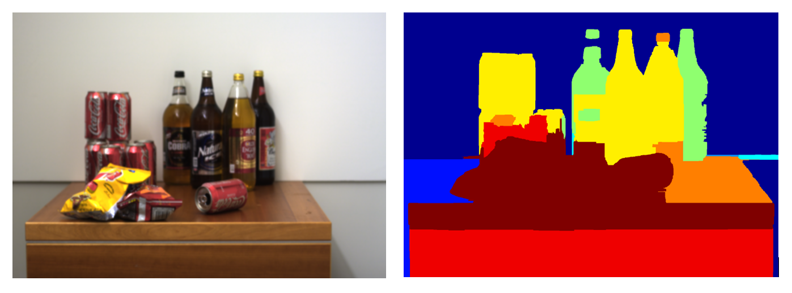
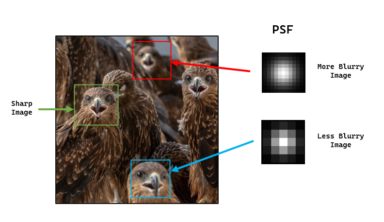
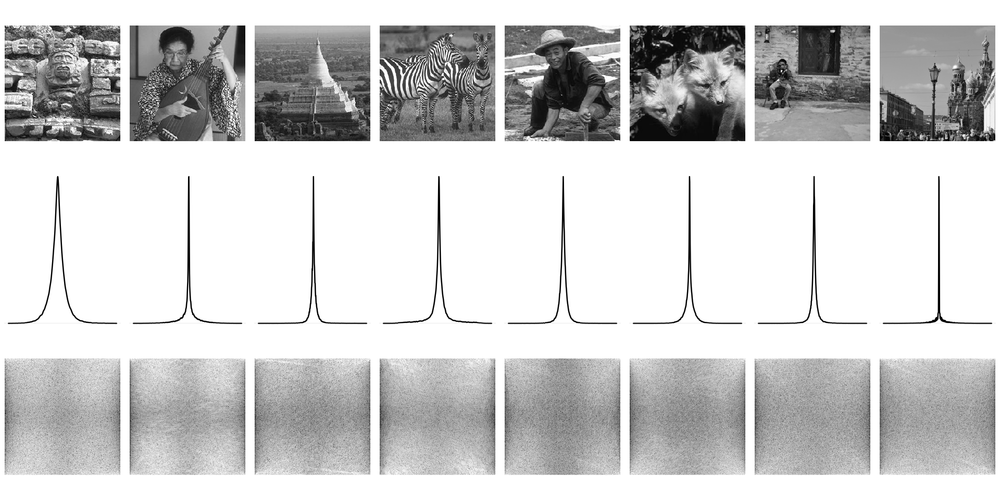
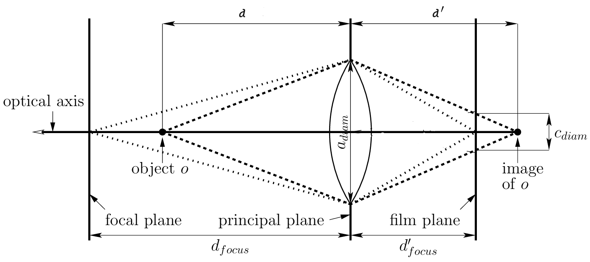
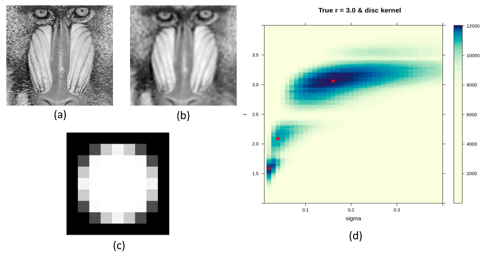
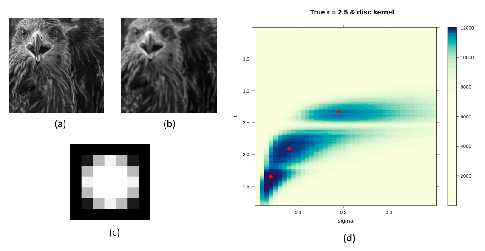
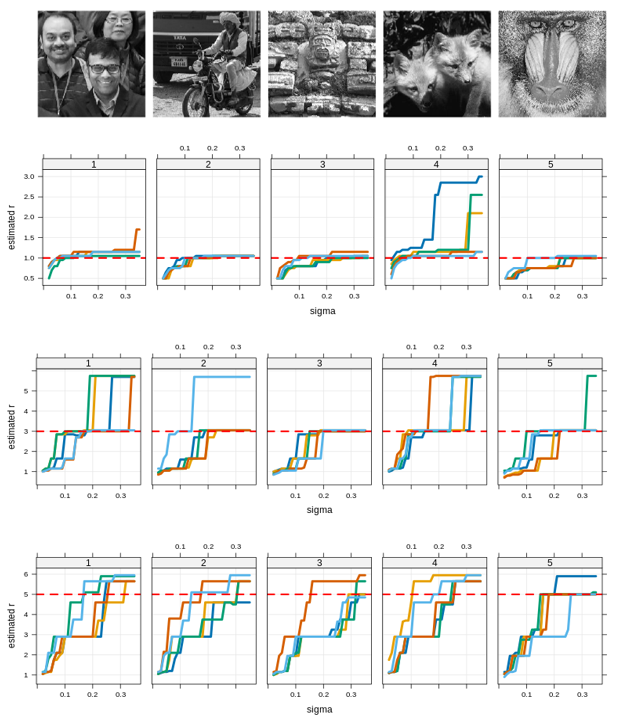
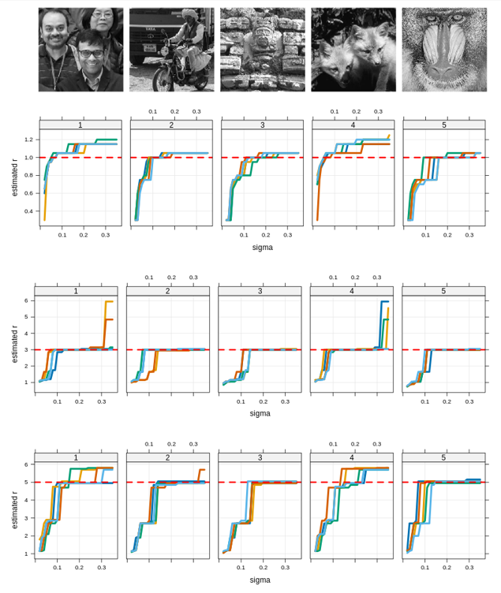
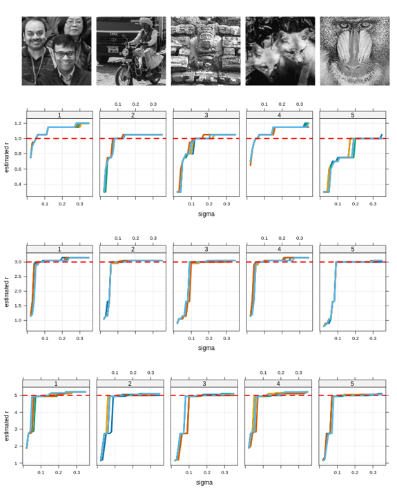

```{r setup, include=FALSE}
knitr::opts_chunk$set(echo = TRUE)
```

\begin{abstract} 
\small{Estimating depth map from a single photograph is an intriguing problem with many interesting practical applications. Levin et al. \cite{levin2007image} proposed a method which requires a modified camera with a specialized coded aperture. However, this approach is not applicable in practice since it requires modifying the camera before capturing the image, which may not always be feasible. We aim to explore whether similar tasks can be done using standard cameras. We have formulated simple parametric models for depth blurring, which we hope will lead to more efficient estimates.}\\
 \small{ \textbf{Keywords:} Auto Regressive Prior, Blur Kernel, Depth Map, Image Segmentation }
\end{abstract}

# Introduction

Traditional photographs are two dimensional projections of a three dimensional scene. The third dimension is _depth_, which represents the distance between camera lens and objects in the image. Depth perception is crucial for understanding spatial relationships, with various applications in computer vision tasks. Additionally, photography and cinematography benefit from depth perception, aiding in the creation of visually compelling compositions. 

Most methods to estimate depth involve analyzing multiple images of the same scene to measure pixel sharpness across the stack and determine depth based on the distance from the sharpest pixel [@gross1987]. Hardware-based solutions are also available, usually involving extra apparatus such as light emitters.

Depth estimation based on single image is a more challenging problem because we have single observation for each pixel of the scene. Depth estimation from defocus blur exploits the phenomenon where objects appear more blurred depending on their distance from the camera lens, serving as a depth surrogate.  @levin2007image utilized this idea with a *sparse gradient prior* on natural images to estimate the *level of blur* per pixel. However, this method requires a modified camera with a special coded aperture. @zhu2013 employed Gabor filters for local frequency component analysis and utilized a *simple gradient prior*, without the need for a special coded aperture. After estimating depth for each pixel, an energy minimization technique based on Markov Random Field over the image is used to generate a smooth depth map.

In this project, we will explore whether a somewhat different approach can be used for the same problem. Instead of using a MRF approach for depth segmentation, we plan to start with modern high-performance segmentation algorithms such as Segment Anything [@sam2023]. Our hope is that if blurring is uniform within each segmented portion, it will be easier to estimate the blur kernel without a special coded aperture. We follow the approach developed by @nandy2021dependent to estimate the blur kernel, using in particular the locally dependent gradient prior proposed by them. However, instead of their nonparametric approach, we formulate and use simple parametric models for depth blurring, which we hope will lead to more efficient estimates for smaller image segments.


```{r,warning=FALSE,echo=FALSE,out.width='85%',out.height = '95%',fig.align='center',echo=FALSE,fig.cap = "Example of Depth Map from \\cite{levin2007image}. Original image (Left panel) and corresponding Depth map (right panel)"}


```

# Mathematical Formulation

When light rays spread from a single point source and hit the camera lens, they should ideally get refracted and converge on the pixel corresponding to the original scene. However, if the source is out of focus, the refracted rays spread out over neighboring pixels as well. This spreading pattern, determined by the object's distance from the lens or camera movement, is called the *Point Spread Function* (PSF) or *Blur Kernel*. The blurred image can be viewed as the result of convolving the original sharp image using the PSF. If we assume that the scene remains static for the duration of the photograph and there is no significant camera shake or rotation, then the observed blurred image $\boldsymbol{b}$ of dimension $M \times N$ can be modeled as:

\begin{equation}
  \label{eq:2.1}
  \boldsymbol{b} = \boldsymbol{k} \ \otimes \ \boldsymbol{l} \ + \ \boldsymbol{\epsilon}
\end{equation}

Where $\boldsymbol{k}$ is an $m \times n$ blur kernel, $\boldsymbol{l}$ is the $(M + m) \times (N + n)$ *true latent image* which we want to estimate, $\boldsymbol{\epsilon}$ is an $M \times N$ matrix of noise, and $\otimes$ denotes the *convolution* operator (By *convolution* we mean *valid* convolution). Reconstructing the latent image from an observed blurred image is called the **image deconvolution problem**. Depending on whether the blur kernel is known or unknown, we classify it as *non-blind deconvolution* or *blind deconvolution* problem. In either case, it is an ill-posed problem because the number of parameters is larger than the number of observations $MN$. One solution to this is to assume a prior for the latent image $\boldsymbol{l}$.

```{r svar,warning=FALSE,echo=FALSE,out.width='70%',out.height = '60%',fig.align='center',echo=FALSE,fig.cap = "Example of Spatially Varying Blur: Each patch exhibits a distinct level of blur."}


```

Note that, the model defined above assumes that the associated PSF is *shift invariant*, meaning the same PSF applies to all pixels of the underlying latent image. However, this may not be the case (Figure \ref{fig:svar}). In the context of depth from defocus blur, the PSF function is *not* shift invariant i.e. it is *spatially varying*. Therefore, (\ref{eq:2.1}) will not hold. We redefine it as:

\begin{equation}
  \label{eq:2.2}
  \boldsymbol{b[t]} = (\boldsymbol{k_t} \ \otimes \ \boldsymbol{l})\boldsymbol{[t]} \ + \ \boldsymbol{\epsilon[t]}
\end{equation}

Where $[t]$ indicates the corresponding elements at pixel location $\boldsymbol{t}$ and $\boldsymbol{k_t}$ is the spatially varying blur kernel at pixel location $\boldsymbol{t}$. Now, the problem of estimating blur kernel and latent image becomes more ill-posed because for each pixel, we need to estimate a blur kernel. However, if the blurring is only due to the objects being away from the plane of focus, we can assume special structures of the associated blur kernels. We model the blur kernel $\boldsymbol{k_t}$ as some probability density over a square grid. For each pixel location $\boldsymbol{t}$, we characterize the blur kernel by the parameter $\boldsymbol{\theta_t}$ that determines the *scale* or *spread* of the associated probability distribution (e.g. scale parameters in bivariate normal distribution). This parameter $\boldsymbol{\theta_t}$ encompasses information regarding the level of blur, hence providing insight into depth. Our objective is to estimate this parameter $\boldsymbol{\theta_t}$ based on the observed blurred image $\boldsymbol{b}$ for each pixel location $\boldsymbol{t}$. 

```{r plot_1,warning=FALSE,echo=FALSE,out.width='90%',out.height='80%',fig.align='center',echo=FALSE,fig.cap = "Eight sharp images (top row) and their density plot of horizontal gradients (middle row) and plot of log modulus DFT coefficients of horizontal gradients (bottom row). Similar observations are found for vertical gradients as well."}

```

# Priors on Natural Images

## Choice of Prior and Basic Ideas 

The prior family used for the latent *natural image*^[By *natural*, we refer to typical scenes captured in amateur digital photography, excluding specialized contexts like astronomy or satellite imaging.] is motivated by the observation that when a gradient filter is applied to image, the distribution of the output has a consistent and distinctive form across a wide range of scene types, with the distribution sharply peaked at zero and relatively heavier tails than the Gaussian distribution and Laplace distribution (Figure \ref{fig:plot_1}). Priors with these features are often referred to as *sparse priors* and a useful parametric family to model this is the so called **Hyper-Laplacian Distribution** given by 

\begin{equation}
 \label{eq:3.1}
 f_{\alpha}(z) = \frac{\alpha}{2\Gamma(\frac{1}{\alpha})}\text{exp}{(-|z|^{\alpha})}, z \in \mathbb{R} \ \ \text{and} \ \ \alpha > 0
\end{equation}

For $\alpha = 2$ we have Gaussian distribution and for $\alpha = 1$ we have Laplace distribution. @levin2007image used $\alpha = 0.8$, while @zhu2013 utilized $\alpha = 2$, assuming IID gradients. @nandy2021dependent showed that the assumption of independent image gradients is incorrect, and modeled the dependency structure of gradients using a simple first-order AR Model.

To apply these priors, we must express the blur model in terms of image gradients, specifically in frequency domain. We will do this for (\ref{eq:2.1}). If $\boldsymbol{\delta_h} = [-1,1]$ and $\boldsymbol{\delta_v} = [-1,1]^T$, then the horizontal and vertical gradients are given by
\begin{equation}
  \label{eq:3.3}
  \boldsymbol{\delta_h}\otimes\boldsymbol{b} = \boldsymbol{\delta_h} \otimes(\boldsymbol{k} \ \otimes \ \boldsymbol{l}) \ + \ (\boldsymbol{\delta_h}\otimes \boldsymbol{\epsilon}) =  k \otimes(\boldsymbol{\delta_h} \ \otimes \ \boldsymbol{l}) \ + \ (\boldsymbol{\delta_h}\otimes \boldsymbol{\epsilon})
\end{equation}  

\begin{equation}
  \label{eq:3.4}
  \boldsymbol{\delta_v}\otimes\boldsymbol{b} = \boldsymbol{\delta_v} \otimes(\boldsymbol{k} \ \otimes \ \boldsymbol{l}) \ + \ (\boldsymbol{\delta_v}\otimes \boldsymbol{\epsilon}) =  k \otimes(\boldsymbol{\delta_v} \ \otimes \ \boldsymbol{l}) \ + \ (\boldsymbol{\delta_v}\otimes \boldsymbol{\epsilon})
\end{equation}

To keep the notations simple, we will henceforth take the model by combining (\ref{eq:3.3}) and (\ref{eq:3.4})

\begin{equation}
 \label{eq:3.5}
 \boldsymbol{y} = \boldsymbol{k} \ \otimes \ \boldsymbol{x} \ + \ \boldsymbol{n}
\end{equation} 

Where, $\boldsymbol{y}$ is the horizontal (or, vertical) gradient of observed blurred image. $\boldsymbol{x}$ and $\boldsymbol{n}$ is the same for latent image and noise. By virtue of the *Convolution Theorem*, we rewrite (\ref{eq:3.5}) in the frequency domain as

\begin{equation}
  \label{eq:3.6}
  \boldsymbol{Y} = \boldsymbol{K} \odot \boldsymbol{X} + \boldsymbol{N}
\end{equation}

Where, $\boldsymbol{Y,K,X}$ and $\boldsymbol{N}$ are the *Discrete Fourier Transform*'s of $\boldsymbol{y,k,x}$ and $\boldsymbol{n}$ respectively. $\odot$ indicates the *element wise product* operator. $\forall \ \boldsymbol{\omega} = (\omega_1,\omega_2)$ we have

\begin{equation}
  \label{eq:3.7}
  \boldsymbol{Y_{\omega} = K_{\omega}X_{\omega} + N_{\omega}}
\end{equation}

\textbf{Remark:} In practice the size of the blur kernel $\boldsymbol{k}$ is much smaller compared to the latent image $\boldsymbol{l}$ and $\boldsymbol{x}$. But for (\ref{eq:3.6}), the size of $\boldsymbol{K}$ must be the same as the size of $\boldsymbol{X}$. Thus, we pad $\boldsymbol{k}$ symmetrically with zeros to make of same size as $\boldsymbol{x}$ and then take DFT.


## Prior on Fourier coefficients

If the elements of $\boldsymbol{x}$ are zero mean IID random variables with pdf (\ref{eq:3.1}). Then by orthogonality of DFT, $\boldsymbol{X_{\omega}}$'s must be IID complex normal when $\alpha = 2$ and uncorrelated and asymptotically complex normal when $\alpha \neq 2$ by CLT of @peligrad2010. When elements of $\boldsymbol{x}$ are correlated, $\boldsymbol{X_{\omega}}$'s are still asymptotically independent and complex normal; however, depending on the correlation structure, the variance is no longer constant and depends on the specific frequency ${\omega}$. We will use either the IID prior, or the simple AR prior of @nandy2021dependent, for which $Var(\boldsymbol{X_{\omega}}) = g_{\omega}\sigma^2$ with the form of $g_{\omega}$ known explicitly.

For spatially varying blur, it is not immediately clear how we can express (\ref{eq:2.2}) in terms of image gradients. We need to assume that the blur kernel $\boldsymbol{k_t}$ is shift invariant in a neighborhood ${\boldsymbol{\eta_t}}$ of size $p_1(\boldsymbol{t}) \times p_2(\boldsymbol{t})$ containing $\boldsymbol{t}$. Then we get equation (\ref{eq:3.9}) as model for blur. This assumption is more or less true, because we expect objects in small local patches to have same depth and hence same level of blur (Figure \ref{fig:svar}). We apply the priors discussed above to these specific patches of the image.

\begin{equation}
 \label{eq:3.9}
 \boldsymbol{y[t']} = (\boldsymbol{k_t} \ \otimes \ \boldsymbol{x})\boldsymbol{[t']} \ + \ \boldsymbol{n[t']} \ \ \ \forall \boldsymbol{t'} \in \boldsymbol{\eta_t}
\end{equation}

# Parametric Models for Blur Kernel

From a single point source, light rays emit in different directions and fall on the lens of camera. The diffracted rays by the lens then form a circular shape on the camera sensor plane, which is called the *Circle of Confusion* or *Blur Circle* (Fig \ref{fig:plot_4}). The diameter of the blur circle ($c_{diam}$) and the depth of an object ($d$) in a given camera setting are related as given in [@barsky2003]:

\begin{equation}
 \label{eq:4.1}
 c_{diam} = a_{diam}f \left|\frac{d - d_{focus}}{d(d_{focus} - f)}\right| \approx a_{diam}f \left|\frac{1}{d_{focus}} - \frac{1}{d}\right|
\end{equation}

In a given camera setting (i.e., fixed $a_{diam}$ and $f$)^[For most cameras, $d_{focus} >> f$, hence the approximation.], $c_{diam} \propto \left|\frac{1}{d_{focus}} - \frac{1}{d}\right|$. As we move away from the plane of focus on either side, we encounter a similar type of $c_{diam}$. Thus, from the diameter of the blur circle, it is challenging to accurately estimate the depth $d$ of an object in an image. Because for each value of $c_{diam}$, two possible values of $d$ exist. It is evident from (\ref{eq:4.1}) that, the support of PSF in our case must be circular rather than square. Due to *diffraction* caused by the camera lens and the boundaries of the circular aperture, we expect the intensity distribution of light to be spherical symmetrically distributed over the circular support. Keeping all these in mind we propose the following models for blur kernel.

```{r plot_4,warning=FALSE,echo=FALSE,out.width='70%',out.height= '30%',fig.align='center',echo=FALSE,fig.cap="Thin Lens Model of Camera and Circle of Confusion $c_{diam}$ in a given camera setting"}


```


\textbf{1. Disc Kernel:} It is the simplest model for blur kernel. The assumption being that uniform spread of light over disc. We characterize the kernel using the parameter $r$. 

$$k(x,y) = \frac{1}{\pi r^2} \times \text{I}_{\{x^2 + y^2 \ \leq \ r^2\}}$$

\textbf{2. Circular Gaussian Kernel:} An obvious choice of kernel in any scientific study is the the widely used Gaussian/Normal distribution. Here, we will consider a truncated version of it over circular region. We characterize the kernel using the radius of circle $r$ and scale parameter $h$.

$$k(x,y) = \frac{C_{h,r}}{2\pi h^2} e^{-\frac{x^2 + y^2}{2h^2}} \times \text{I}_{\{x^2 + y^2 \ \leq \ r^2\}}$$

\textbf{3. Circular Cauchy Kernel:}  We know that the intercept on the x-axis of a beam of light coming from the point $(0,h)$ under certain assumption is distributed as a Cauchy$(0,h)$ distribution. Extending this concept to the two-dimensional case, we have a bivariate Cauchy distribution over a circular support. We characterize this using the radius of the circle r and the scale parameter $h$.

  $$k(x,y) = \frac{C_{h,r}}{2\pi}\frac{h}{(x^2 + y^2 + h^2)^{3/2}}\times \text{I}_{\{x^2 + y^2 \ \leq \ r^2\}}$$

\textbf{4. Rectangular Gaussian Kernel:}  We can also consider a truncated Gaussian kernel defined over a finite square grid $S_h$, characterized by $h$. In this scenario, we have only one parameter $h$.
      $$k(x,y) = \frac{C_{h}}{2\pi h^2} e^{-\frac{x^2 + y^2}{2h^2}}\text{I}_{\{ (x,y) \in S_h\}}$$

\textbf{Remark:} The parameter $r$ in both the Circular Gaussian and Circular Cauchy kernel characterizes the radius of the blur circle (i.e., $c_{diam}/2$). For a given camera setting, there exists a relation between $h$ and $r$, namely $h = \kappa \times r$ with $\kappa$ depending upon particular camera. This implies that we cannot change $h$ and $r$ independently.

# Maximum Likelihood Estimation of Blur Kernel Parameters

Our main focus in this section is to develop *Maximum Likelihood Estimation* procedure for the parameter $\boldsymbol{\theta_t}$ of blur kernel for each pixel location $\boldsymbol{t}$. For the first three kernels $\boldsymbol{\theta_t} = (r_t,h_t)$, and for the Gaussian kernel $\boldsymbol{\theta_t} = h_t$. We need to estimate these parameters based on the observed image $\boldsymbol{b}$ or equivalently $\boldsymbol{y}$. For that we need joint distribution of elements of $\boldsymbol{y}$. 

As our priors for $\boldsymbol{x}$ are defined in terms of Fourier coefficients, we move to the frequency domain. In the case of generalized prior we have $\boldsymbol{X_{\omega}} \sim \mathcal{CN}(0,\sigma^2 g_{\omega}) \ \ \forall \boldsymbol{\omega}$ independently. In addition, if the errors in the original image, given by $\boldsymbol{\epsilon}$, are assumed to be IID Gaussian, then its gradient $\boldsymbol{n}$ will have correlated elements and successive elements in the direction of the gradient will have correlation 0.5, while all other pairs will be uncorrelated. This will induce a non-constant variance for $\boldsymbol{N_{\omega}}$, given by a function $h_{\omega}$ such that $Var(\boldsymbol{N_{\omega}}) = \eta^2 h_{\omega}$. Hence, $\boldsymbol{N_{\omega}} \sim \mathcal{CN}(0,\eta^2 h_{\omega})$ independently. An explicit expression for $h_{\omega}$ can be found similarly to that of $g_{\omega}$.

From (\ref{eq:3.7}) we have, $\boldsymbol{Y_{\omega}} \sim \mathcal{CN}(0,\sigma^2|K_\omega|^2 g_{\omega} + \eta^2 h_{\omega}) \ \ \boldsymbol{\forall \omega}$. For a given choice of model for blur kernel, we estimate parameters $\boldsymbol{\theta}$ based on $\boldsymbol{Y_{\omega}}$'s using maximum likelihood principle. For ease of calculation we have used likelihood of $|\boldsymbol{Y_{\omega}}|^2$'s.

\textbf{Result:} \textit{If $Z \sim \mathcal{CN}(0,\sigma^2)$. We know that $\text{Re}(Z)$ and $\text{Im}(Z)$ follows $\mathcal{N}(0,\frac{\sigma^2}{2})$ independently. Then, $|Z|^2  = \text{Re}^2(Z) + \text{Im}^2(Z) \sim \frac{\sigma^2}{2}\chi^2_2 \equiv \text{Exp}(\lambda = \frac{1}{\sigma^2})$.}

Using last result, $\boldsymbol{|Y_\omega|^2} \sim \text{Exp}(\lambda_\omega = \frac{1}{\sigma^2|K_\omega|^2 g_{\omega} + \eta^2 h_{\omega}})$ $\boldsymbol{\forall \omega}$ independently. If $f_{\theta,\omega}(.)$ denotes the pdf of $\text{Exp}(\lambda_\omega = \frac{1}{\sigma^2|K_\omega|^2 g_{\omega} + \eta^2 h_{\omega}})$ for given parameters $\boldsymbol{\theta}$ (say,) of blur kernel model. Then, likelihood of $\boldsymbol{|Y_\omega|^2}$ is given by - 

\begin{equation}
 \label{eq:5.1}
 f_{\theta}(|Y_{\omega}|^2,\forall \omega) = \prod_{\omega} f_{\theta,\omega}(|Y_{\omega}|^2)
\end{equation} 

The above considerations are only for gradients in a particular direction, i.e., *horizontal* or *vertical*. To incorporate both directions in the estimation procedure, we assume for simplicity that they are independent. The joint likelihood is then given by 
\begin{equation}
 \label{eq:5.2}
 L(\boldsymbol{\theta}) = L_h(\boldsymbol{\theta})\times L_v(\boldsymbol{\theta}) = f_{\theta}(|Y_{h,\omega}|^2,\forall \omega) \times f_{\theta}(|Y_{v,\omega'}|^2,\forall \omega')
\end{equation} 

Our goal is to find the $\boldsymbol{\theta}$ maximizing $L(\boldsymbol{\theta})$, or equivalently $\log L(\boldsymbol{\theta}) = \log L_h(\boldsymbol{\theta}) + \log L_v(\boldsymbol{\theta})$. We do this by numerically optimizing the objective (log-likelhood) function. For the spatially varying case, we can simply apply this procedure to local patches $\boldsymbol{\eta_t}$ for all pixel locations $\boldsymbol{t}$ in the image domain, or to segments identified by segmentation algorithms.

# Choice of Tuning Parameters in ML Estimation


The log-likelihood, defined in (\ref{eq:5.2}), is a complicated function of the blur kernel parameter $\boldsymbol{\theta}$. This parameter is involved in the expression $\lambda_{\omega}$ through $|K_{\omega}|^2$, which itself is a complicated function of $\boldsymbol{\theta}$. Therefore, before we start using any optimization method to find the maximizer of the log-likelihood, we should investigate the behavior of $L(\boldsymbol{\theta})$ as a function of $\boldsymbol{\theta}$. For this, we conducted simulated experiments as shown in Figure \ref{fig:plot6}. For now, we will focus on the disc kernel. We considered a sequence of values for $r$ ranging from 1 to 4 with a step size of $\Delta{r} = 0.05$, and for $\sigma$ ranging from 0.01 to 0.4 with a step size of $\Delta{\sigma} = 0.01$, while keeping $\eta = 0.001$ constant.


```{r plot6,warning=FALSE,echo=FALSE,out.width='93%',out.height= '55%',fig.align='center',echo=FALSE,fig.cap = "(a) 101 $\\times$ 101 Sharp Image, (b) Blurred Image Using disc kernel with $r = 3$, (c) Disc Kernel with $r = 3$, (d) Levelplot of log likelihood as a function of $\\sigma$ and $r$"}


```

In Figure \ref{fig:plot6}, (a) shows the original sharp image of size $101 \times 101$. We use a disc kernel with $r_{\text{true}} = 3$ to simulate defocus blur as shown in (b). The log likelihood is plotted as a function of $r$ and $\sigma$ in (d). Three local maxima points are visible in the plot, indicated by red dots. The global maximum is located near $r = 3$, with the corresponding value of $\sigma$ around 0.17. Maximizing the log likelihood over a grid of values of $(r,\sigma)$ gives a correct estimate of $r$ in this case. However, it is not guaranteed that the global maximum always indicates the true parameter $r$. Figure \ref{fig:plot7} shows another example, where we implement the same simulation with $r_{\text{true}} = 2.5$. But this time the global maximum is attained at $r = 1.65$ with corresponding $\sigma = 0.04$, which is different from the true parameter value. In this case, we have three local maxima, with one near the true parameter value and corresponding $\sigma$ near 0.2.

Simply looking for global maxima is not the solution. Choice of the prior parameter $\sigma$ significantly affects the performance of ML Estimation. In the Bayesian Paradigm, this is quite common. If we can choose $\sigma$ such that the maximizer of the log-likelihood for that given $\sigma$ closely matches the true parameter, then we are done. To find a reasonable value of $\sigma$ we use simulation. We consider five sharp images of size $255 \times 255$ and true parameter values $r_{true} = 1, 3, 5$ to simulate defocus blur. For each $r_{true}$ value and fixed patch size, we randomly select five patches from each image and plot the estimated $r$ as a function of $\sigma$ for each random patch. We have considered patch sizes $51 \times 51$, $101 \times 101$, and $201 \times 201$.

```{r plot7,warning=FALSE,echo=FALSE,out.width='93%',out.height= '45%',fig.align='center',echo=FALSE,fig.cap = "(a) 101 $\\times$ 101 Sharp Image, (b) Blurred Image Using disc kernel with $r = 2.5$, (c) Disc Kernel with $r = 2.5$, (d) Levelplot of log likelihood as a function of $\\sigma$ and $r$"}


```

From Figure \ref{fig:plot8}, \ref{fig:plot9} and \ref{fig:plot10}, we observe that as patch size increases, the estimated $r$ becomes more stable as a function of $\sigma$. Most importantly for $\sigma = 0.2$, the estimated $r$ closely matches with the true value $r_{true}$ across all cases, indicating that $\sigma = 0.2$ is a suitable choice for the prior parameter. This observation is consistent with Figures \ref{fig:plot6} and \ref{fig:plot7}. It is also clear that the maximum likelihood estimation does not perform well for small patch sizes as expected. Because we have less number of pixels for small patch sizes.

```{r plot8,warning=FALSE,echo=FALSE,out.width='100%',out.height= '95%',fig.align='center',echo=FALSE,fig.cap = "$51 \\times 51$ Patch and Disc Kernel: Top row indicates the sharp images used for simulation and  second, third and bottom row corresponds to $r_{true}$ = 1,3,5 respectively."}


```

```{r plot9,warning=FALSE,echo=FALSE,out.width='100%',out.height= '95%',fig.align='center',echo=FALSE,fig.cap = "$101 \\times 101$ Patch and Disc Kernel: Top row indicates the sharp images used for simulation and  second, third and bottom row corresponds to $r_{true}$ = 1,3,5 respectively."}


```

```{r plot10,warning=FALSE,echo=FALSE,out.width='100%',out.height= '90%',fig.align='center',echo=FALSE,fig.cap = "$201 \\times 201$ Patch and Disc Kernel: Top row indicates the sharp images used for simulation and  second, third and bottom row corresponds to $r_{true}$ = 1,3,5 respectively."}


```

# Considerations in Estimation of Sptially Varying Blur

We have developed a procedure for estimating blur kernel parameters for images with uniform blur. However, real-world images often exhibit spatially varying blur, where the level of blur varies from pixel to pixel. To address this, one reasonable assumption is that the level of blur remains locally constant within a small patch around each pixel. By applying our estimation procedure to each local patch, we can obtain the blur level for each pixel, as described in Equation (\ref{eq:3.9}). This results in an estimated blur map for the image. However, the generated blur map may not be entirely smooth, as illustrated in **Figure**. We conducted a simple experiment using spatially varying blur with a disc kernel on a $255\times255$ image. Both the original and estimated blur maps are shown. We used local patches of size $51\times 51$ for estimation. It is evident that the estimated blur map closely resembles the original blur map, with a high **PSNR value**.

The estimated blur map is clearly not smooth, particularly for transition regions between two blur levels. To obtain a smoother blur map, we need to employ *Markov Random Field Smoothing*. The idea is to solve a penalized problem, penalizing the difference between blur levels on neighboring pixels. An adaptive weighting, primarily based on RGB distance between pixels, is used in literature to obtain a smoothed blur map. But, this entire procedure is time-consuming and fails in situations where a local patch contains pixels with very different depth values.

The assumption of locally constant level of blur is not always valid. In real images, level of blur tends to remain constant for different objects within the image, as it is the objects themselves that vary in distance from the camera, not the individual pixels. **Figure** provides an example illustrating this phenomenon, where different birds in the image exhibit varying levels of blur.

Therefore, instead of attempting to estimate the blur level for each pixel, a more effective approach would be to estimate the blur level for each distinct object in the image. By segmenting the image into meaningful objects, such as birds in this example, and estimating the blur level for each segment, we can generate a more accurate blur map easily. This leads to the idea of *Segment Anything*.

# Segment Anything

Segment Anything

* What is SAM
* Guided SAM and Automatic SAM
* Choice of tuning parameters in SAM
* Initial Image Processing tasks
* Example

# Challenges in ML Estimation

Estimating the blur map requires applying the maximum likelihood procedure to image segments identified by SAM. But it is not that straight forward. Because the maximum likelihood procedure is defined for rectangular matrices. But the image segments are of irregular shape. As a result we need to fill/pad the segments with zeros to make it a rectangular matrix. Although it seems very obvious to do, but it actually deteriorates the estimation quality of blur kernel parameters. The issue arises because the discrete Fourier transform (DFT) distributes frequency content across all spatial locations. Consequently, even though zeros are introduced in the spatial domain through padding, they do not equate to zeros in the frequency domain. Thus, the zero padded/filled regions contribute to the likelihood calculation, often biasing the estimation towards selecting smaller values of the radius i.e. $r$. To address the issue of zero padding, we have attempted several approaches. Below, we have listed them:

1. Instead of utilizing segments identified by SAM, an alternative approach involves using bounding boxes corresponding to these segments for blur estimation. However, bounding boxes may encompass objects with vastly different depths, leading to significantly varied blur levels within the same box. In such scenarios, we've observed that the sub-area of the box with the least level of blur tends to dominate the Fourier spectrum. Consequently, if a blurred object's bounding box includes a sharp object, the estimated radius ($r$) will likely be small.

2. Another strategy is to decompose irregularly shaped segments into smaller, regular shapes and apply the estimation procedure to these subregions. However, this approach is challenging to implement due to the highly irregular nature of segments.

3. To mitigate the contribution of zero-padded regions in the estimation procedure, one approach could involve downweighting their influence. Treating the zero-padded/filled parts as outliers with respect to other regions and employing robust estimation procedures might seem intuitive. However, this approach is not viable because, in terms of the distribution of image gradients, zero values are more prevalent.

4. Instead of working in frequency domain we can work in spatial domain. By expressing (\ref{eq:3.5}) as $\text{Vec}(\boldsymbol{y}) = \boldsymbol{A_k} \text{Vec}(\boldsymbol{x}) + \text{Vec}(\boldsymbol{n})$, we can formulate the maximum likelihood procedure as previously done in the frequency domain. However, this approach necessitates the calculation of the inverse of an $MN \times MN$ matrix multiple times, making it computationally infeasible.


# Decorrelation Loss Function


# Simulated Experiments

Simulated experiment

patch by patch

# Application on Real Images

Images and Depth map

# Discussion

Advantages, Limitations

# Future Work

# Acknowledgment

# References


