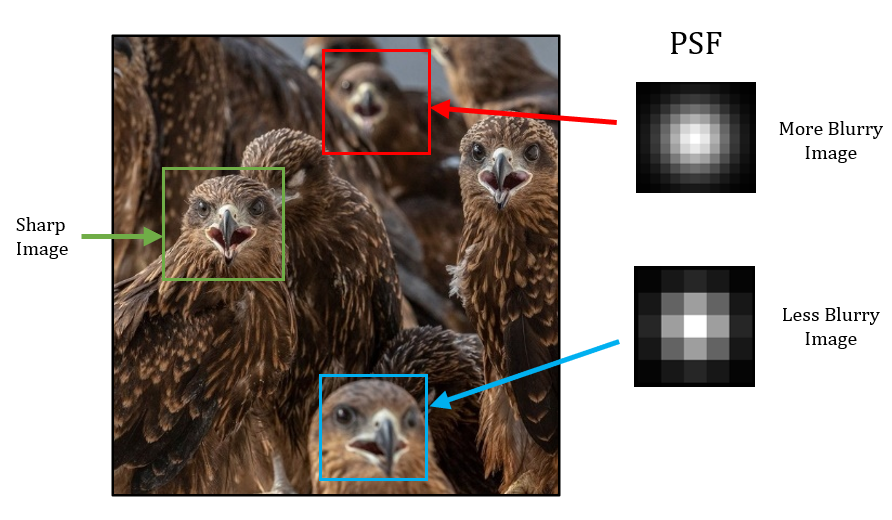

```{r setup, include=FALSE}
knitr::opts_chunk$set(echo = TRUE)
```

\begin{abstract} 
\small{Estimating depth map from a single photograph is an intriguing problem with many applications. Levin et al.'s proposed a method which requires a modified camera with special coded aperture. We aim to explore whether similar tasks can be done using standard cameras. We have formulated simple parametric models for depth blurring, which we hope will lead to more efficient estimates.}\\
 \small{ \textbf{Keywords:} Auto Regressive Prior, Blur Kernel, Depth Map, Image Segmentation }
\end{abstract}

# Introduction

Traditional photographs are two dimensional projections of a three dimensional scene. The third dimension is _depth_, which represents the distance between camera lens and objects in the image. Depth perception is crucial for understanding spatial relationships, with various applications in computer vision tasks. Additionally, photography and cinematography benefit from depth perception, aiding in the creation of visually compelling compositions. 

Most methods to estimate depth involve analyzing multiple images of the same scene to measure pixel sharpness across the stack and determine depth based on the distance from the sharpest pixel [1]. Hardware-based solutions are also available, usually involving extra apparatus such as light emitters.

Depth estimation based on single image is a more challenging problem because we have a single observation for each pixel of the scene. Depth estimation from defocus blur exploits the phenomenon where objects appear more blurred depending on their distance from the camera lens, serving as a depth surrogate.  @levin2007image utilized this idea with a *sparse gradient prior* on natural images to estimate the *level of blur* per pixel. However, this method requires a modified camera with a special coded aperture. Zhu et al \textbf{[3]} employed Gabor filters for local frequency component analysis and utilized a *simple gradient prior*, without the need for a special coded aperture. [FIXME: Add a sentence about using Markov Random Field for segmentation.]

In this project, we will explore whether a somewhat different approach can be used for the same problem. Instead of using a MRF approach for depth segmentation, we plan to start with modern high-performance segmentation algorithms such as Segment Anything \textbf{[6]}. Our hope is that if blurring is uniform within each segmented portion, it will be easier to estimate the blur kernel without a special coded aperture. We follow the approach developed by @nandy2021dependent to estimate the blur kernel, using in particular the locally dependent gradient prior proposed by them. However, instead of their nonparametric approach, we formulate and use simple parametric models for depth blurring, which we hope will lead to more efficient estimates for smaller image segments.


```{r,warning=FALSE,echo=FALSE,out.width='80%',out.height = '90%',fig.align='center',echo=FALSE,fig.cap = "Example of Depth Map from Levin et al.\\textbf{[2]}. Original image (Left panel) and corresponding Depth map (right panel)"}


```

# Mathematical Formulation

When light rays spread from a single point source and hit the camera lens, they should ideally get refracted and converge on the pixel corresponding to the original scene. However, if the source is out of focus, the refracted rays spread out over neighboring pixels as well. This spreading pattern, determined by the object's distance from the lens or camera movement, is called the *Point Spread Function* (PSF) or *Blur Kernel*. The blurred image can be viewed as the result of convolving the original sharp image using the PSF. If we assume that the scene remains static for the duration of the photograph and there is no significant camera shake or rotation, then the observed blurred image $\boldsymbol{b}$ of dimension $M \times N$ can be modeled as:

\begin{equation}
  \label{eq:2.1}
  \boldsymbol{b} = \boldsymbol{k} \ \otimes \ \boldsymbol{l} \ + \ \boldsymbol{\epsilon}
\end{equation}

Where $\boldsymbol{k}$ is an $m \times n$ blur kernel, $\boldsymbol{l}$ is the $(M + m) \times (N + n)$ *true latent image* which we want to estimate, $\boldsymbol{\epsilon}$ is an $M \times N$ matrix of noise, and $\otimes$ denotes the *convolution* operator (By *convolution* we mean *valid* convolution). Reconstructing the latent image from an observed blurred image is called the **image deconvolution problem**. Depending on whether the blur kernel is known or unknown, we classify it as *non-blind deconvolution* or *blind deconvolution* problem. In either case, it is an ill-posed problem because the number of parameters is larger than the number of observations $MN$. One solution to this is to assume a prior for the latent image $\boldsymbol{l}$.

```{r svar,warning=FALSE,echo=FALSE,out.width='80%',out.height = '70%',fig.align='center',echo=FALSE,fig.cap = "Example of Spatially Varying Blur: Each patch exhibits a distinct level of blur."}


```

Note that, the model defined above assumes that the associated PSF is *shift invariant*, meaning the same PSF applies to all pixels of the underlying latent image. However, this may not be the case (Figure \ref{fig:svar}). In the context of depth from defocus blur, the PSF function is *not* shift invariant i.e. it is *spatially varying*. Therefore, (\ref{eq:2.1}) will not hold. We redefine it as:

\begin{equation}
  \label{eq:2.2}
  \boldsymbol{b[t]} = (\boldsymbol{k_t} \ \otimes \ \boldsymbol{l})\boldsymbol{[t]} \ + \ \boldsymbol{\epsilon[t]}
\end{equation}

Where $[t]$ indicates the corresponding elements at pixel location $\boldsymbol{t}$ and $\boldsymbol{k_t}$ is the spatially varying blur kernel at pixel location $\boldsymbol{t}$. Now, the problem of estimating blur kernel and latent image becomes more ill-posed because for each pixel, we need to estimate a blur kernel. However, if the blurring is only due to the objects being away from the plane of focus, we can assume special structures of the associated blur kernels. We model the blur kernel $\boldsymbol{k_t}$ as some probability density over a square grid. For each pixel location $\boldsymbol{t}$, we characterize the blur kernel by the parameter $\boldsymbol{\theta_t}$ that determines the *scale* or *spread* of the associated probability distribution (e.g. scale parameters in bivariate normal distribution). This parameter $\boldsymbol{\theta_t}$ encompasses information regarding the level of blur, hence providing insight into depth. Our objective is to estimate this parameter $\boldsymbol{\theta_t}$ based on the observed blurred image $\boldsymbol{b}$ for each pixel location $\boldsymbol{t}$. 

```{r plot_1,warning=FALSE,echo=FALSE,out.width='90%',out.height='80%',fig.align='center',echo=FALSE,fig.cap = "Eight sharp images (top row) and their density plot of horizontal gradients (middle row) and plot of log modulus DFT coefficients of horizontal gradients (bottom row). Similar observations are found for vertical gradients as well."}

```

# Priors on Natural Images

## Choice of Prior and Basic Ideas 

The prior family used for the latent *natural image*^[By *natural*, we refer to typical scenes captured in amateur digital photography, excluding specialized contexts like astronomy or satellite imaging.] is motivated by the observation that when a gradient filter is applied to image, the distribution of the output has a consistent and distinctive form across a wide range of scene types, with the distribution sharply peaked at zero and relatively heavier tails than the Gaussian distribution and Laplace distribution (Figure \ref{fig:plot_1}). Priors with these features are often referred to as *sparse priors* and a useful parametric family to model this is the so called **Hyper-Laplacian Distribution** given by 

\begin{equation}
 \label{eq:3.1}
 f_{\alpha}(z) = \frac{\alpha}{2\Gamma(\frac{1}{\alpha})}\text{exp}{(-|z|^{\alpha})}, z \in \mathbb{R} \ \ \text{and} \ \ \alpha > 0
\end{equation}

For $\alpha = 2$ we have Gaussian distribution and for $\alpha = 1$ we have Laplace distribution. @levin2007image used $\alpha = 0.8$, while Zhu et al. \textbf{[3]} utilized $\alpha = 2$, assuming IID gradients [FIXME: Zhu et al was gradient?]. @nandy2021dependent show that the assumption of independent image gradients is incorrect, and model the dependency structure of gradients using a simple first-order AR Model.

To use these priors to estimate the blur kernel, we first formulate the prior in the frequency domain. We will do this for (\ref{eq:2.1}). If $\delta_h = [-1,1]$ and $\delta_v = [-1,1]^T$, then the horizontal and vertical gradients are given by
\begin{equation}
  \label{eq:3.3}
  \delta_h\otimes\boldsymbol{b} = \delta_h \otimes(\boldsymbol{k} \ \otimes \ \boldsymbol{l}) \ + \ (\delta_h\otimes \boldsymbol{\epsilon}) =  k \otimes(\delta_h \ \otimes \ \boldsymbol{l}) \ + \ (\delta_h\otimes \boldsymbol{\epsilon})
\end{equation}  

\begin{equation}
  \label{eq:3.4}
  \delta_v\otimes\boldsymbol{b} = \delta_v \otimes(\boldsymbol{k} \ \otimes \ \boldsymbol{l}) \ + \ (\delta_v\otimes \boldsymbol{\epsilon}) =  k \otimes(\delta_v \ \otimes \ \boldsymbol{l}) \ + \ (\delta_v\otimes \boldsymbol{\epsilon})
\end{equation}

To keep the notations simple, we will henceforth take the model by combining (\ref{eq:3.3}) and (\ref{eq:3.4})

\begin{equation}
 \label{eq:3.5}
 \boldsymbol{y} = \boldsymbol{k} \ \otimes \ \boldsymbol{x} \ + \ \boldsymbol{n}
\end{equation} 

Where, $\boldsymbol{y}$ is the horizontal (or, vertical) gradient of observed blurred image. $\boldsymbol{x}$ and $\boldsymbol{n}$ is the same for latent image and noise. By virtue of the *Convolution Theorem*, we rewrite (\ref{eq:3.5}) in the frequency domain as

\begin{equation}
  \label{eq:3.6}
  \boldsymbol{Y} = \boldsymbol{K} \odot \boldsymbol{X} + \boldsymbol{N}
\end{equation}

Where, $\boldsymbol{Y,K,X}$ and $\boldsymbol{N}$ are the *Discrete Fourier Transform*'s of $\boldsymbol{y,k,x}$ and $\boldsymbol{n}$ respectively. $\odot$ indicates the *element wise product* operator. $\forall \ \omega = (\omega_1,\omega_2)$ we have

\begin{equation}
  \label{eq:3.7}
  \boldsymbol{Y_{\omega} = K_{\omega}X_{\omega} + N_{\omega}}
\end{equation}

\textbf{Remark:} In practice the size of the blur kernel $\boldsymbol{k}$ is much smaller compared to the latent image $\boldsymbol{l}$ and $\boldsymbol{x}$. But for (\ref{eq:3.6}), the size of $\boldsymbol{K}$ must be the same as the size of $\boldsymbol{X}$. Thus, we pad $\boldsymbol{k}$ symmetrically with zeros to make of same size as $\boldsymbol{x}$ and then take DFT.


## Prior on Fourier coefficients

If the elements of $\boldsymbol{x}$ are zero mean IID random variables with pdf (\ref{eq:3.1}). Then by orthogonality of DFT, $X_{\omega}$'s must be IID complex normal when $\alpha = 2$ and uncorrelated and asymptotically complex normal when $\alpha \neq 2$ by CLT of Peligrad and Wu \textbf{[8]}. When elements of $\boldsymbol{x}$ are correlated, then $X_{\omega}$'s are still asymptotically independent and complex normal; however,  depending on the correlation structure, the variance is no longer constant and depends on the specific frequency ${\omega}$. We will use either the IID prior, or the simple AR prior of @nandy2021dependent, for which $Var(\boldsymbol{X_{\omega}}) = g_{\omega}\sigma^2$ with the form of $g_{\omega}$ is known explicitly.

For spatially varying blur, it is not immediately clear how we can express (\ref{eq:2.2}) in terms of image gradients. We need to assume that the blur kernel $\boldsymbol{k_t}$ is shift invariant in a neighborhood ${\boldsymbol{\eta_t}}$ of size $p_1(\boldsymbol{t}) \times p_2(\boldsymbol{t})$ containing $\boldsymbol{t}$ (\ref{eq:3.9}). This assumption is more or less true, because we expect objects in small local patches to have same depth and hence same level of blur (Figure \ref{fig:svar}). Then, we apply the prior discussed above to that specific patch of the image.

\begin{equation}
 \label{eq:3.9}
 \boldsymbol{y[t']} = (\boldsymbol{k_t} \ \otimes \ \boldsymbol{x})\boldsymbol{[t']} \ + \ \boldsymbol{n[t']} \ \ \ \forall \boldsymbol{t'} \in \boldsymbol{\eta_t}
\end{equation}

# Parametric Models for Blur Kernel

From a single point source, light rays emit in different directions and fall on the lens of the camera. The diffracted rays by the lens then form a circular shape on the camera sensor plane, which is called the *Circle of Confusion* or *Blur Circle* (Fig \ref{fig:plot_4}). The diameter of the blur circle ($c_{diam}$) and the depth of an object in a given camera setting are related as:

\begin{equation}
 \label{eq:4.1}
 c_{diam} = a_{diam}f \left|\frac{d - d_{focus}}{d(d_{focus} - f)}\right| \approx a_{diam}f \left|\frac{1}{d_{focus}} - \frac{1}{d}\right|
\end{equation}

In a given camera setting (i.e., fixed $a_{diam}$ and $f$)^[For most cameras, $d_{focus} >> f$, hence the approximation.], $c_{diam} \propto \left|\frac{1}{d_{focus}} - \frac{1}{d}\right|$. As we move away from the plane of focus on either side, we encounter a similar type of $c_{diam}$. Thus, from the diameter of the blur circle, it is challenging to accurately estimate the depth $d$ of an object in an image because for each value of $c_{diam}$, two possible values of $d$ exist. It is evident from (\ref{eq:4.1}) that, the support of PSF in our case must be circular rather than square. Due to *diffraction* caused by the camera lens and the boundaries of the circular aperture, we expect the intensity distribution of light to be spherical symmetrically distributed over the circular support. Keeping all these in mind we propose the following models for blur kernel.

```{r plot_4,warning=FALSE,echo=FALSE,out.width='70%',out.height= '30%',fig.align='center',echo=FALSE,fig.cap="Thin Lens Model of Camera and Circle of Confusion $c_{diam}$ in a given camera setting"}


```


\textbf{1. Disc Kernel:} It is the simplest model for blur kernel. The assumption being that uniform spread of light over disc. We characterize the kernel using the parameter $r$. 

$$k(x,y) = \frac{1}{\pi r^2} \times \text{I}_{\{x^2 + y^2 \ \leq \ r^2\}}$$

\textbf{2. Circular Gaussian Kernel:} An obvious choice of kernel in any scientific study is the the widely used Gaussian/Normal distribution. Here, we will consider a truncated version of it over circular region. We characterize the kernel using the radius of circle $r$ and scale parameter $h$.

$$k(x,y) = \frac{C_{h,r}}{2\pi h^2} e^{-\frac{x^2 + y^2}{2h^2}} \times \text{I}_{\{x^2 + y^2 \ \leq \ r^2\}}$$

\textbf{3. Circular Cauchy Kernel:}  We know that the intercept on the x-axis of a beam of light coming from the point $(0,h)$ under certain assumption is distributed as a Cauchy$(0,h)$ distribution. Extending this concept to the two-dimensional case, we have a bivariate Cauchy distribution over a circular support. We characterize this using the radius of the circle r and the scale parameter $h$.

  $$k(x,y) = \frac{C_{h,r}}{2\pi}\frac{h}{(x^2 + y^2 + h^2)^{3/2}}\times \text{I}_{\{x^2 + y^2 \ \leq \ r^2\}}$$

\textbf{4. Rectangular Gaussian Kernel:}  We can also consider a truncated Gaussian kernel defined over a finite square grid $S_h$, characterized by $h$. In this scenario, we have only one parameter $h$.
      $$k(x,y) = \frac{C_{h}}{2\pi h^2} e^{-\frac{x^2 + y^2}{2h^2}}\text{I}_{\{ (x,y) \in S_h\}}$$

\textbf{Remark:} The parameter $r$ in both the Circular Gaussian and Circular Cauchy kernel characterizes the radius of the blur circle (i.e., $c_{diam}/2$). For a given camera setting, there exists a relation between $h$ and $r$, namely $h = \kappa \times c_{diam}$ with $\kappa \in (0,\frac{1}{2}]$, which depends upon particular camera. This implies that we cannot change $h$ and $r$ independently.

# ML Estimation of Blur Kernel Parameters

Our main focus in this section is to develop *Maximum Likelihood Estimation* procedure for the parameter $\boldsymbol{\theta_t}$ of blur kernel for each pixel location $\boldsymbol{t}$. For the first three kernels $\boldsymbol{\theta_t} = (r_t,h_t)$, and for the Gaussian kernel $\boldsymbol{\theta_t} = h_t$. Our objective is to estimate these parameters based on the observed image $\boldsymbol{b}$ or equivalently $\boldsymbol{y}$. For that we need joint distribution of elements of $\boldsymbol{y}$. 

For easier calculations we move to frequency domain. In the case of generalized prior we have $\boldsymbol{X_{\omega}} \sim \mathcal{CN}(0,\sigma^2 g_{\omega}) \ \ \forall \omega$ independently. In addition, if the errors in the original image, given by $\boldsymbol{\epsilon}$, are assumed to be IID Gaussian, then its gradient $\boldsymbol{n}$ will have correlated elements and successive elements in the direction of the gradient will have correlation 0.5, while all other pairs will be uncorrelated. This will induce a non-constant variance for $\boldsymbol{N_{\omega}}$, given by a function $h_{\omega}$ such that $Var(\boldsymbol{N_{\omega}}) = \eta^2 h_{\omega}$. Hence, $\boldsymbol{N_{\omega}} \sim \mathcal{CN}(0,\eta^2 h_{\omega})$ independently. An explicit expression for $h_{\omega}$ can be found similarly to that of $g_{\omega}$.

From (\ref{eq:3.7}) we have, $\boldsymbol{Y_{\omega}} \sim \mathcal{CN}(0,\sigma^2|K_\omega|^2 g_{\omega} + \eta^2 h_{\omega}) \ \ \boldsymbol{\forall \omega}$. For a given choice of model for blur kernel, we estimate parameters $\boldsymbol{\theta}$ based on $\boldsymbol{Y_{\omega}}$'s using maximum likelihood principle. For ease of calculation we have used likelihood of $|\boldsymbol{Y_{\omega}}|^2$'s.

\textbf{Result:} \textit{If $Z \sim \mathcal{CN}(0,\sigma^2)$. We know that $\text{Re}(Z)$ and $\text{Im}(Z)$ follows $\mathcal{N}(0,\frac{\sigma^2}{2})$ independently. Then, $|Z|^2  = \text{Re}^2(Z) + \text{Im}^2(Z) \sim \frac{\sigma^2}{2}\chi^2_2 \equiv \text{Exp}(\lambda = \frac{1}{\sigma^2})$.}

Using last result, $\boldsymbol{|Y_\omega|^2} \sim \text{Exp}(\lambda_\omega = \frac{1}{\sigma^2|K_\omega|^2 g_{\omega} + \eta^2 h_{\omega}})$ $\boldsymbol{\forall \omega}$ independently. If $f_{\theta,\omega}(.)$ denotes the pdf of $\text{Exp}(\lambda_\omega = \frac{1}{\sigma^2|K_\omega|^2 g_{\omega} + \eta^2 h_{\omega}})$ for given parameters $\boldsymbol{\theta}$ (say,) of blur kernel model. Then, likelihood of $\boldsymbol{|Y_\omega|^2}$ is given by - 

\begin{equation}
 \label{eq:5.1}
 f_{\theta}(|Y_{\omega}|^2,\forall \omega) = \prod_{\omega} f_{\theta,\omega}(|Y_{\omega}|^2)
\end{equation} 

The above considerations are only for gradients in a particular direction, i.e., *horizontal* or *vertical*. We should incorporate both directions in the estimation procedure. For simplicity we assume that they are independent although clearly they are not as they must integrate to the same latent image $\boldsymbol{l}$. The joint likelihood is given by 

\begin{equation}
 \label{eq:5.2}
 L(\theta) = L_h(\theta)\times L_v(\theta) = f_{\theta}(|Y_{h,\omega}|^2,\forall \omega) \times f_{\theta}(|Y_{v,\omega'}|^2,\forall \omega')
\end{equation} 

Our goal is to find maximizer of $L(\boldsymbol{\theta})$ or equivalently of $\log(L(\boldsymbol{\theta})) = log(L_h(\boldsymbol{\theta})) + log(L_v(\boldsymbol{\theta}))$ as a function of $\boldsymbol{\theta}$. For the spatially varying case, we simply apply this procedure to local patches $\boldsymbol{\eta_t}$ for all pixel locations $\boldsymbol{t}$ in the image domain.

# References


